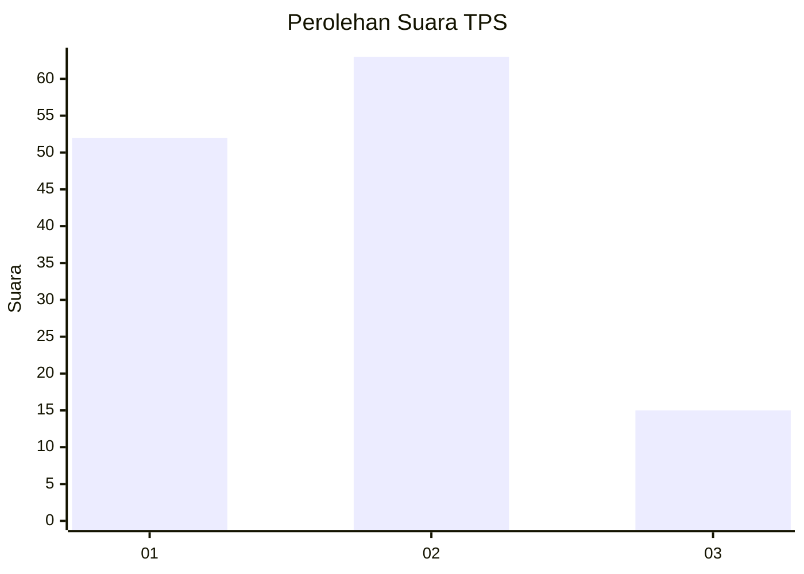
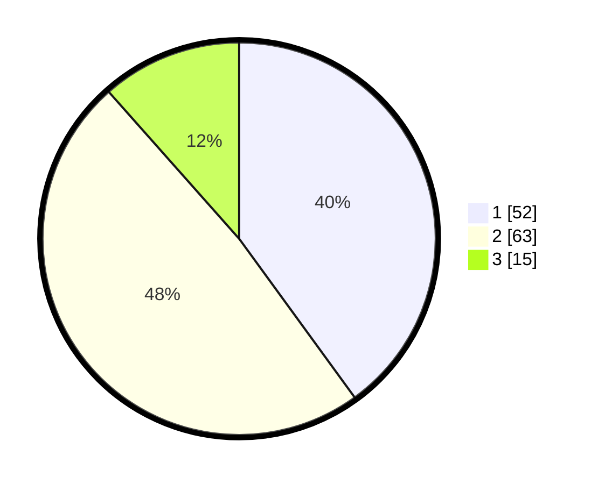

# Hasil

## Grafik

## Tabel

| No. | Nama Paslon    | Suara | Suara (raw) | Persentase |
|:--- |:-------------- | -----:| -----------:| ----------:|
| 1   | ANIES MUHAIMIN | 52    | [52][p-1]   | 40,00      |
| 2   | PRABOWO GIBRAN | 63    | [63][p-2]   | 48,46      |
| 3   | GANJAR MAHFUD  | 15    | [15][p-3]   | 11,54      |

[p-1]: https://github.com/gigit-pemilu/pemilu-2024-18-lampung/blob/main/pilpres/hitung-suara/sub/18-lampung/sub/01-lampung-selatan/sub/04-natar/sub/2001-hajimena/sub/002-tps/sub/paslon-1.txt
[p-2]: https://github.com/gigit-pemilu/pemilu-2024-18-lampung/blob/main/pilpres/hitung-suara/sub/18-lampung/sub/01-lampung-selatan/sub/04-natar/sub/2001-hajimena/sub/002-tps/sub/paslon-2.txt
[p-3]: https://github.com/gigit-pemilu/pemilu-2024-18-lampung/blob/main/pilpres/hitung-suara/sub/18-lampung/sub/01-lampung-selatan/sub/04-natar/sub/2001-hajimena/sub/002-tps/sub/paslon-3.txt

## Foto C Plano

https://sirekap-obj-formc.kpu.go.id/60dc/pemilu/ppwp/18/01/04/20/01/1801042001002-20240214-192011--85473f57-21f7-485f-9256-d30e09d91cab.jpg

https://sirekap-obj-formc.kpu.go.id/60dc/pemilu/ppwp/18/01/04/20/01/1801042001002-20240214-195548--3cfc3ad6-6682-42a6-84cd-f3e31e6492ee.jpg

https://sirekap-obj-formc.kpu.go.id/60dc/pemilu/ppwp/18/01/04/20/01/1801042001002-20240214-192226--43e0193b-2259-419b-a337-3e7d8805b33a.jpg

## Metadata

| Key        | Value               |
| ---------- | ------------------- |
| Time Stamp | 2024-02-15 19:00:26 |

## DATA PEMILIH TETAP

Jumlah pemilih dalam DPT: **133**.
 * L: **62**.
 * P: **71**.

## DATA PENGGUNA HAK PILIH

Jumlah pengguna hak pilih dalam DPT: **133**.
 * L: **62**.
 * P: **71**.

Jumlah pengguna hak pilih dalam DPTb: **0**.
 * L: **0**.
 * P: **0**.

Jumlah pengguna hak pilih dalam DPK: **0**.
 * L: **0**.
 * P: **0**.

Jumlah pengguna hak pilih: **133**.
 * L: **62**.
 * P: **71**.

## JUMLAH SUARA SAH DAN TIDAK SAH

JUMLAH SELURUH SUARA SAH: **130**.

JUMLAH SUARA TIDAK SAH: **3**.

JUMLAH SELURUH SUARA SAH DAN SUARA TIDAK SAH: **133**.

