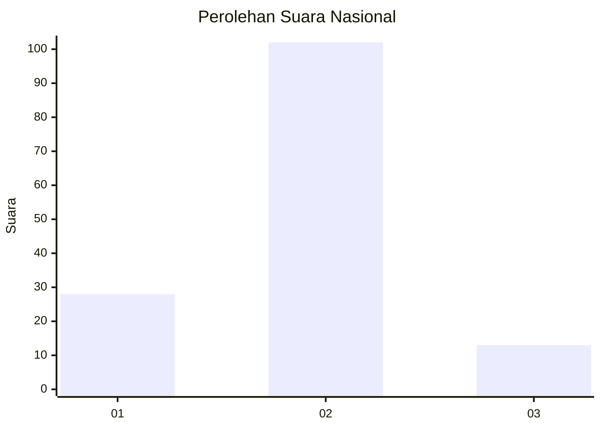
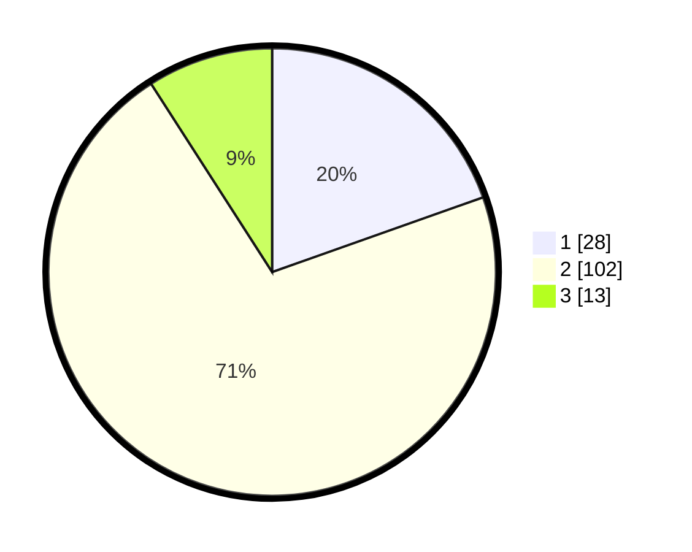

# Hasil

## Grafik

## Tabel

| No. | Nama Paslon    | Suara | Suara (raw) | Persentase |
|:--- |:-------------- | -----:| -----------:| ----------:|
| 1   | ANIES MUHAIMIN | 28    | [28][p-1]   | 19,58      |
| 2   | PRABOWO GIBRAN | 102   | [102][p-2]  | 71,33      |
| 3   | GANJAR MAHFUD  | 13    | [13][p-3]   | 9,09       |

[p-1]: https://github.com/gigit-pemilu/pemilu-2024/blob/main/pilpres/hitung-suara/sub/18-lampung/sub/01-lampung-selatan/sub/04-natar/sub/2001-hajimena/sub/007-tps/sub/paslon-1.txt
[p-2]: https://github.com/gigit-pemilu/pemilu-2024/blob/main/pilpres/hitung-suara/sub/18-lampung/sub/01-lampung-selatan/sub/04-natar/sub/2001-hajimena/sub/007-tps/sub/paslon-2.txt
[p-3]: https://github.com/gigit-pemilu/pemilu-2024/blob/main/pilpres/hitung-suara/sub/18-lampung/sub/01-lampung-selatan/sub/04-natar/sub/2001-hajimena/sub/007-tps/sub/paslon-3.txt

## Foto C Plano

https://sirekap-obj-formc.kpu.go.id/f95f/pemilu/ppwp/18/01/04/20/01/1801042001007-20240214-235334--47d1a9e8-0e4c-461a-901f-41975cac8644.jpg

https://sirekap-obj-formc.kpu.go.id/f95f/pemilu/ppwp/18/01/04/20/01/1801042001007-20240215-000102--41cd2ab4-5531-4749-81d6-9926ac890a67.jpg

https://sirekap-obj-formc.kpu.go.id/f95f/pemilu/ppwp/18/01/04/20/01/1801042001007-20240215-000203--1448dd8e-88e0-4708-bb48-65ad8d831b3c.jpg

## Metadata

| Key        | Value               |
| ---------- | ------------------- |
| Time Stamp | 2024-02-15 23:29:50 |

