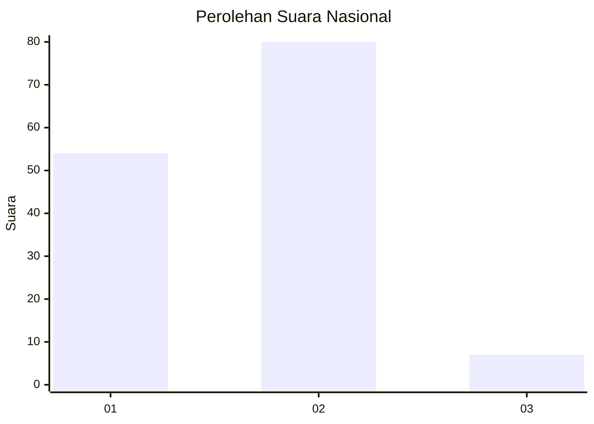
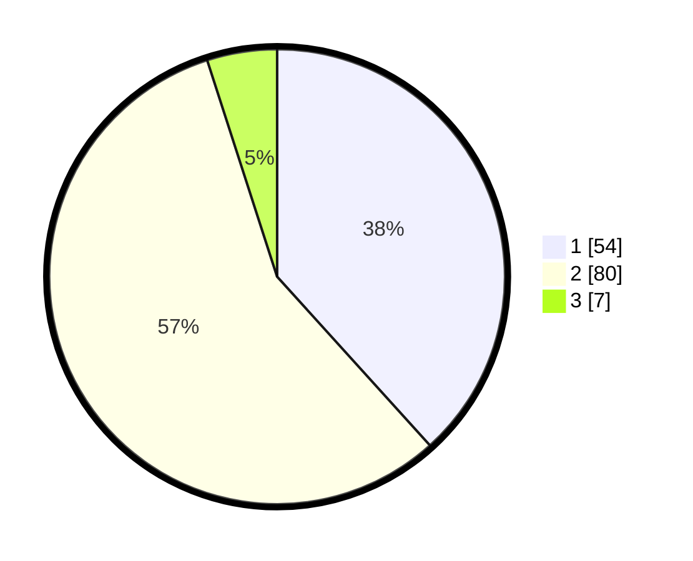

# Hasil

## Grafik

## Tabel

| No. | Nama Paslon    | Suara | Suara (raw) | Persentase |
|:--- |:-------------- | -----:| -----------:| ----------:|
| 1   | ANIES MUHAIMIN | 54    | [54][p-1]   | 38,30      |
| 2   | PRABOWO GIBRAN | 80    | [80][p-2]   | 56,74      |
| 3   | GANJAR MAHFUD  | 7     | [7][p-3]    | 4,96       |

[p-1]: https://github.com/gigit-pemilu/pemilu-2024/blob/main/pilpres/hitung-suara/sub/18-lampung/sub/01-lampung-selatan/sub/04-natar/sub/2001-hajimena/sub/009-tps/sub/paslon-1.txt
[p-2]: https://github.com/gigit-pemilu/pemilu-2024/blob/main/pilpres/hitung-suara/sub/18-lampung/sub/01-lampung-selatan/sub/04-natar/sub/2001-hajimena/sub/009-tps/sub/paslon-2.txt
[p-3]: https://github.com/gigit-pemilu/pemilu-2024/blob/main/pilpres/hitung-suara/sub/18-lampung/sub/01-lampung-selatan/sub/04-natar/sub/2001-hajimena/sub/009-tps/sub/paslon-3.txt

## Foto C Plano

https://sirekap-obj-formc.kpu.go.id/7592/pemilu/ppwp/18/01/04/20/01/1801042001009-20240215-013736--788e1c3d-2d62-468f-9ec7-42ceb4b5268e.jpg

https://sirekap-obj-formc.kpu.go.id/7592/pemilu/ppwp/18/01/04/20/01/1801042001009-20240215-013819--b9b0b1ba-9f53-4130-b3c1-6d6a2d3f4a6c.jpg

https://sirekap-obj-formc.kpu.go.id/7592/pemilu/ppwp/18/01/04/20/01/1801042001009-20240215-013857--5bbef8d4-1412-4c07-a433-96f4a392119a.jpg

## Metadata

| Key        | Value               |
| ---------- | ------------------- |
| Time Stamp | 2024-02-15 23:29:50 |

