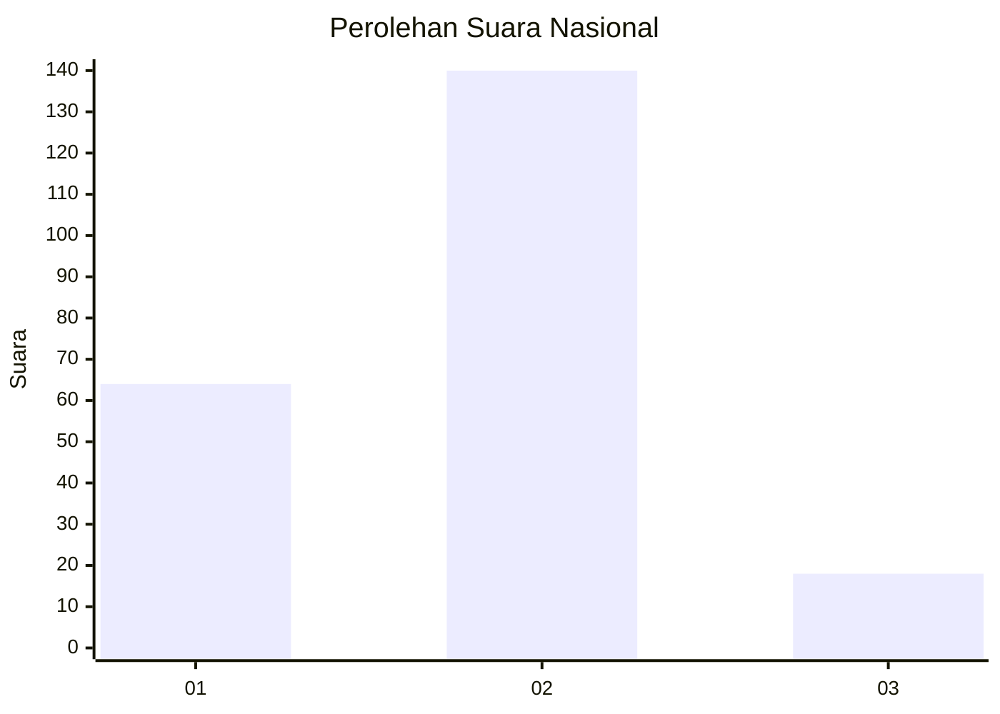
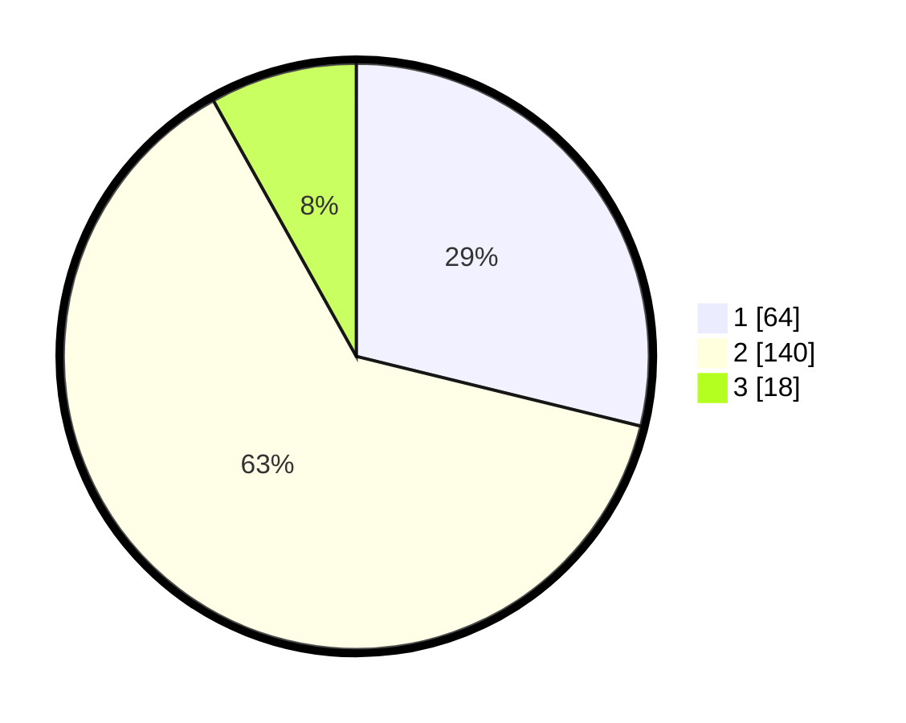

# Hasil

## Grafik

## Tabel

| No. | Nama Paslon    | Suara | Suara (raw) | Persentase |
|:--- |:-------------- | -----:| -----------:| ----------:|
| 1   | ANIES MUHAIMIN | 64    | [64][p-1]   | 28,83      |
| 2   | PRABOWO GIBRAN | 140   | [140][p-2]  | 63,06      |
| 3   | GANJAR MAHFUD  | 18    | [18][p-3]   | 8,11       |

[p-1]: https://github.com/gigit-pemilu/pemilu-2024/blob/main/pilpres/hitung-suara/sub/18-lampung/sub/01-lampung-selatan/sub/04-natar/sub/2001-hajimena/sub/011-tps/sub/paslon-1.txt
[p-2]: https://github.com/gigit-pemilu/pemilu-2024/blob/main/pilpres/hitung-suara/sub/18-lampung/sub/01-lampung-selatan/sub/04-natar/sub/2001-hajimena/sub/011-tps/sub/paslon-2.txt
[p-3]: https://github.com/gigit-pemilu/pemilu-2024/blob/main/pilpres/hitung-suara/sub/18-lampung/sub/01-lampung-selatan/sub/04-natar/sub/2001-hajimena/sub/011-tps/sub/paslon-3.txt

## Foto C Plano

https://sirekap-obj-formc.kpu.go.id/d026/pemilu/ppwp/18/01/04/20/01/1801042001011-20240215-011018--3c26a3c3-1aad-4328-9ade-dacdf227914e.jpg

https://sirekap-obj-formc.kpu.go.id/d026/pemilu/ppwp/18/01/04/20/01/1801042001011-20240215-011108--aaac7a7b-7789-42ce-b12f-6248b73d29da.jpg

https://sirekap-obj-formc.kpu.go.id/d026/pemilu/ppwp/18/01/04/20/01/1801042001011-20240215-011150--ceec5413-1dfe-4aef-b5e9-37417d209637.jpg

## Metadata

| Key        | Value               |
| ---------- | ------------------- |
| Time Stamp | 2024-02-15 23:29:50 |

