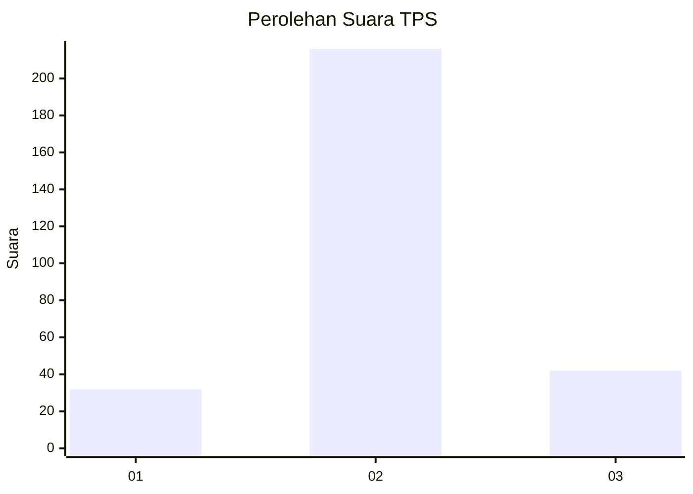
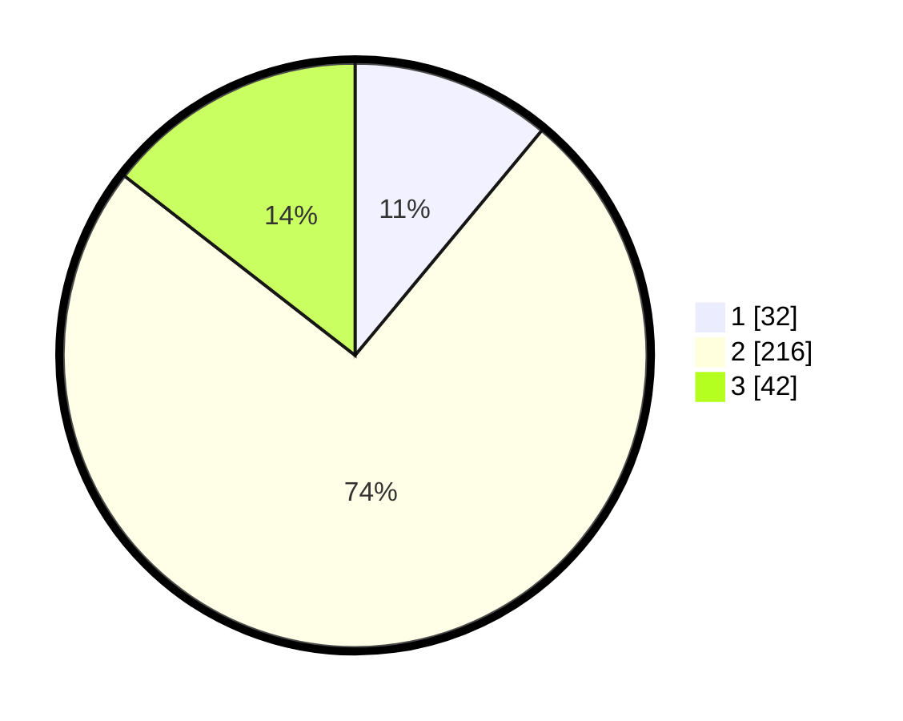

# Hasil

## Grafik

## Tabel

| No. | Nama Paslon    | Suara | Suara (raw) | Persentase |
|:--- |:-------------- | -----:| -----------:| ----------:|
| 1   | ANIES MUHAIMIN | 32    | [32][p-1]   | 11,03      |
| 2   | PRABOWO GIBRAN | 216   | [216][p-2]  | 74,48      |
| 3   | GANJAR MAHFUD  | 42    | [42][p-3]   | 14,48      |

[p-1]: https://github.com/gigit-pemilu/pemilu-2024-18-lampung/blob/main/pilpres/hitung-suara/sub/18-lampung/sub/01-lampung-selatan/sub/04-natar/sub/2004-natar/sub/011-tps/sub/paslon-1.txt
[p-2]: https://github.com/gigit-pemilu/pemilu-2024-18-lampung/blob/main/pilpres/hitung-suara/sub/18-lampung/sub/01-lampung-selatan/sub/04-natar/sub/2004-natar/sub/011-tps/sub/paslon-2.txt
[p-3]: https://github.com/gigit-pemilu/pemilu-2024-18-lampung/blob/main/pilpres/hitung-suara/sub/18-lampung/sub/01-lampung-selatan/sub/04-natar/sub/2004-natar/sub/011-tps/sub/paslon-3.txt

## Foto C Plano

https://sirekap-obj-formc.kpu.go.id/08e5/pemilu/ppwp/18/01/04/20/04/1801042004011-20240214-224459--67807be0-be22-4f4b-90db-77f9b55de223.jpg

https://sirekap-obj-formc.kpu.go.id/08e5/pemilu/ppwp/18/01/04/20/04/1801042004011-20240214-224656--08cf9676-9d1a-4cf6-80b4-967ed6de99d6.jpg

https://sirekap-obj-formc.kpu.go.id/08e5/pemilu/ppwp/18/01/04/20/04/1801042004011-20240214-224951--b5bf8c1f-1ec1-48b2-ae15-a9306f24cbd6.jpg

## Metadata

| Key        | Value               |
| ---------- | ------------------- |
| Time Stamp | 2024-02-24 22:31:28 |

