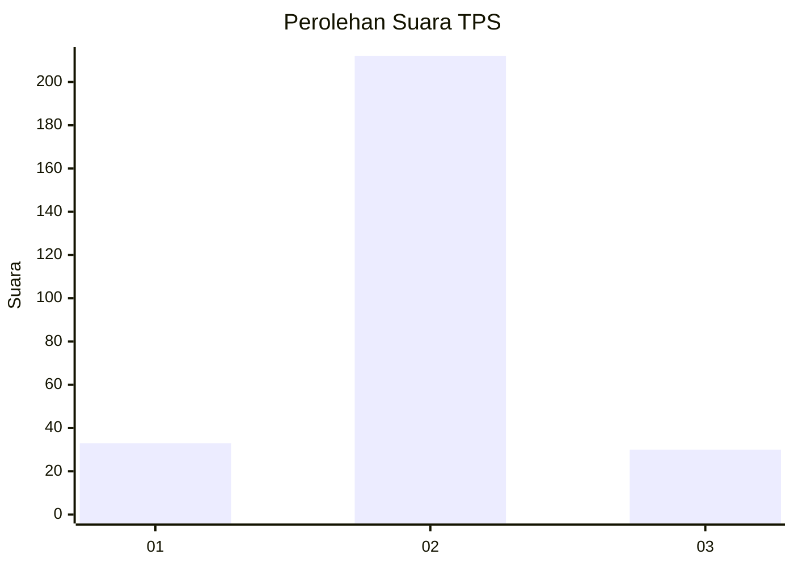
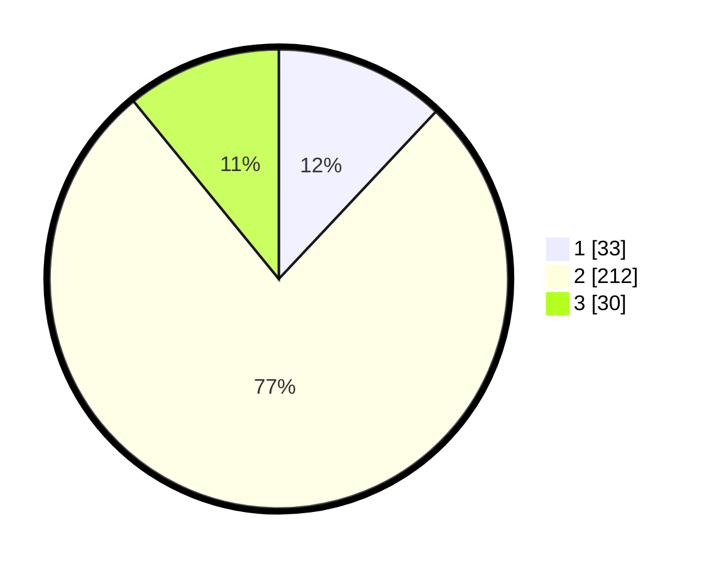

# Hasil

## Grafik

## Tabel

| No. | Nama Paslon    | Suara | Suara (raw) | Persentase |
|:--- |:-------------- | -----:| -----------:| ----------:|
| 1   | ANIES MUHAIMIN | 33    | [33][p-1]   | 12,00      |
| 2   | PRABOWO GIBRAN | 212   | [212][p-2]  | 77,09      |
| 3   | GANJAR MAHFUD  | 30    | [30][p-3]   | 10,91      |

[p-1]: https://github.com/gigit-pemilu/pemilu-2024-18-lampung/blob/main/pilpres/hitung-suara/sub/18-lampung/sub/01-lampung-selatan/sub/04-natar/sub/2006-negara-ratu/sub/025-tps/sub/paslon-1.txt
[p-2]: https://github.com/gigit-pemilu/pemilu-2024-18-lampung/blob/main/pilpres/hitung-suara/sub/18-lampung/sub/01-lampung-selatan/sub/04-natar/sub/2006-negara-ratu/sub/025-tps/sub/paslon-2.txt
[p-3]: https://github.com/gigit-pemilu/pemilu-2024-18-lampung/blob/main/pilpres/hitung-suara/sub/18-lampung/sub/01-lampung-selatan/sub/04-natar/sub/2006-negara-ratu/sub/025-tps/sub/paslon-3.txt

## Foto C Plano

https://sirekap-obj-formc.kpu.go.id/1a81/pemilu/ppwp/18/01/04/20/06/1801042006025-20240214-155820--c405416b-0bed-4b88-9063-f7ed31d2da31.jpg

https://sirekap-obj-formc.kpu.go.id/1a81/pemilu/ppwp/18/01/04/20/06/1801042006025-20240214-155910--e6ecabed-6174-4e9a-ab2f-7ce8ffe9bac2.jpg

https://sirekap-obj-formc.kpu.go.id/1a81/pemilu/ppwp/18/01/04/20/06/1801042006025-20240214-160123--cac5e005-9845-4a84-83e0-f98c3e6f9885.jpg

## Metadata

| Key        | Value               |
| ---------- | ------------------- |
| Time Stamp | 2024-02-24 22:31:28 |

