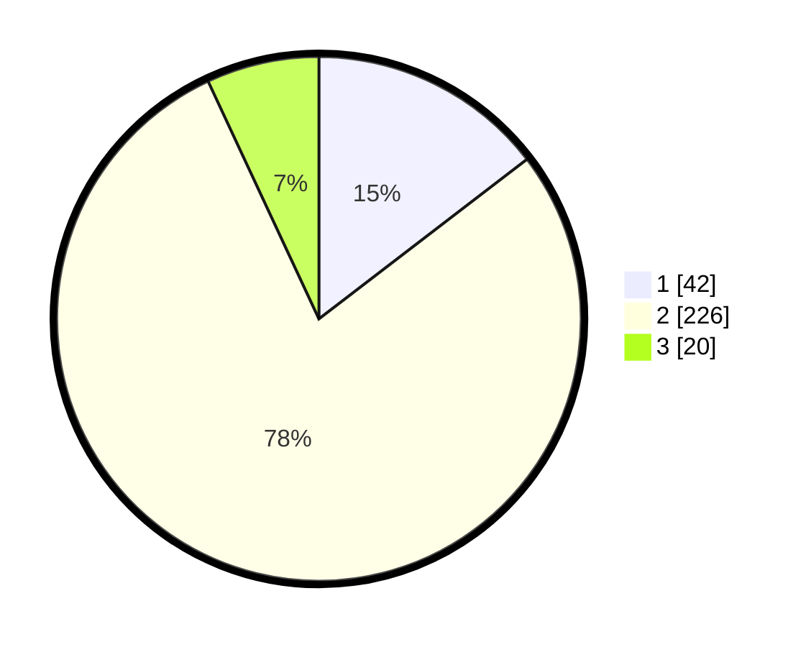

# Hasil

## Grafik

## Tabel

| No. | Nama Paslon    | Suara | Suara (raw) | Persentase |
|:--- |:-------------- | -----:| -----------:| ----------:|
| 1   | ANIES MUHAIMIN | 42    | [42][p-1]   | 14,58      |
| 2   | PRABOWO GIBRAN | 226   | [226][p-2]  | 78,47      |
| 3   | GANJAR MAHFUD  | 20    | [20][p-3]   | 6,94       |

[p-1]: https://github.com/gigit-pemilu/pemilu-2024-18-lampung/blob/main/pilpres/hitung-suara/sub/18-lampung/sub/01-lampung-selatan/sub/04-natar/sub/2006-negara-ratu/sub/039-tps/sub/paslon-1.txt
[p-2]: https://github.com/gigit-pemilu/pemilu-2024-18-lampung/blob/main/pilpres/hitung-suara/sub/18-lampung/sub/01-lampung-selatan/sub/04-natar/sub/2006-negara-ratu/sub/039-tps/sub/paslon-2.txt
[p-3]: https://github.com/gigit-pemilu/pemilu-2024-18-lampung/blob/main/pilpres/hitung-suara/sub/18-lampung/sub/01-lampung-selatan/sub/04-natar/sub/2006-negara-ratu/sub/039-tps/sub/paslon-3.txt

## Foto C Plano

https://sirekap-obj-formc.kpu.go.id/6b88/pemilu/ppwp/18/01/04/20/06/1801042006039-20240215-013301--3239a9dc-0574-4c0e-8e95-5a982fec0d3e.jpg

https://sirekap-obj-formc.kpu.go.id/6b88/pemilu/ppwp/18/01/04/20/06/1801042006039-20240215-013405--ef31d9e6-484d-4b1d-ae03-90aceab0645a.jpg

https://sirekap-obj-formc.kpu.go.id/6b88/pemilu/ppwp/18/01/04/20/06/1801042006039-20240215-013501--cda8c8d3-57f9-4112-95cc-d44551e4a634.jpg

## Metadata

| Key        | Value               |
| ---------- | ------------------- |
| Time Stamp | 2024-02-24 22:31:28 |

