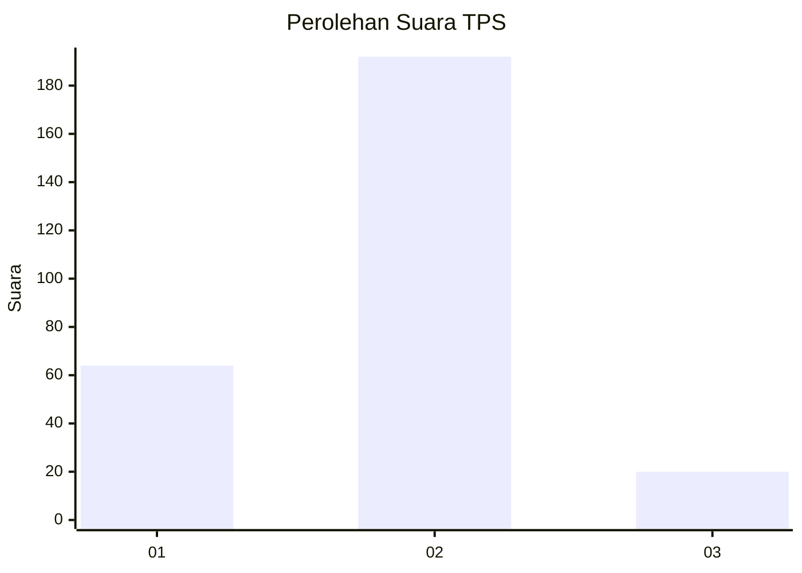
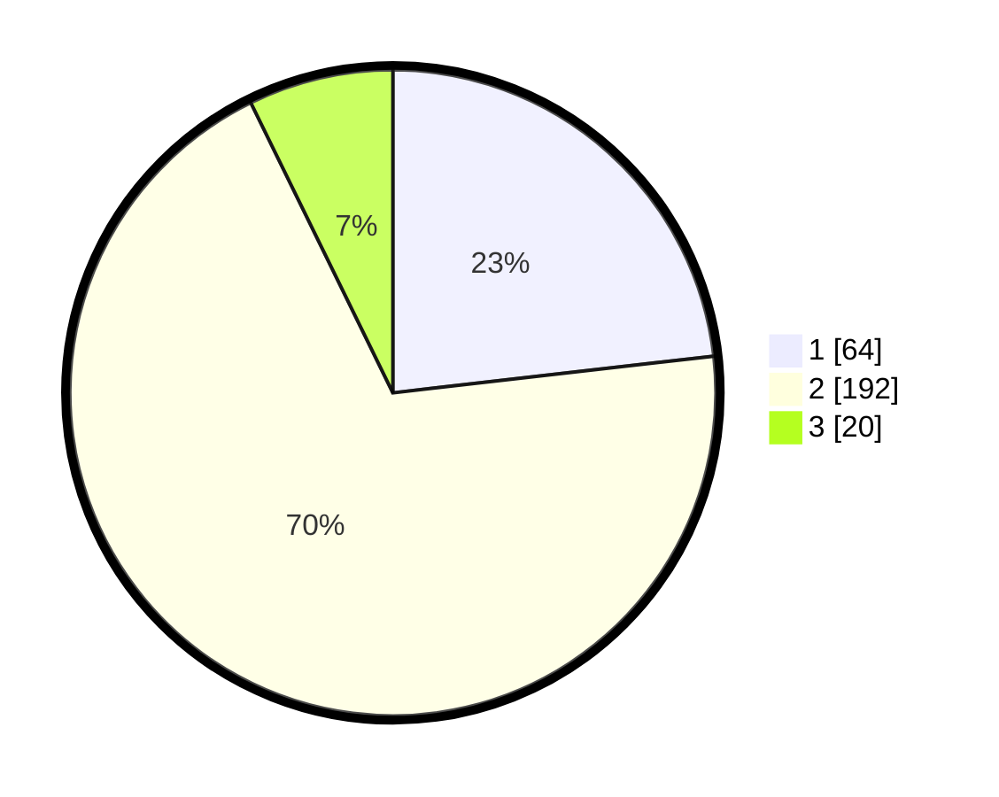

# Hasil

## Grafik

## Tabel

| No. | Nama Paslon    | Suara | Suara (raw) | Persentase |
|:--- |:-------------- | -----:| -----------:| ----------:|
| 1   | ANIES MUHAIMIN | 64    | [64][p-1]   | 23,19      |
| 2   | PRABOWO GIBRAN | 192   | [192][p-2]  | 69,57      |
| 3   | GANJAR MAHFUD  | 20    | [20][p-3]   | 7,25       |

[p-1]: https://github.com/gigit-pemilu/pemilu-2024-18-lampung/blob/main/pilpres/hitung-suara/sub/18-lampung/sub/01-lampung-selatan/sub/04-natar/sub/2007-merak-batin/sub/022-tps/sub/paslon-1.txt
[p-2]: https://github.com/gigit-pemilu/pemilu-2024-18-lampung/blob/main/pilpres/hitung-suara/sub/18-lampung/sub/01-lampung-selatan/sub/04-natar/sub/2007-merak-batin/sub/022-tps/sub/paslon-2.txt
[p-3]: https://github.com/gigit-pemilu/pemilu-2024-18-lampung/blob/main/pilpres/hitung-suara/sub/18-lampung/sub/01-lampung-selatan/sub/04-natar/sub/2007-merak-batin/sub/022-tps/sub/paslon-3.txt

## Foto C Plano

https://sirekap-obj-formc.kpu.go.id/d6b6/pemilu/ppwp/18/01/04/20/07/1801042007022-20240215-013005--fafbed28-e5fc-47b8-ab67-d29679cc40ce.jpg

https://sirekap-obj-formc.kpu.go.id/d6b6/pemilu/ppwp/18/01/04/20/07/1801042007022-20240215-013013--aa7f8ae1-79bf-4bd4-81f4-4abdb61865ae.jpg

https://sirekap-obj-formc.kpu.go.id/d6b6/pemilu/ppwp/18/01/04/20/07/1801042007022-20240215-013022--c30ee82f-aa3b-47b4-9370-7c57dcf04dd4.jpg

## Metadata

| Key        | Value               |
| ---------- | ------------------- |
| Time Stamp | 2024-02-15 23:29:50 |

