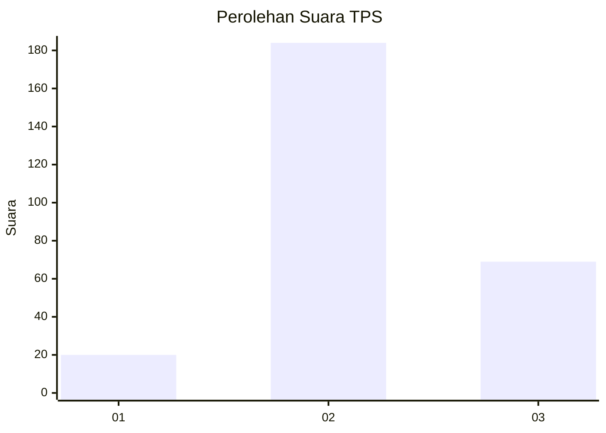
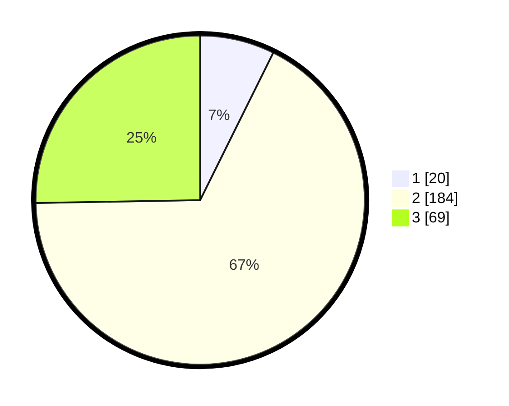

# Hasil

## Grafik

## Tabel

| No. | Nama Paslon    | Suara | Suara (raw) | Persentase |
|:--- |:-------------- | -----:| -----------:| ----------:|
| 1   | ANIES MUHAIMIN | 20    | [20][p-1]   | 7,33       |
| 2   | PRABOWO GIBRAN | 184   | [184][p-2]  | 67,40      |
| 3   | GANJAR MAHFUD  | 69    | [69][p-3]   | 25,27      |

[p-1]: https://github.com/gigit-pemilu/pemilu-2024-18-lampung/blob/main/pilpres/hitung-suara/sub/18-lampung/sub/01-lampung-selatan/sub/04-natar/sub/2008-tanjung-sari/sub/014-tps/sub/paslon-1.txt
[p-2]: https://github.com/gigit-pemilu/pemilu-2024-18-lampung/blob/main/pilpres/hitung-suara/sub/18-lampung/sub/01-lampung-selatan/sub/04-natar/sub/2008-tanjung-sari/sub/014-tps/sub/paslon-2.txt
[p-3]: https://github.com/gigit-pemilu/pemilu-2024-18-lampung/blob/main/pilpres/hitung-suara/sub/18-lampung/sub/01-lampung-selatan/sub/04-natar/sub/2008-tanjung-sari/sub/014-tps/sub/paslon-3.txt

## Foto C Plano

https://sirekap-obj-formc.kpu.go.id/2cf6/pemilu/ppwp/18/01/04/20/08/1801042008014-20240214-155227--63597669-3ffd-4c0d-889e-e4105c24ead7.jpg

https://sirekap-obj-formc.kpu.go.id/2cf6/pemilu/ppwp/18/01/04/20/08/1801042008014-20240214-141753--9a22863c-5b13-41bd-b20e-0160af169502.jpg

https://sirekap-obj-formc.kpu.go.id/2cf6/pemilu/ppwp/18/01/04/20/08/1801042008014-20240215-022109--53740354-d80f-4438-a410-95e5df846cfc.jpg

## Metadata

| Key        | Value               |
| ---------- | ------------------- |
| Time Stamp | 2024-02-16 00:00:26 |

