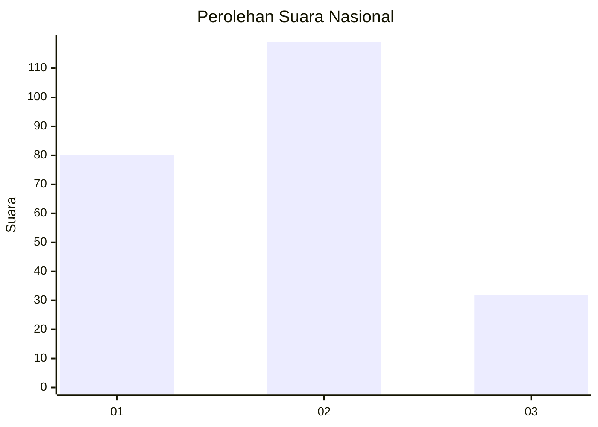
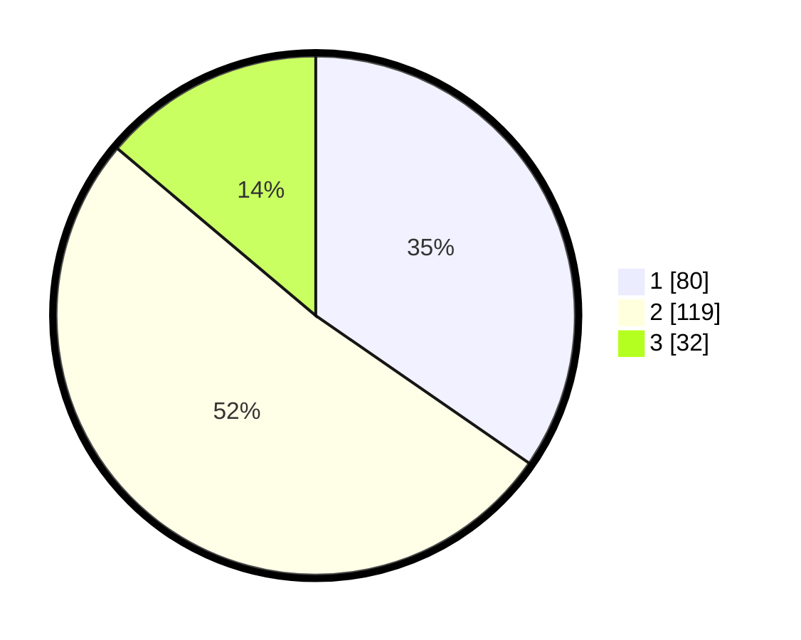

# Hasil

## Grafik

## Tabel

| No. | Nama Paslon    | Suara | Suara (raw) | Persentase |
|:--- |:-------------- | -----:| -----------:| ----------:|
| 1   | ANIES MUHAIMIN | 80    | [80][p-1]   | 34,63      |
| 2   | PRABOWO GIBRAN | 119   | [119][p-2]  | 51,52      |
| 3   | GANJAR MAHFUD  | 32    | [32][p-3]   | 13,85      |

[p-1]: https://github.com/gigit-pemilu/pemilu-2024/blob/main/pilpres/hitung-suara/sub/18-lampung/sub/01-lampung-selatan/sub/13-jati-agung/sub/2001-way-hui/sub/020-tps/sub/paslon-1.txt
[p-2]: https://github.com/gigit-pemilu/pemilu-2024/blob/main/pilpres/hitung-suara/sub/18-lampung/sub/01-lampung-selatan/sub/13-jati-agung/sub/2001-way-hui/sub/020-tps/sub/paslon-2.txt
[p-3]: https://github.com/gigit-pemilu/pemilu-2024/blob/main/pilpres/hitung-suara/sub/18-lampung/sub/01-lampung-selatan/sub/13-jati-agung/sub/2001-way-hui/sub/020-tps/sub/paslon-3.txt

## Foto C Plano

https://sirekap-obj-formc.kpu.go.id/27f7/pemilu/ppwp/18/01/13/20/01/1801132001020-20240214-155604--a25fa774-bc0a-4705-99ae-70048ba6661c.jpg

https://sirekap-obj-formc.kpu.go.id/27f7/pemilu/ppwp/18/01/13/20/01/1801132001020-20240214-155732--7371ea80-4857-42c7-aa14-670b6a902c17.jpg

https://sirekap-obj-formc.kpu.go.id/27f7/pemilu/ppwp/18/01/13/20/01/1801132001020-20240214-155917--d11b5f2c-07e0-4a61-91fd-7a3dbdceaf45.jpg

## Metadata

| Key        | Value               |
| ---------- | ------------------- |
| Time Stamp | 2024-02-15 22:30:27 |

