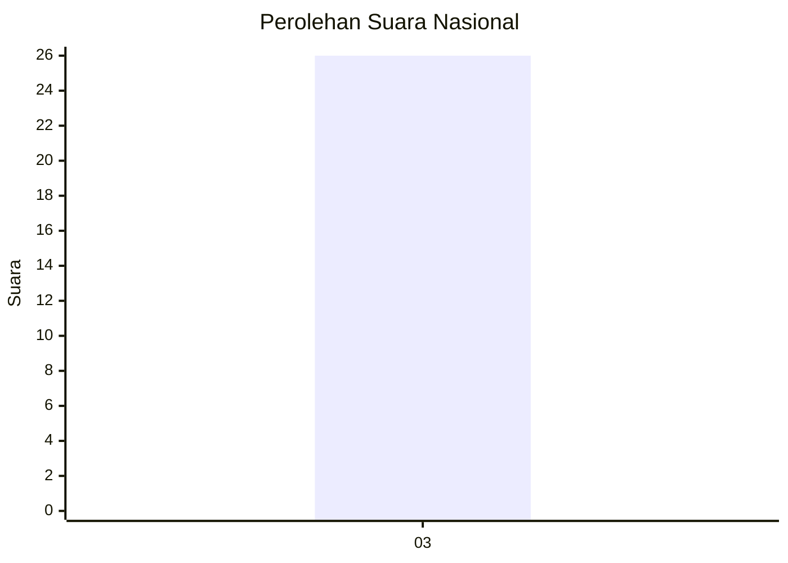
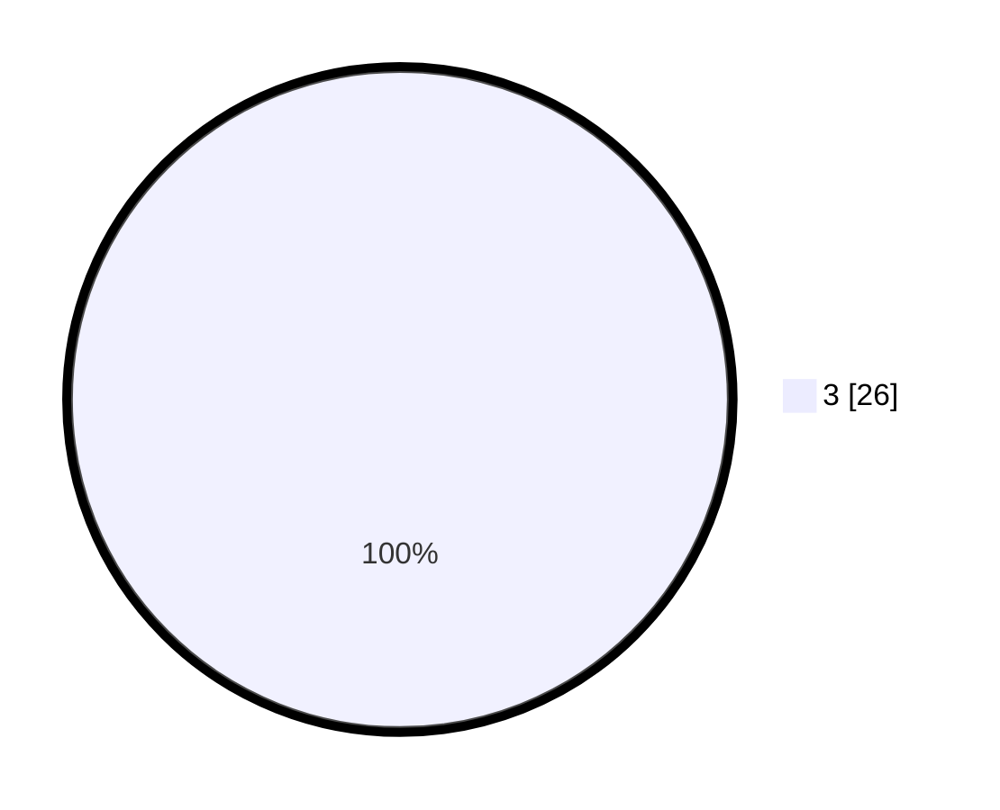

# Hasil

## Grafik

## Tabel

| No. | Nama Paslon   | Suara | Suara (raw) | Persentase |
|:--- |:------------- | -----:| -----------:| ----------:|
| 3   | GANJAR MAHFUD | 26    | [26][p-3]   | 100,00     |

[p-1]: https://github.com/gigit-pemilu/pemilu-2024/blob/main/pilpres/hitung-suara/sub/18-lampung/sub/01-lampung-selatan/sub/13-jati-agung/sub/2021-margorejo/sub/002-tps/sub/paslon-1.txt
[p-2]: https://github.com/gigit-pemilu/pemilu-2024/blob/main/pilpres/hitung-suara/sub/18-lampung/sub/01-lampung-selatan/sub/13-jati-agung/sub/2021-margorejo/sub/002-tps/sub/paslon-2.txt
[p-3]: https://github.com/gigit-pemilu/pemilu-2024/blob/main/pilpres/hitung-suara/sub/18-lampung/sub/01-lampung-selatan/sub/13-jati-agung/sub/2021-margorejo/sub/002-tps/sub/paslon-3.txt

## Foto C Plano

https://sirekap-obj-formc.kpu.go.id/8ec6/pemilu/ppwp/18/01/13/20/21/1801132021002-20240215-002737--aef65bab-044e-42f9-b4bf-221b1d05a401.jpg

https://sirekap-obj-formc.kpu.go.id/8ec6/pemilu/ppwp/18/01/13/20/21/1801132021002-20240215-002823--1d3e8a18-7c62-4c90-865f-9319bdff9d7f.jpg

https://sirekap-obj-formc.kpu.go.id/8ec6/pemilu/ppwp/18/01/13/20/21/1801132021002-20240215-002911--9bf56e33-2ca7-45b3-b859-e9249b6f31dc.jpg

## Metadata

| Key        | Value               |
| ---------- | ------------------- |
| Time Stamp | 2024-02-25 13:00:00 |

