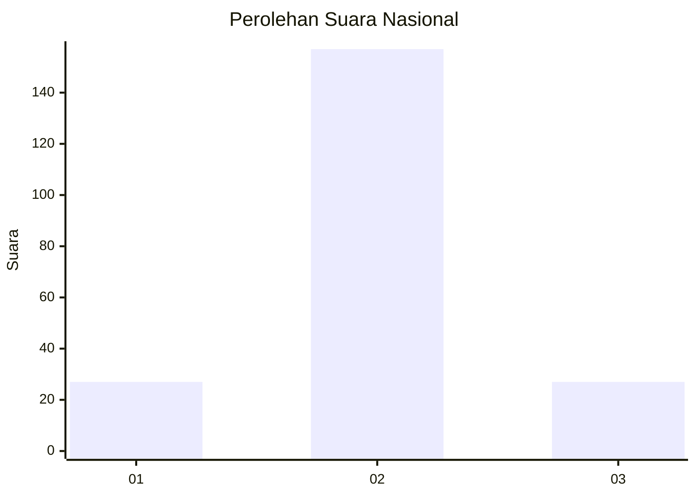
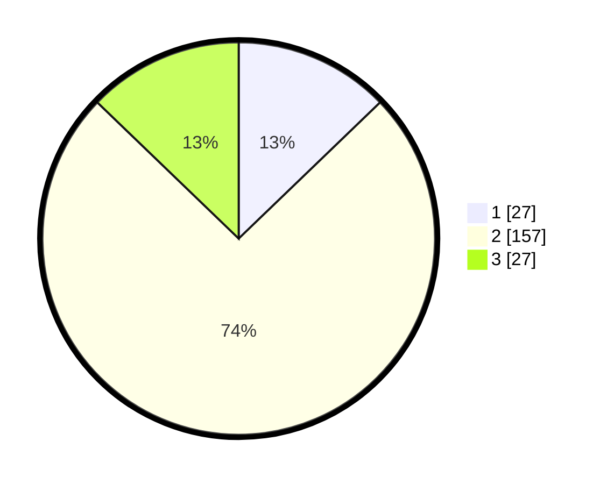

# Hasil

## Grafik

## Tabel

| No. | Nama Paslon    | Suara | Suara (raw) | Persentase |
|:--- |:-------------- | -----:| -----------:| ----------:|
| 1   | ANIES MUHAIMIN | 27    | [27][p-1]   | 12,80      |
| 2   | PRABOWO GIBRAN | 157   | [157][p-2]  | 74,41      |
| 3   | GANJAR MAHFUD  | 27    | [27][p-3]   | 12,80      |

[p-1]: https://github.com/gigit-pemilu/pemilu-2024/blob/main/pilpres/hitung-suara/sub/18-lampung/sub/01-lampung-selatan/sub/17-candipuro/sub/2002-sinar-palembang/sub/003-tps/sub/paslon-1.txt
[p-2]: https://github.com/gigit-pemilu/pemilu-2024/blob/main/pilpres/hitung-suara/sub/18-lampung/sub/01-lampung-selatan/sub/17-candipuro/sub/2002-sinar-palembang/sub/003-tps/sub/paslon-2.txt
[p-3]: https://github.com/gigit-pemilu/pemilu-2024/blob/main/pilpres/hitung-suara/sub/18-lampung/sub/01-lampung-selatan/sub/17-candipuro/sub/2002-sinar-palembang/sub/003-tps/sub/paslon-3.txt

## Foto C Plano

https://sirekap-obj-formc.kpu.go.id/a238/pemilu/ppwp/18/01/17/20/02/1801172002003-20240215-001255--4e67a976-bcb6-43dd-98a7-1bfe8b7c92e7.jpg

https://sirekap-obj-formc.kpu.go.id/a238/pemilu/ppwp/18/01/17/20/02/1801172002003-20240215-001435--4ab24f6e-3816-4965-a0de-892075e1aa82.jpg

https://sirekap-obj-formc.kpu.go.id/a238/pemilu/ppwp/18/01/17/20/02/1801172002003-20240215-001625--74d23abd-8b22-4026-9930-6779dfc1900e.jpg

## Metadata

| Key        | Value               |
| ---------- | ------------------- |
| Time Stamp | 2024-02-16 00:30:27 |

