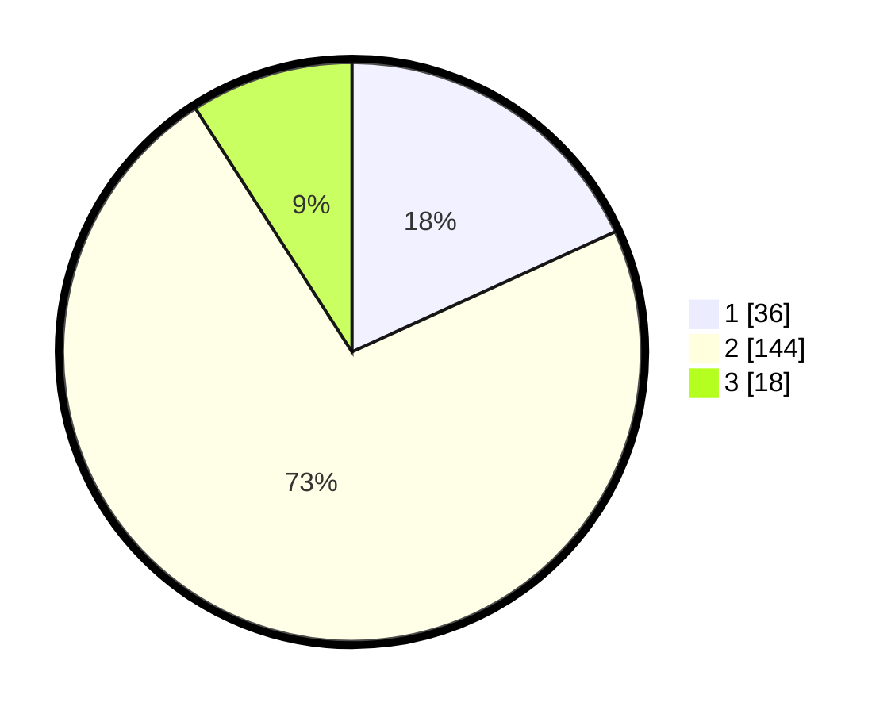

# Hasil

## Grafik

## Tabel

| No. | Nama Paslon    | Suara | Suara (raw) | Persentase |
|:--- |:-------------- | -----:| -----------:| ----------:|
| 1   | ANIES MUHAIMIN | 36    | [36][p-1]   | 18,18      |
| 2   | PRABOWO GIBRAN | 144   | [144][p-2]  | 72,73      |
| 3   | GANJAR MAHFUD  | 18    | [18][p-3]   | 9,09       |

[p-1]: https://github.com/gigit-pemilu/pemilu-2024/blob/main/pilpres/hitung-suara/sub/18-lampung/sub/01-lampung-selatan/sub/17-candipuro/sub/2002-sinar-palembang/sub/004-tps/sub/paslon-1.txt
[p-2]: https://github.com/gigit-pemilu/pemilu-2024/blob/main/pilpres/hitung-suara/sub/18-lampung/sub/01-lampung-selatan/sub/17-candipuro/sub/2002-sinar-palembang/sub/004-tps/sub/paslon-2.txt
[p-3]: https://github.com/gigit-pemilu/pemilu-2024/blob/main/pilpres/hitung-suara/sub/18-lampung/sub/01-lampung-selatan/sub/17-candipuro/sub/2002-sinar-palembang/sub/004-tps/sub/paslon-3.txt

## Foto C Plano

https://sirekap-obj-formc.kpu.go.id/2325/pemilu/ppwp/18/01/17/20/02/1801172002004-20240215-010444--1b671759-fada-4fe4-8aa4-ab773d7c4718.jpg

https://sirekap-obj-formc.kpu.go.id/2325/pemilu/ppwp/18/01/17/20/02/1801172002004-20240215-011445--ce306ccc-b233-4bc9-8fe2-1ecfbd714d3a.jpg

https://sirekap-obj-formc.kpu.go.id/2325/pemilu/ppwp/18/01/17/20/02/1801172002004-20240215-011201--b67c4957-e0db-4375-9640-2673fe08102f.jpg

## Metadata

| Key        | Value               |
| ---------- | ------------------- |
| Time Stamp | 2024-02-16 03:00:26 |

