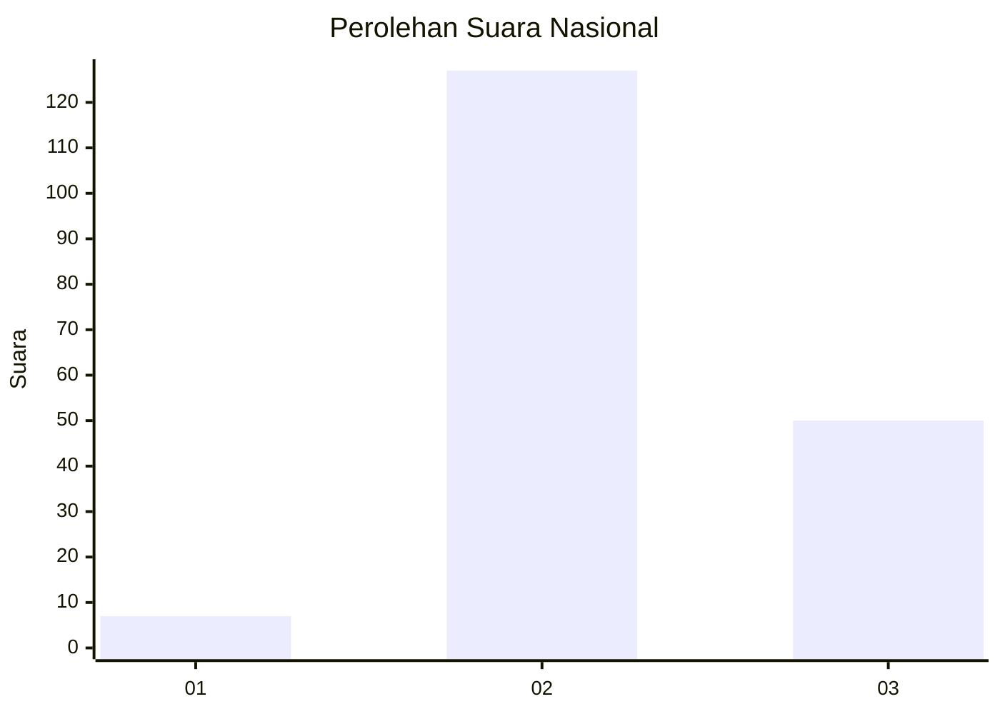

# Hasil

## Grafik

## Tabel

| No. | Nama Paslon    | Suara | Suara (raw) | Persentase |
|:--- |:-------------- | -----:| -----------:| ----------:|
| 1   | ANIES MUHAIMIN | 7     | [7][p-1]    | 3,80       |
| 2   | PRABOWO GIBRAN | 127   | [127][p-2]  | 69,02      |
| 3   | GANJAR MAHFUD  | 50    | [50][p-3]   | 27,17      |

[p-1]: https://github.com/gigit-pemilu/pemilu-2024/blob/main/pilpres/hitung-suara/sub/18-lampung/sub/01-lampung-selatan/sub/17-candipuro/sub/2010-rawa-selapan/sub/003-tps/sub/paslon-1.txt
[p-2]: https://github.com/gigit-pemilu/pemilu-2024/blob/main/pilpres/hitung-suara/sub/18-lampung/sub/01-lampung-selatan/sub/17-candipuro/sub/2010-rawa-selapan/sub/003-tps/sub/paslon-2.txt
[p-3]: https://github.com/gigit-pemilu/pemilu-2024/blob/main/pilpres/hitung-suara/sub/18-lampung/sub/01-lampung-selatan/sub/17-candipuro/sub/2010-rawa-selapan/sub/003-tps/sub/paslon-3.txt

## Foto C Plano

https://sirekap-obj-formc.kpu.go.id/686e/pemilu/ppwp/18/01/17/20/10/1801172010003-20240215-092346--4d74ac7b-04ba-4f71-b0f9-a6ea35d55eb7.jpg

https://sirekap-obj-formc.kpu.go.id/686e/pemilu/ppwp/18/01/17/20/10/1801172010003-20240215-092352--34a3cf11-cf69-4f52-b82b-8605c9a82511.jpg

https://sirekap-obj-formc.kpu.go.id/686e/pemilu/ppwp/18/01/17/20/10/1801172010003-20240215-092355--f19c4358-d55d-4e54-9b64-0db11d1cb41c.jpg

## Metadata

| Key        | Value               |
| ---------- | ------------------- |
| Time Stamp | 2024-02-16 01:00:27 |

