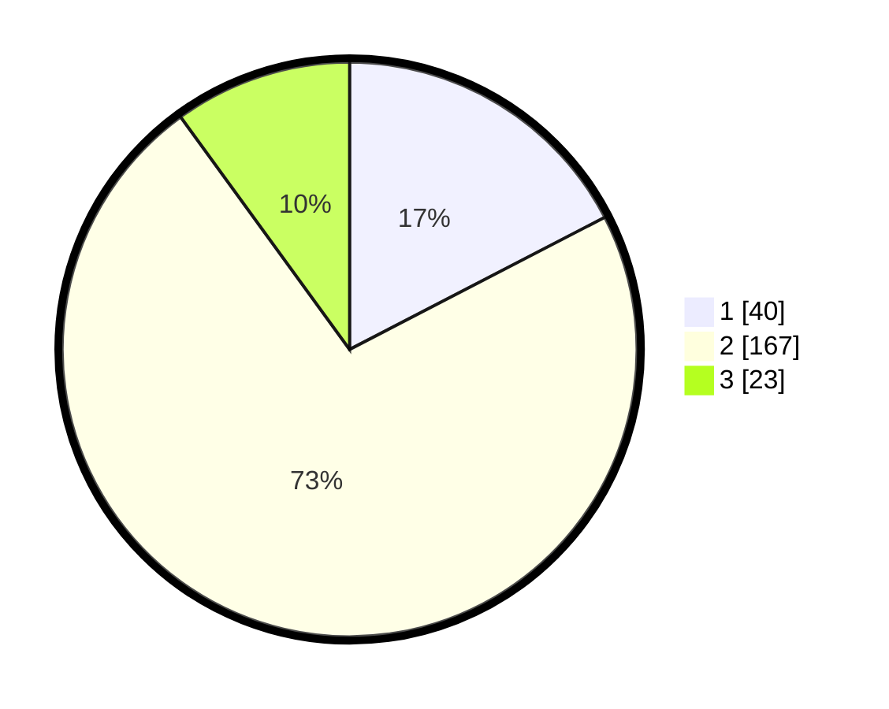

# Hasil

## Grafik

## Tabel

| No. | Nama Paslon    | Suara | Suara (raw) | Persentase |
|:--- |:-------------- | -----:| -----------:| ----------:|
| 1   | ANIES MUHAIMIN | 40    | [40][p-1]   | 17,39      |
| 2   | PRABOWO GIBRAN | 167   | [167][p-2]  | 72,61      |
| 3   | GANJAR MAHFUD  | 23    | [23][p-3]   | 10,00      |

[p-1]: https://github.com/gigit-pemilu/pemilu-2024/blob/main/pilpres/hitung-suara/sub/18-lampung/sub/01-lampung-selatan/sub/18-merbau-mataram/sub/2001-merbau-mataram/sub/008-tps/sub/paslon-1.txt
[p-2]: https://github.com/gigit-pemilu/pemilu-2024/blob/main/pilpres/hitung-suara/sub/18-lampung/sub/01-lampung-selatan/sub/18-merbau-mataram/sub/2001-merbau-mataram/sub/008-tps/sub/paslon-2.txt
[p-3]: https://github.com/gigit-pemilu/pemilu-2024/blob/main/pilpres/hitung-suara/sub/18-lampung/sub/01-lampung-selatan/sub/18-merbau-mataram/sub/2001-merbau-mataram/sub/008-tps/sub/paslon-3.txt

## Foto C Plano

https://sirekap-obj-formc.kpu.go.id/b245/pemilu/ppwp/18/01/18/20/01/1801182001008-20240214-232916--f8c8986a-0e6c-4f33-ab47-cdfa8083469d.jpg

https://sirekap-obj-formc.kpu.go.id/b245/pemilu/ppwp/18/01/18/20/01/1801182001008-20240216-052023--a653eaf0-84fe-4b0a-bdcd-b006e56a03b4.jpg

https://sirekap-obj-formc.kpu.go.id/b245/pemilu/ppwp/18/01/18/20/01/1801182001008-20240214-233140--3e75fd60-fb79-44f2-85f5-64da385c9362.jpg

## Metadata

| Key        | Value               |
| ---------- | ------------------- |
| Time Stamp | 2024-02-16 16:25:10 |

