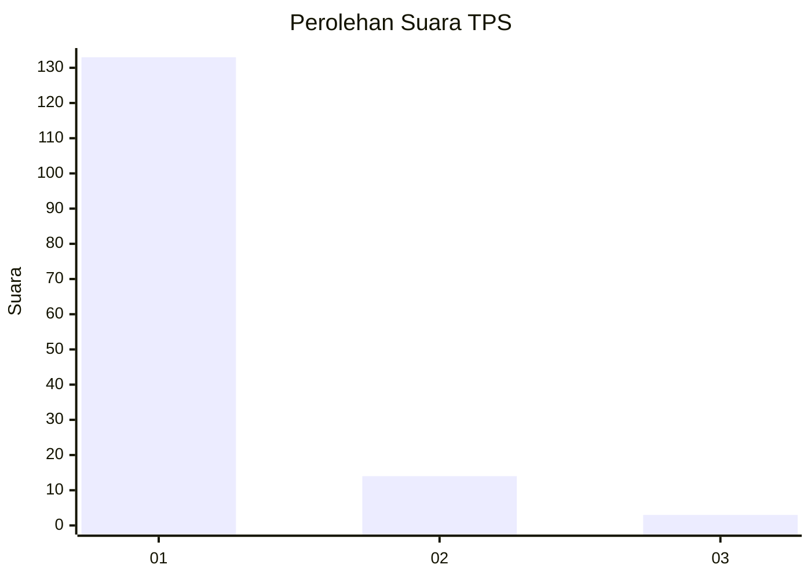
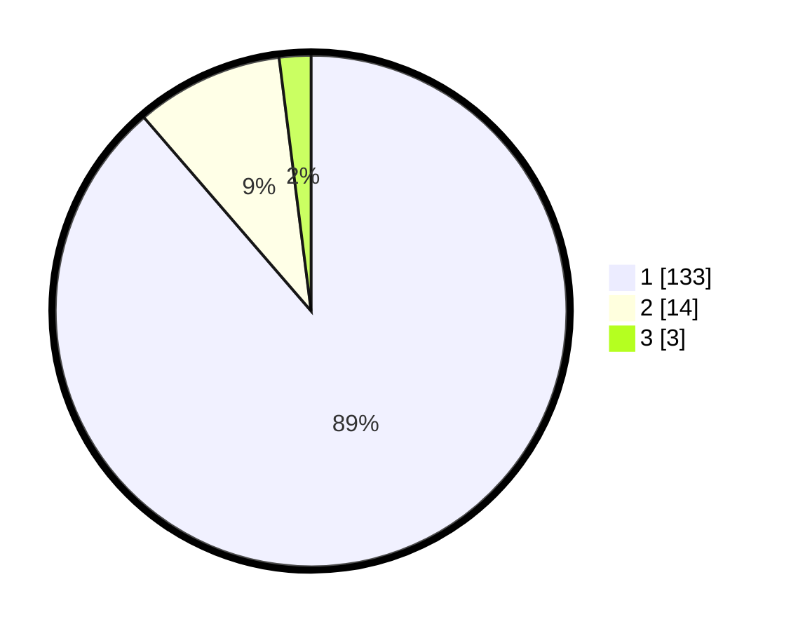

# Hasil

## Grafik

## Tabel

| No. | Nama Paslon    | Suara | Suara (raw) | Persentase |
|:--- |:-------------- | -----:| -----------:| ----------:|
| 1   | ANIES MUHAIMIN | 133   | [133][p-1]  | 88,67      |
| 2   | PRABOWO GIBRAN | 14    | [14][p-2]   | 9,33       |
| 3   | GANJAR MAHFUD  | 3     | [3][p-3]    | 2,00       |

[p-1]: https://github.com/gigit-pemilu/pemilu-2024-18-lampung/blob/main/pilpres/hitung-suara/sub/18-lampung/sub/02-lampung-tengah/sub/01-kalirejo/sub/2003-kalirejo/sub/011-tps/sub/paslon-1.txt
[p-2]: https://github.com/gigit-pemilu/pemilu-2024-18-lampung/blob/main/pilpres/hitung-suara/sub/18-lampung/sub/02-lampung-tengah/sub/01-kalirejo/sub/2003-kalirejo/sub/011-tps/sub/paslon-2.txt
[p-3]: https://github.com/gigit-pemilu/pemilu-2024-18-lampung/blob/main/pilpres/hitung-suara/sub/18-lampung/sub/02-lampung-tengah/sub/01-kalirejo/sub/2003-kalirejo/sub/011-tps/sub/paslon-3.txt

## Foto C Plano

https://sirekap-obj-formc.kpu.go.id/a02a/pemilu/ppwp/18/02/01/20/03/1802012003011-20240214-191958--3ada2216-bafd-4af4-9aee-065baf13a3bf.jpg

https://sirekap-obj-formc.kpu.go.id/a02a/pemilu/ppwp/18/02/01/20/03/1802012003011-20240214-191948--e9cb78ff-145e-4680-8485-0b09a6172553.jpg

https://sirekap-obj-formc.kpu.go.id/a02a/pemilu/ppwp/18/02/01/20/03/1802012003011-20240214-192054--03101827-b97d-4ed5-a763-80880f18423d.jpg

## Metadata

| Key        | Value               |
| ---------- | ------------------- |
| Time Stamp | 2024-02-17 16:00:02 |

## DATA PEMILIH TETAP

Jumlah pemilih dalam DPT: **268**.
 * L: **34**.
 * P: **234**.

## DATA PENGGUNA HAK PILIH

Jumlah pengguna hak pilih dalam DPT: **240**.
 * L: **0**.
 * P: **899**.

Jumlah pengguna hak pilih dalam DPTb: **433**.
 * L: **448**.
 * P: **444**.

Jumlah pengguna hak pilih dalam DPK: **886**.
 * L: **888**.
 * P: **884**.

Jumlah pengguna hak pilih: **240**.
 * L: **44**.
 * P: **490**.

## JUMLAH SUARA SAH DAN TIDAK SAH

JUMLAH SELURUH SUARA SAH: **210**.

JUMLAH SUARA TIDAK SAH: **1**.

JUMLAH SELURUH SUARA SAH DAN SUARA TIDAK SAH: **211**.

