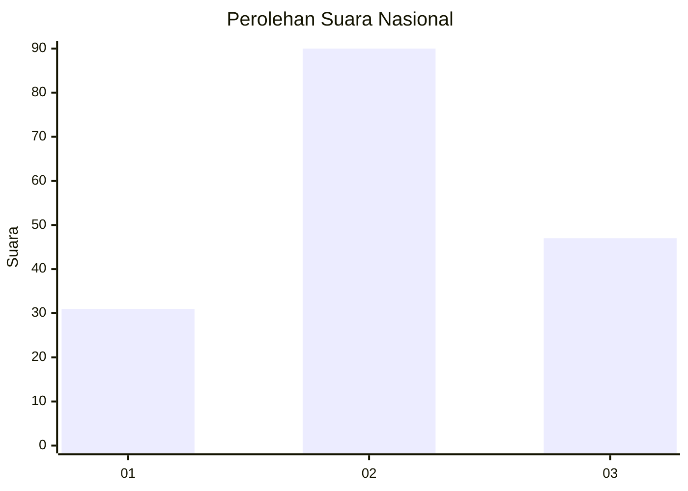
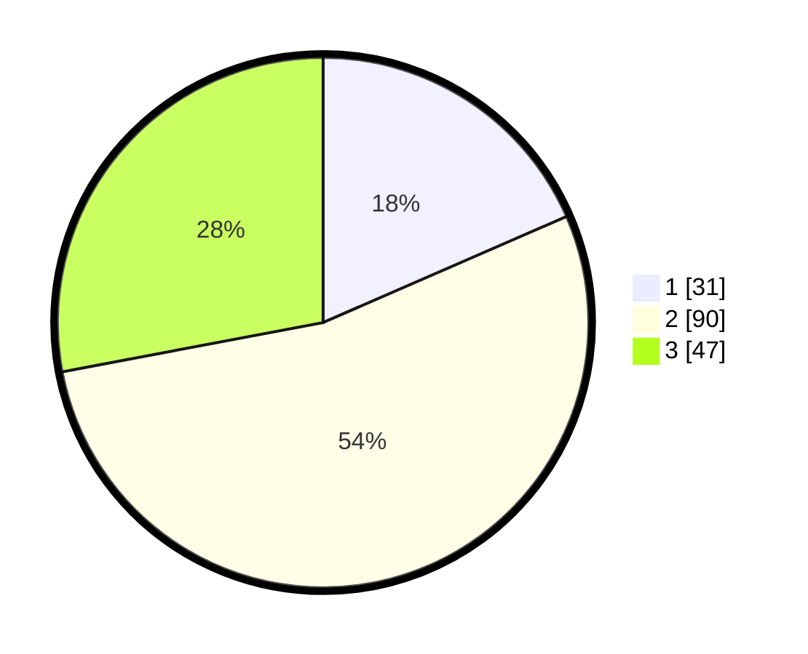

# Hasil

## Grafik

## Tabel

| No. | Nama Paslon    | Suara | Suara (raw) | Persentase |
|:--- |:-------------- | -----:| -----------:| ----------:|
| 1   | ANIES MUHAIMIN | 31    | [31][p-1]   | 18,45      |
| 2   | PRABOWO GIBRAN | 90    | [90][p-2]   | 53,57      |
| 3   | GANJAR MAHFUD  | 47    | [47][p-3]   | 27,98      |

[p-1]: https://github.com/gigit-pemilu/pemilu-2024/blob/main/pilpres/hitung-suara/sub/18-lampung/sub/02-lampung-tengah/sub/02-bangun-rejo/sub/2001-purwodadi/sub/002-tps/sub/paslon-1.txt
[p-2]: https://github.com/gigit-pemilu/pemilu-2024/blob/main/pilpres/hitung-suara/sub/18-lampung/sub/02-lampung-tengah/sub/02-bangun-rejo/sub/2001-purwodadi/sub/002-tps/sub/paslon-2.txt
[p-3]: https://github.com/gigit-pemilu/pemilu-2024/blob/main/pilpres/hitung-suara/sub/18-lampung/sub/02-lampung-tengah/sub/02-bangun-rejo/sub/2001-purwodadi/sub/002-tps/sub/paslon-3.txt

## Foto C Plano

https://sirekap-obj-formc.kpu.go.id/a829/pemilu/ppwp/18/02/02/20/01/1802022001002-20240215-054912--cfcb9f03-34e2-4e1c-9ab3-ee5a99fa897e.jpg

https://sirekap-obj-formc.kpu.go.id/a829/pemilu/ppwp/18/02/02/20/01/1802022001002-20240215-000540--346a4481-77a5-4dbb-9805-66c99bdb095d.jpg

https://sirekap-obj-formc.kpu.go.id/a829/pemilu/ppwp/18/02/02/20/01/1802022001002-20240215-055303--4758a8d8-7ed1-43c4-9683-8407cfc8c41b.jpg

## Metadata

| Key        | Value               |
| ---------- | ------------------- |
| Time Stamp | 2024-02-16 22:30:00 |

