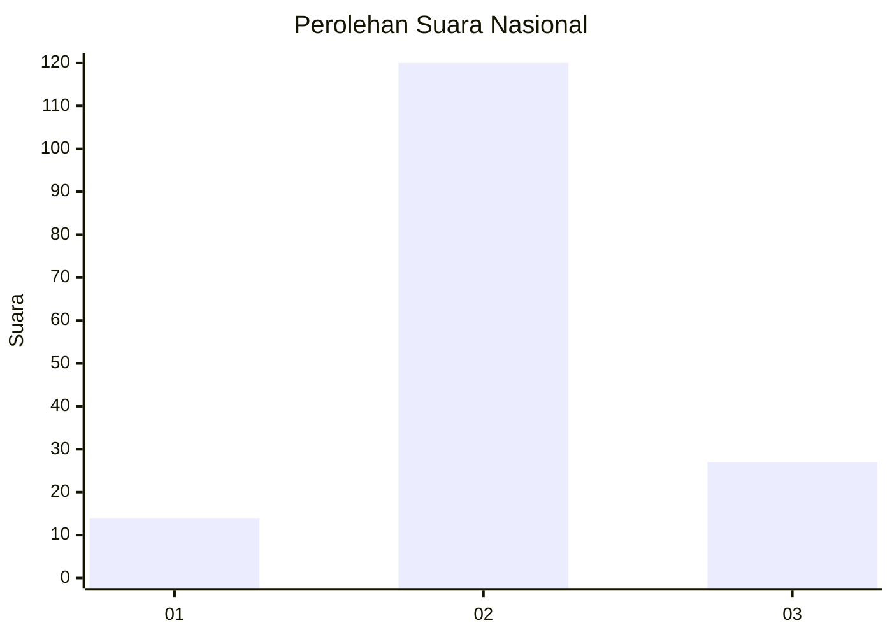
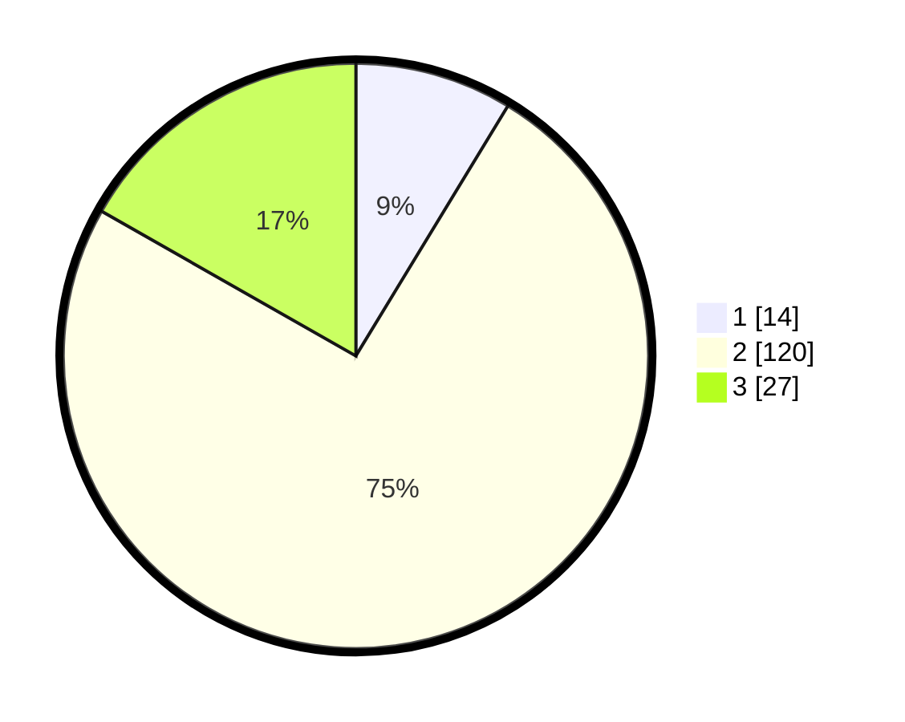

# Hasil

## Grafik

## Tabel

| No. | Nama Paslon    | Suara | Suara (raw) | Persentase |
|:--- |:-------------- | -----:| -----------:| ----------:|
| 1   | ANIES MUHAIMIN | 14    | [14][p-1]   | 8,70       |
| 2   | PRABOWO GIBRAN | 120   | [120][p-2]  | 74,53      |
| 3   | GANJAR MAHFUD  | 27    | [27][p-3]   | 16,77      |

[p-1]: https://github.com/gigit-pemilu/pemilu-2024/blob/main/pilpres/hitung-suara/sub/18-lampung/sub/02-lampung-tengah/sub/02-bangun-rejo/sub/2001-purwodadi/sub/004-tps/sub/paslon-1.txt
[p-2]: https://github.com/gigit-pemilu/pemilu-2024/blob/main/pilpres/hitung-suara/sub/18-lampung/sub/02-lampung-tengah/sub/02-bangun-rejo/sub/2001-purwodadi/sub/004-tps/sub/paslon-2.txt
[p-3]: https://github.com/gigit-pemilu/pemilu-2024/blob/main/pilpres/hitung-suara/sub/18-lampung/sub/02-lampung-tengah/sub/02-bangun-rejo/sub/2001-purwodadi/sub/004-tps/sub/paslon-3.txt

## Foto C Plano

https://sirekap-obj-formc.kpu.go.id/e414/pemilu/ppwp/18/02/02/20/01/1802022001004-20240214-194443--85765df2-64bf-4d04-9dd2-e378d7a33990.jpg

https://sirekap-obj-formc.kpu.go.id/e414/pemilu/ppwp/18/02/02/20/01/1802022001004-20240214-203539--7862e17c-7445-48d8-8069-abc0dc31f458.jpg

https://sirekap-obj-formc.kpu.go.id/e414/pemilu/ppwp/18/02/02/20/01/1802022001004-20240214-203655--411b8dac-117c-4e6c-8df9-3eb8c5ec9b64.jpg

## Metadata

| Key        | Value               |
| ---------- | ------------------- |
| Time Stamp | 2024-02-14 21:46:01 |

