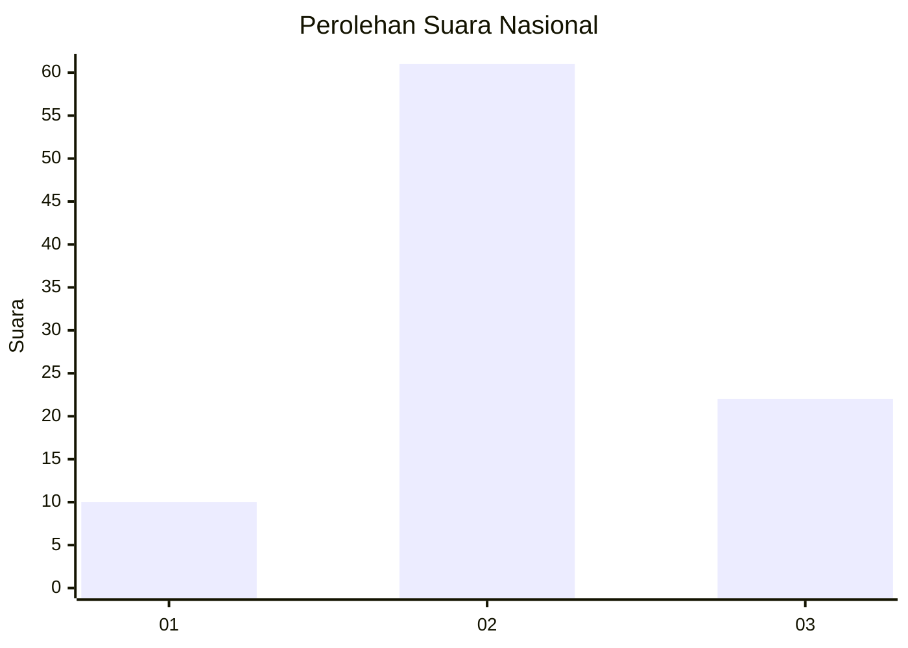
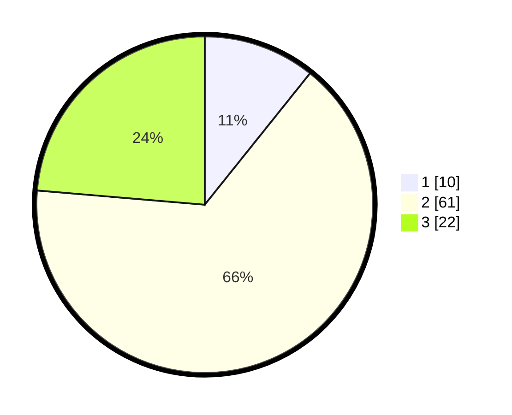

# Hasil

## Grafik

## Tabel

| No. | Nama Paslon    | Suara | Suara (raw) | Persentase |
|:--- |:-------------- | -----:| -----------:| ----------:|
| 1   | ANIES MUHAIMIN | 10    | [10][p-1]   | 10,75      |
| 2   | PRABOWO GIBRAN | 61    | [61][p-2]   | 65,59      |
| 3   | GANJAR MAHFUD  | 22    | [22][p-3]   | 23,66      |

[p-1]: https://github.com/gigit-pemilu/pemilu-2024/blob/main/pilpres/hitung-suara/sub/18-lampung/sub/02-lampung-tengah/sub/02-bangun-rejo/sub/2008-timbul-rejo/sub/002-tps/sub/paslon-1.txt
[p-2]: https://github.com/gigit-pemilu/pemilu-2024/blob/main/pilpres/hitung-suara/sub/18-lampung/sub/02-lampung-tengah/sub/02-bangun-rejo/sub/2008-timbul-rejo/sub/002-tps/sub/paslon-2.txt
[p-3]: https://github.com/gigit-pemilu/pemilu-2024/blob/main/pilpres/hitung-suara/sub/18-lampung/sub/02-lampung-tengah/sub/02-bangun-rejo/sub/2008-timbul-rejo/sub/002-tps/sub/paslon-3.txt

## Foto C Plano

https://sirekap-obj-formc.kpu.go.id/83f6/pemilu/ppwp/18/02/02/20/08/1802022008002-20240223-173302--f7715e40-f9c0-4bcf-9183-65a209ab6395.jpg

https://sirekap-obj-formc.kpu.go.id/83f6/pemilu/ppwp/18/02/02/20/08/1802022008002-20240223-173309--fb874031-902e-484a-a8fd-937d978411f9.jpg

https://sirekap-obj-formc.kpu.go.id/83f6/pemilu/ppwp/18/02/02/20/08/1802022008002-20240223-173317--6d60f207-c823-422b-ae31-bd71ee5a6014.jpg

## Metadata

| Key        | Value               |
| ---------- | ------------------- |
| Time Stamp | 2024-02-24 22:31:28 |

