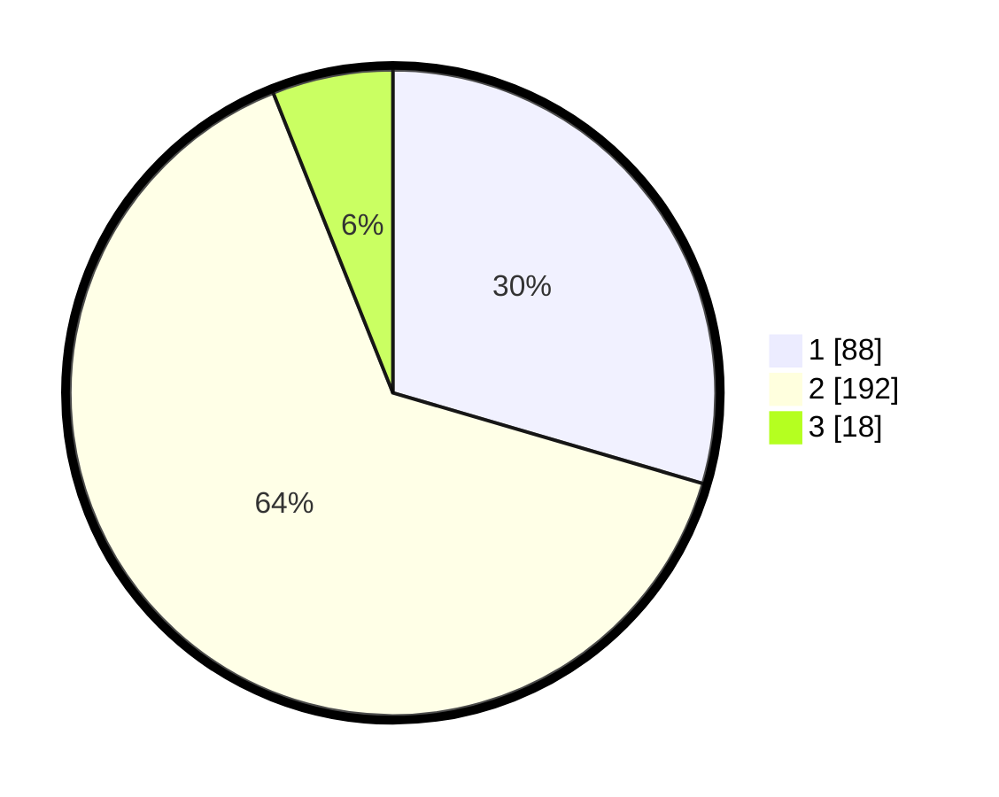

# Hasil

## Grafik

## Tabel

| No. | Nama Paslon    | Suara | Suara (raw) | Persentase |
|:--- |:-------------- | -----:| -----------:| ----------:|
| 1   | ANIES MUHAIMIN | 88    | [88][p-1]   | 29,53      |
| 2   | PRABOWO GIBRAN | 192   | [192][p-2]  | 64,43      |
| 3   | GANJAR MAHFUD  | 18    | [18][p-3]   | 6,04       |

[p-1]: https://github.com/gigit-pemilu/pemilu-2024-18-lampung/blob/main/pilpres/hitung-suara/sub/18-lampung/sub/02-lampung-tengah/sub/03-padang-ratu/sub/2019-mojokerto/sub/008-tps/sub/paslon-1.txt
[p-2]: https://github.com/gigit-pemilu/pemilu-2024-18-lampung/blob/main/pilpres/hitung-suara/sub/18-lampung/sub/02-lampung-tengah/sub/03-padang-ratu/sub/2019-mojokerto/sub/008-tps/sub/paslon-2.txt
[p-3]: https://github.com/gigit-pemilu/pemilu-2024-18-lampung/blob/main/pilpres/hitung-suara/sub/18-lampung/sub/02-lampung-tengah/sub/03-padang-ratu/sub/2019-mojokerto/sub/008-tps/sub/paslon-3.txt

## Foto C Plano

https://sirekap-obj-formc.kpu.go.id/1b81/pemilu/ppwp/18/02/03/20/19/1802032019008-20240215-153823--d6ca27e2-ba05-4a18-9864-0a4a4af90a0e.jpg

https://sirekap-obj-formc.kpu.go.id/1b81/pemilu/ppwp/18/02/03/20/19/1802032019008-20240215-154833--e967cd3b-b0e2-4e1f-9b0c-6baddb9a3b9a.jpg

https://sirekap-obj-formc.kpu.go.id/1b81/pemilu/ppwp/18/02/03/20/19/1802032019008-20240215-154018--6cf9ec91-67ba-4e0d-9bb5-5ff330e66008.jpg

## Metadata

| Key        | Value               |
| ---------- | ------------------- |
| Time Stamp | 2024-02-15 22:30:27 |

