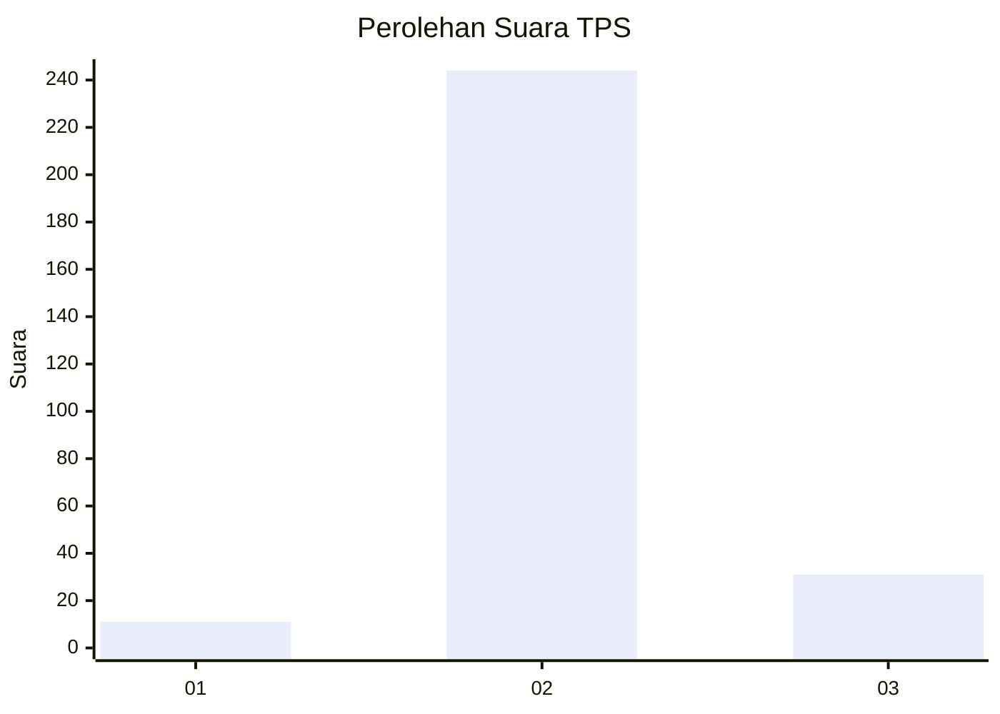
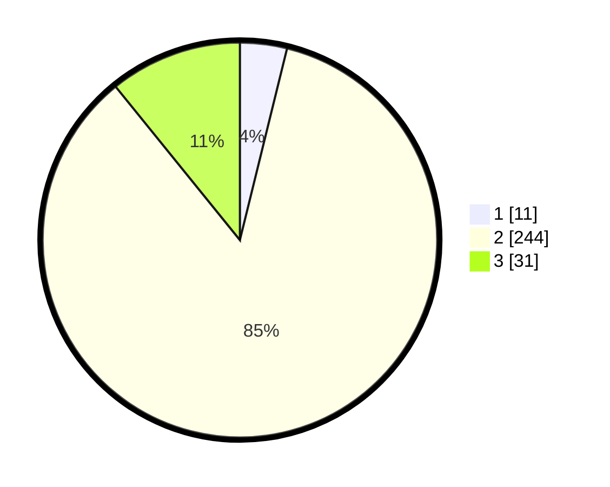

# Hasil

## Grafik

## Tabel

| No. | Nama Paslon    | Suara | Suara (raw) | Persentase |
|:--- |:-------------- | -----:| -----------:| ----------:|
| 1   | ANIES MUHAIMIN | 11    | [11][p-1]   | 3,85       |
| 2   | PRABOWO GIBRAN | 244   | [244][p-2]  | 85,31      |
| 3   | GANJAR MAHFUD  | 31    | [31][p-3]   | 10,84      |

[p-1]: https://github.com/gigit-pemilu/pemilu-2024-18-lampung/blob/main/pilpres/hitung-suara/sub/18-lampung/sub/02-lampung-tengah/sub/04-gunung-sugih/sub/2009-buyut-udik/sub/902-tps/sub/paslon-1.txt
[p-2]: https://github.com/gigit-pemilu/pemilu-2024-18-lampung/blob/main/pilpres/hitung-suara/sub/18-lampung/sub/02-lampung-tengah/sub/04-gunung-sugih/sub/2009-buyut-udik/sub/902-tps/sub/paslon-2.txt
[p-3]: https://github.com/gigit-pemilu/pemilu-2024-18-lampung/blob/main/pilpres/hitung-suara/sub/18-lampung/sub/02-lampung-tengah/sub/04-gunung-sugih/sub/2009-buyut-udik/sub/902-tps/sub/paslon-3.txt

## Foto C Plano

https://sirekap-obj-formc.kpu.go.id/42cb/pemilu/ppwp/18/02/04/20/09/1802042009902-20240223-163409--f70b6b3e-c940-4e9d-825d-524ac29947fe.jpg

https://sirekap-obj-formc.kpu.go.id/42cb/pemilu/ppwp/18/02/04/20/09/1802042009902-20240223-163415--20b68e41-911d-4a0e-b2ef-80bf84781452.jpg

https://sirekap-obj-formc.kpu.go.id/42cb/pemilu/ppwp/18/02/04/20/09/1802042009902-20240223-163420--f28c94d1-fc33-484a-bb55-76b63abae334.jpg

## Metadata

| Key        | Value               |
| ---------- | ------------------- |
| Time Stamp | 2024-02-24 22:31:28 |

