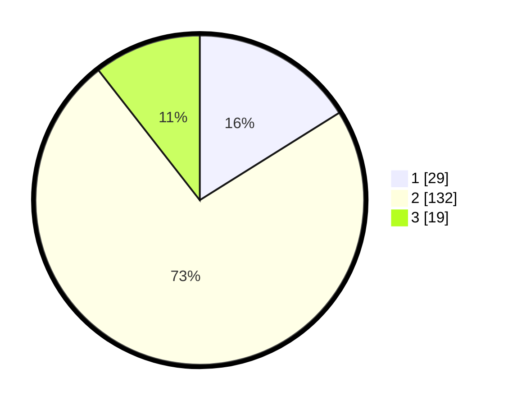

# Hasil

## Grafik

## Tabel

| No. | Nama Paslon    | Suara | Suara (raw) | Persentase |
|:--- |:-------------- | -----:| -----------:| ----------:|
| 1   | ANIES MUHAIMIN | 29    | [29][p-1]   | 16,11      |
| 2   | PRABOWO GIBRAN | 132   | [132][p-2]  | 73,33      |
| 3   | GANJAR MAHFUD  | 19    | [19][p-3]   | 10,56      |

[p-1]: https://github.com/gigit-pemilu/pemilu-2024-18-lampung/blob/main/pilpres/hitung-suara/sub/18-lampung/sub/02-lampung-tengah/sub/05-trimurjo/sub/1003-adi-puro/sub/004-tps/sub/paslon-1.txt
[p-2]: https://github.com/gigit-pemilu/pemilu-2024-18-lampung/blob/main/pilpres/hitung-suara/sub/18-lampung/sub/02-lampung-tengah/sub/05-trimurjo/sub/1003-adi-puro/sub/004-tps/sub/paslon-2.txt
[p-3]: https://github.com/gigit-pemilu/pemilu-2024-18-lampung/blob/main/pilpres/hitung-suara/sub/18-lampung/sub/02-lampung-tengah/sub/05-trimurjo/sub/1003-adi-puro/sub/004-tps/sub/paslon-3.txt

## Foto C Plano

https://sirekap-obj-formc.kpu.go.id/cc45/pemilu/ppwp/18/02/05/10/03/1802051003004-20240224-115141--3f9b291a-08bd-4b53-b29e-f5db2d183758.jpg

https://sirekap-obj-formc.kpu.go.id/cc45/pemilu/ppwp/18/02/05/10/03/1802051003004-20240224-115148--fbc738d4-4090-4b45-bae4-48ff0a605d7d.jpg

https://sirekap-obj-formc.kpu.go.id/cc45/pemilu/ppwp/18/02/05/10/03/1802051003004-20240224-115155--8a252b35-f26e-4f82-b06f-8c9a6549a973.jpg

## Metadata

| Key        | Value               |
| ---------- | ------------------- |
| Time Stamp | 2024-02-25 16:00:00 |

