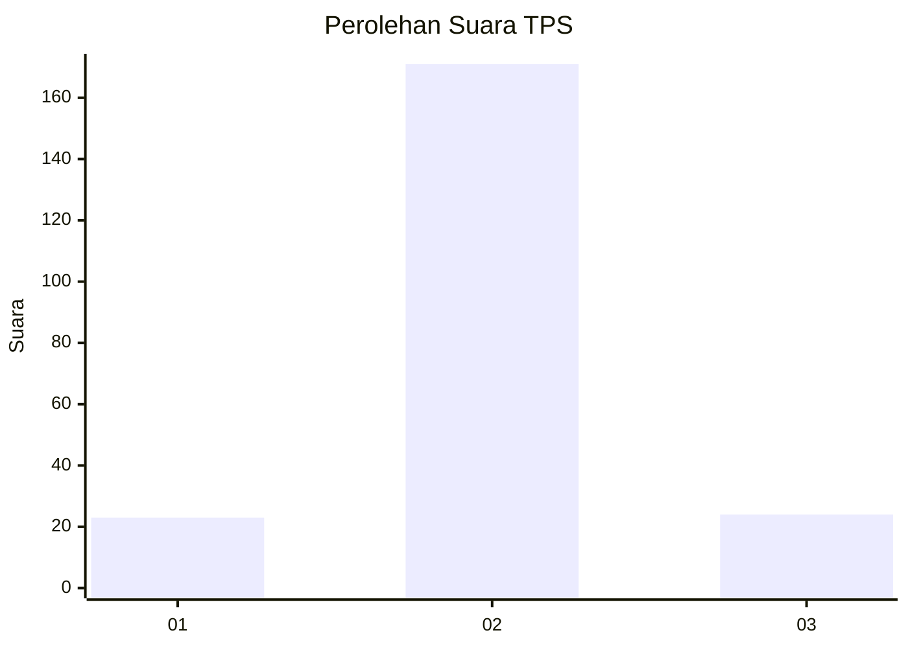
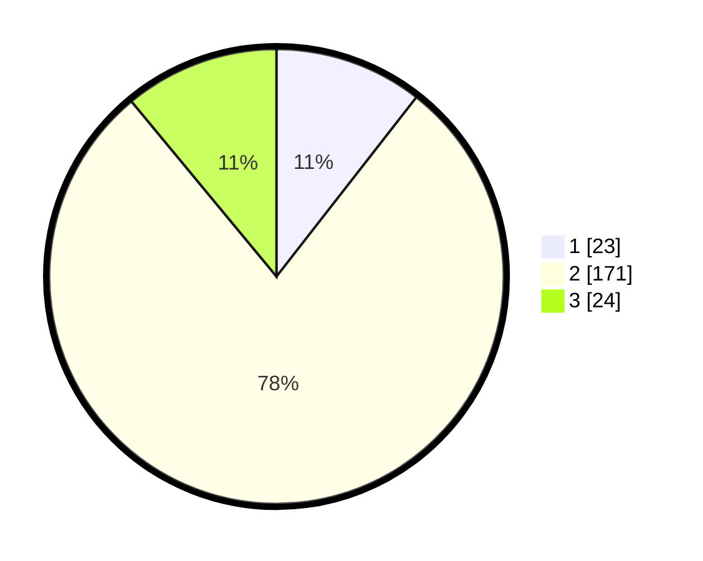

# Hasil

## Grafik

## Tabel

| No. | Nama Paslon    | Suara | Suara (raw) | Persentase |
|:--- |:-------------- | -----:| -----------:| ----------:|
| 1   | ANIES MUHAIMIN | 23    | [23][p-1]   | 10,55      |
| 2   | PRABOWO GIBRAN | 171   | [171][p-2]  | 78,44      |
| 3   | GANJAR MAHFUD  | 24    | [24][p-3]   | 11,01      |

[p-1]: https://github.com/gigit-pemilu/pemilu-2024-18-lampung/blob/main/pilpres/hitung-suara/sub/18-lampung/sub/02-lampung-tengah/sub/08-seputih-raman/sub/2001-rejo-basuki/sub/001-tps/sub/paslon-1.txt
[p-2]: https://github.com/gigit-pemilu/pemilu-2024-18-lampung/blob/main/pilpres/hitung-suara/sub/18-lampung/sub/02-lampung-tengah/sub/08-seputih-raman/sub/2001-rejo-basuki/sub/001-tps/sub/paslon-2.txt
[p-3]: https://github.com/gigit-pemilu/pemilu-2024-18-lampung/blob/main/pilpres/hitung-suara/sub/18-lampung/sub/02-lampung-tengah/sub/08-seputih-raman/sub/2001-rejo-basuki/sub/001-tps/sub/paslon-3.txt

## Foto C Plano

https://sirekap-obj-formc.kpu.go.id/833c/pemilu/ppwp/18/02/08/20/01/1802082001001-20240225-104751--7fd45056-62b7-47ad-bed1-c10c4cd923a3.jpg

https://sirekap-obj-formc.kpu.go.id/833c/pemilu/ppwp/18/02/08/20/01/1802082001001-20240225-104801--13cf8eca-9168-4abf-9272-0bd5079f6657.jpg

https://sirekap-obj-formc.kpu.go.id/833c/pemilu/ppwp/18/02/08/20/01/1802082001001-20240225-104814--b5e01a26-9050-44f2-b959-e3cbbe1d9fc3.jpg

## Metadata

| Key        | Value               |
| ---------- | ------------------- |
| Time Stamp | 2024-02-25 17:00:00 |

