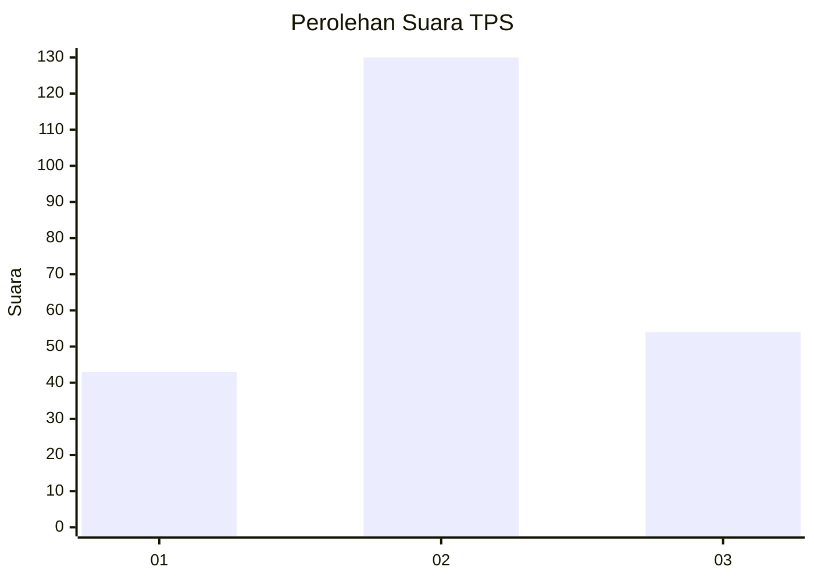
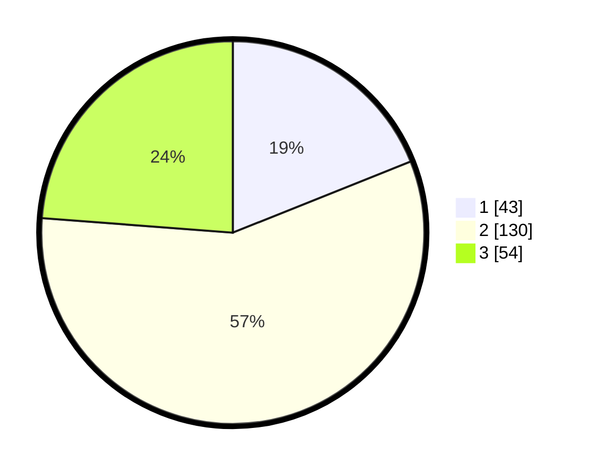

# Hasil

## Grafik

## Tabel

| No. | Nama Paslon    | Suara | Suara (raw) | Persentase |
|:--- |:-------------- | -----:| -----------:| ----------:|
| 1   | ANIES MUHAIMIN | 43    | [43][p-1]   | 18,94      |
| 2   | PRABOWO GIBRAN | 130   | [130][p-2]  | 57,27      |
| 3   | GANJAR MAHFUD  | 54    | [54][p-3]   | 23,79      |

[p-1]: https://github.com/gigit-pemilu/pemilu-2024-18-lampung/blob/main/pilpres/hitung-suara/sub/18-lampung/sub/02-lampung-tengah/sub/11-seputih-mataram/sub/2001-fajar-mataram/sub/001-tps/sub/paslon-1.txt
[p-2]: https://github.com/gigit-pemilu/pemilu-2024-18-lampung/blob/main/pilpres/hitung-suara/sub/18-lampung/sub/02-lampung-tengah/sub/11-seputih-mataram/sub/2001-fajar-mataram/sub/001-tps/sub/paslon-2.txt
[p-3]: https://github.com/gigit-pemilu/pemilu-2024-18-lampung/blob/main/pilpres/hitung-suara/sub/18-lampung/sub/02-lampung-tengah/sub/11-seputih-mataram/sub/2001-fajar-mataram/sub/001-tps/sub/paslon-3.txt

## Foto C Plano

https://sirekap-obj-formc.kpu.go.id/2960/pemilu/ppwp/18/02/11/20/01/1802112001001-20240224-160306--91e65e93-76d8-43f7-99cf-35135f12b205.jpg

https://sirekap-obj-formc.kpu.go.id/2960/pemilu/ppwp/18/02/11/20/01/1802112001001-20240224-160314--394c8d09-701c-417d-af15-0607e39879d0.jpg

https://sirekap-obj-formc.kpu.go.id/2960/pemilu/ppwp/18/02/11/20/01/1802112001001-20240224-160322--01b64acf-a690-4c09-b9e4-ded00f8ff7f4.jpg

## Metadata

| Key        | Value               |
| ---------- | ------------------- |
| Time Stamp | 2024-02-27 15:00:00 |

