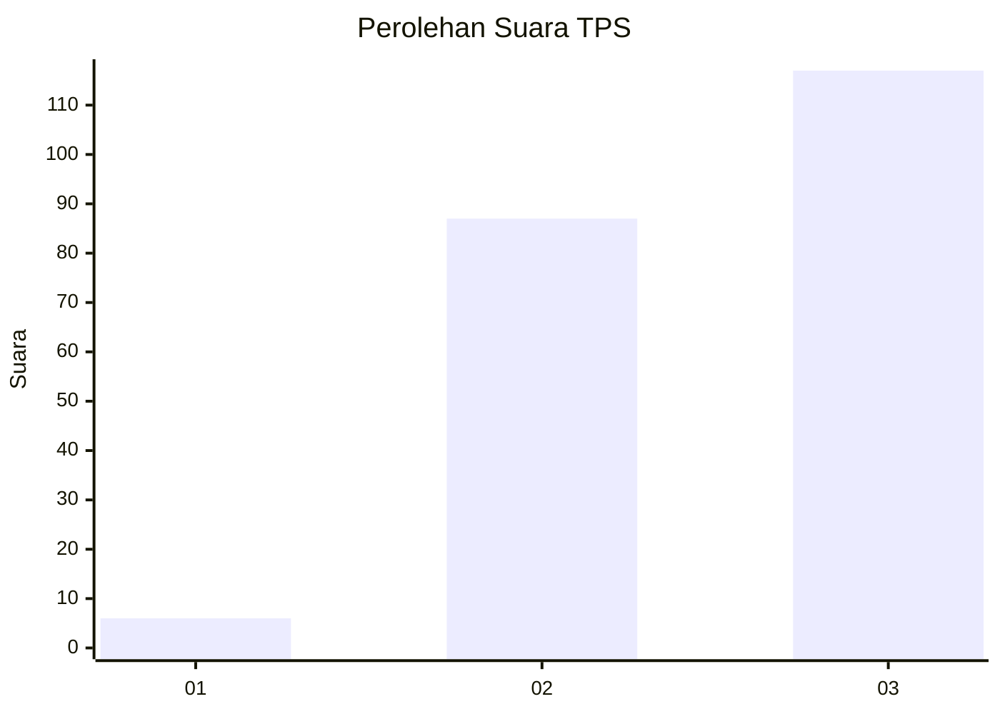
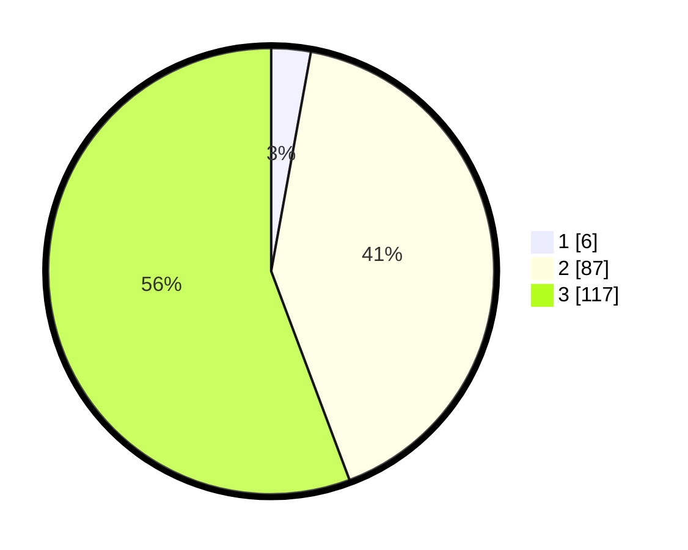

# Hasil

## Grafik

## Tabel

| No. | Nama Paslon    | Suara | Suara (raw) | Persentase |
|:--- |:-------------- | -----:| -----------:| ----------:|
| 1   | ANIES MUHAIMIN | 6     | [6][p-1]    | 2,86       |
| 2   | PRABOWO GIBRAN | 87    | [87][p-2]   | 41,43      |
| 3   | GANJAR MAHFUD  | 117   | [117][p-3]  | 55,71      |

[p-1]: https://github.com/gigit-pemilu/pemilu-2024-18-lampung/blob/main/pilpres/hitung-suara/sub/18-lampung/sub/02-lampung-tengah/sub/11-seputih-mataram/sub/2001-fajar-mataram/sub/005-tps/sub/paslon-1.txt
[p-2]: https://github.com/gigit-pemilu/pemilu-2024-18-lampung/blob/main/pilpres/hitung-suara/sub/18-lampung/sub/02-lampung-tengah/sub/11-seputih-mataram/sub/2001-fajar-mataram/sub/005-tps/sub/paslon-2.txt
[p-3]: https://github.com/gigit-pemilu/pemilu-2024-18-lampung/blob/main/pilpres/hitung-suara/sub/18-lampung/sub/02-lampung-tengah/sub/11-seputih-mataram/sub/2001-fajar-mataram/sub/005-tps/sub/paslon-3.txt

## Foto C Plano

https://sirekap-obj-formc.kpu.go.id/8729/pemilu/ppwp/18/02/11/20/01/1802112001005-20240224-162837--24f211f0-69e0-47b5-9eaa-630399273eb9.jpg

https://sirekap-obj-formc.kpu.go.id/8729/pemilu/ppwp/18/02/11/20/01/1802112001005-20240224-162845--1b88b2f8-a2eb-4cdb-80e9-9bd6438dc6e5.jpg

https://sirekap-obj-formc.kpu.go.id/8729/pemilu/ppwp/18/02/11/20/01/1802112001005-20240224-162853--9df4b5b5-da1d-4668-ab40-817122859b7b.jpg

## Metadata

| Key        | Value               |
| ---------- | ------------------- |
| Time Stamp | 2024-02-25 14:00:00 |

