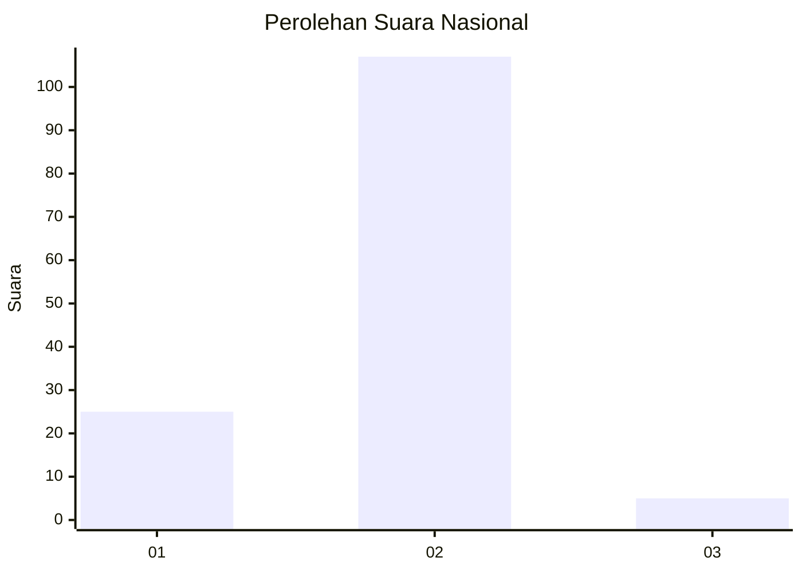
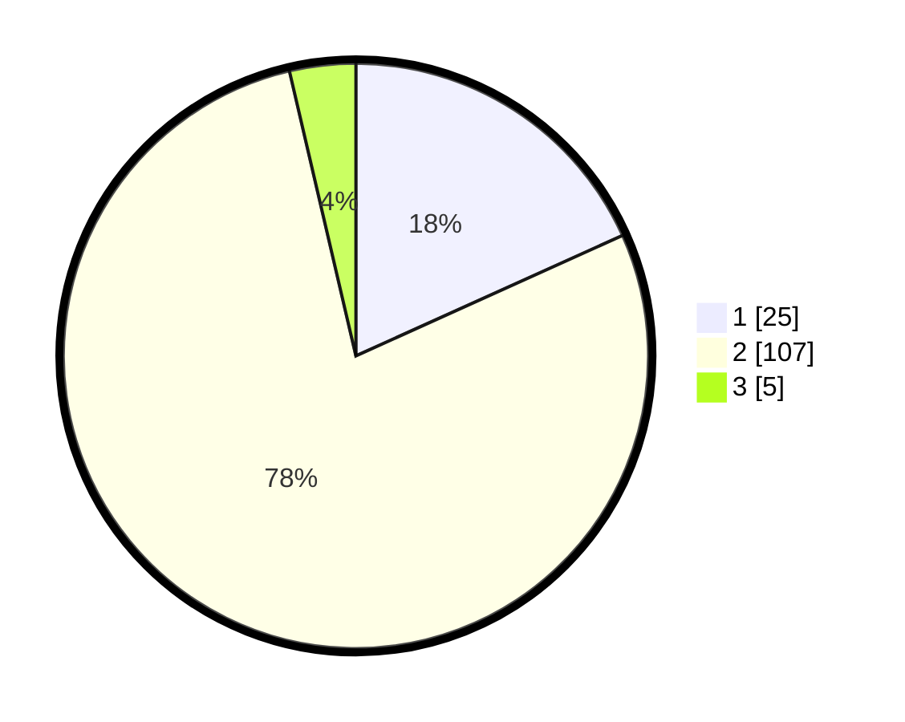

# Hasil

## Grafik

## Tabel

| No. | Nama Paslon    | Suara | Suara (raw) | Persentase |
|:--- |:-------------- | -----:| -----------:| ----------:|
| 1   | ANIES MUHAIMIN | 25    | [25][p-1]   | 18,25      |
| 2   | PRABOWO GIBRAN | 107   | [107][p-2]  | 78,10      |
| 3   | GANJAR MAHFUD  | 5     | [5][p-3]    | 3,65       |

[p-1]: https://github.com/gigit-pemilu/pemilu-2024/blob/main/pilpres/hitung-suara/sub/18-lampung/sub/02-lampung-tengah/sub/13-terusan-nunyai/sub/2001-gunung-batin-udik/sub/001-tps/sub/paslon-1.txt
[p-2]: https://github.com/gigit-pemilu/pemilu-2024/blob/main/pilpres/hitung-suara/sub/18-lampung/sub/02-lampung-tengah/sub/13-terusan-nunyai/sub/2001-gunung-batin-udik/sub/001-tps/sub/paslon-2.txt
[p-3]: https://github.com/gigit-pemilu/pemilu-2024/blob/main/pilpres/hitung-suara/sub/18-lampung/sub/02-lampung-tengah/sub/13-terusan-nunyai/sub/2001-gunung-batin-udik/sub/001-tps/sub/paslon-3.txt

## Foto C Plano

https://sirekap-obj-formc.kpu.go.id/0045/pemilu/ppwp/18/02/13/20/01/1802132001001-20240225-110658--09bde6a9-c7dc-4dd0-9d0a-4d98edeba349.jpg

https://sirekap-obj-formc.kpu.go.id/0045/pemilu/ppwp/18/02/13/20/01/1802132001001-20240225-112903--c2d50e12-3dce-484b-b7cc-7f9eda247b34.jpg

https://sirekap-obj-formc.kpu.go.id/0045/pemilu/ppwp/18/02/13/20/01/1802132001001-20240225-110835--25bedb0b-bff8-407c-8276-ba258908a4c6.jpg

## Metadata

| Key        | Value               |
| ---------- | ------------------- |
| Time Stamp | 2024-02-25 20:00:00 |

