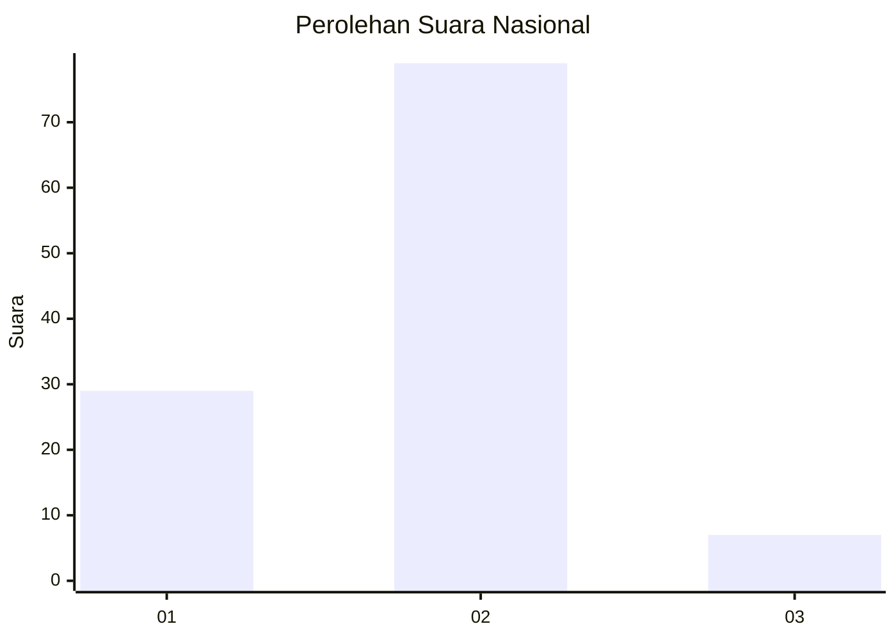
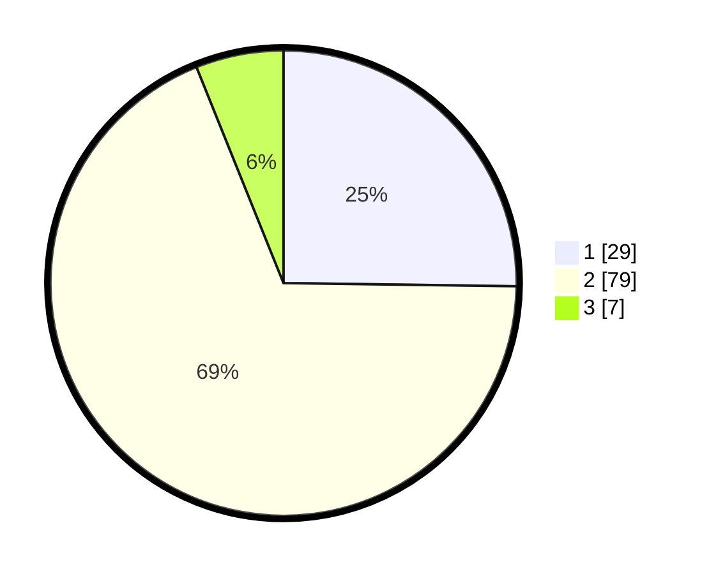

# Hasil

## Grafik

## Tabel

| No. | Nama Paslon    | Suara | Suara (raw) | Persentase |
|:--- |:-------------- | -----:| -----------:| ----------:|
| 1   | ANIES MUHAIMIN | 29    | [29][p-1]   | 25,22      |
| 2   | PRABOWO GIBRAN | 79    | [79][p-2]   | 68,70      |
| 3   | GANJAR MAHFUD  | 7     | [7][p-3]    | 6,09       |

[p-1]: https://github.com/gigit-pemilu/pemilu-2024/blob/main/pilpres/hitung-suara/sub/18-lampung/sub/02-lampung-tengah/sub/13-terusan-nunyai/sub/2001-gunung-batin-udik/sub/002-tps/sub/paslon-1.txt
[p-2]: https://github.com/gigit-pemilu/pemilu-2024/blob/main/pilpres/hitung-suara/sub/18-lampung/sub/02-lampung-tengah/sub/13-terusan-nunyai/sub/2001-gunung-batin-udik/sub/002-tps/sub/paslon-2.txt
[p-3]: https://github.com/gigit-pemilu/pemilu-2024/blob/main/pilpres/hitung-suara/sub/18-lampung/sub/02-lampung-tengah/sub/13-terusan-nunyai/sub/2001-gunung-batin-udik/sub/002-tps/sub/paslon-3.txt

## Foto C Plano

https://sirekap-obj-formc.kpu.go.id/7042/pemilu/ppwp/18/02/13/20/01/1802132001002-20240225-113029--1d473b96-8d83-413d-b534-b0e21cf872b1.jpg

https://sirekap-obj-formc.kpu.go.id/7042/pemilu/ppwp/18/02/13/20/01/1802132001002-20240225-113049--421b963f-a336-4252-9050-bac5f26bc2df.jpg

https://sirekap-obj-formc.kpu.go.id/7042/pemilu/ppwp/18/02/13/20/01/1802132001002-20240225-113103--c01ff2a7-9685-4130-9a3e-826d602bc33f.jpg

## Metadata

| Key        | Value               |
| ---------- | ------------------- |
| Time Stamp | 2024-02-25 22:00:00 |

