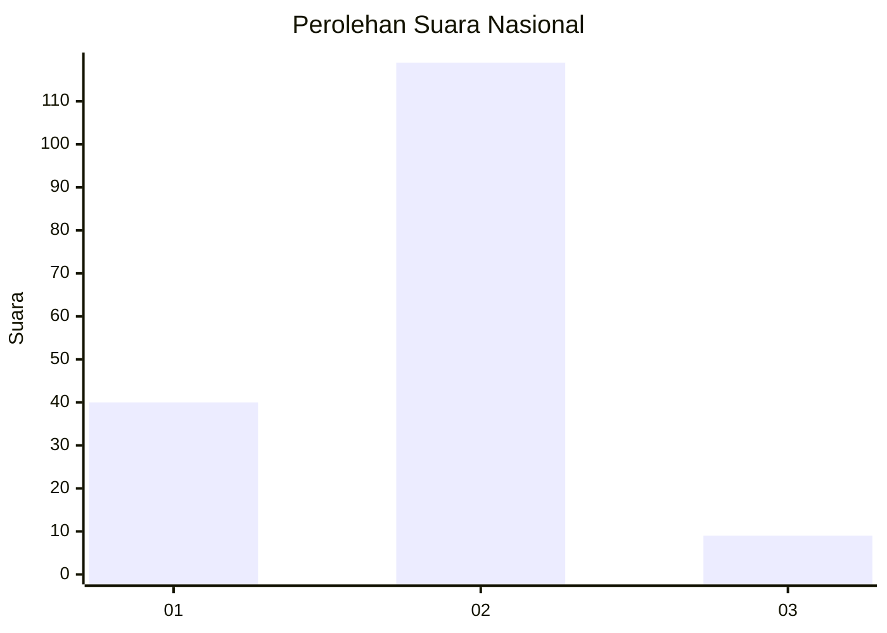
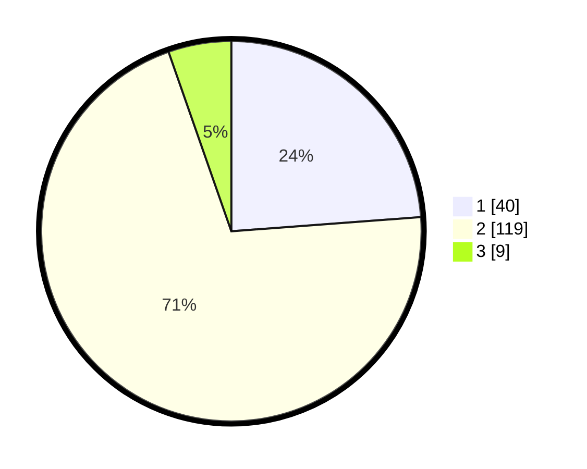

# Hasil

## Grafik

## Tabel

| No. | Nama Paslon    | Suara | Suara (raw) | Persentase |
|:--- |:-------------- | -----:| -----------:| ----------:|
| 1   | ANIES MUHAIMIN | 40    | [40][p-1]   | 23,81      |
| 2   | PRABOWO GIBRAN | 119   | [119][p-2]  | 70,83      |
| 3   | GANJAR MAHFUD  | 9     | [9][p-3]    | 5,36       |

[p-1]: https://github.com/gigit-pemilu/pemilu-2024/blob/main/pilpres/hitung-suara/sub/18-lampung/sub/02-lampung-tengah/sub/13-terusan-nunyai/sub/2001-gunung-batin-udik/sub/004-tps/sub/paslon-1.txt
[p-2]: https://github.com/gigit-pemilu/pemilu-2024/blob/main/pilpres/hitung-suara/sub/18-lampung/sub/02-lampung-tengah/sub/13-terusan-nunyai/sub/2001-gunung-batin-udik/sub/004-tps/sub/paslon-2.txt
[p-3]: https://github.com/gigit-pemilu/pemilu-2024/blob/main/pilpres/hitung-suara/sub/18-lampung/sub/02-lampung-tengah/sub/13-terusan-nunyai/sub/2001-gunung-batin-udik/sub/004-tps/sub/paslon-3.txt

## Foto C Plano

https://sirekap-obj-formc.kpu.go.id/dbc3/pemilu/ppwp/18/02/13/20/01/1802132001004-20240225-110914--b9dd56d7-db6f-4388-8f6d-cbe643e23ef9.jpg

https://sirekap-obj-formc.kpu.go.id/dbc3/pemilu/ppwp/18/02/13/20/01/1802132001004-20240225-110921--f95502d7-f896-464b-ae1d-67f0b46e2a8c.jpg

https://sirekap-obj-formc.kpu.go.id/dbc3/pemilu/ppwp/18/02/13/20/01/1802132001004-20240225-110929--1981fd40-9013-40e9-94ab-f85c9829ca4b.jpg

## Metadata

| Key        | Value               |
| ---------- | ------------------- |
| Time Stamp | 2024-02-25 17:00:00 |

