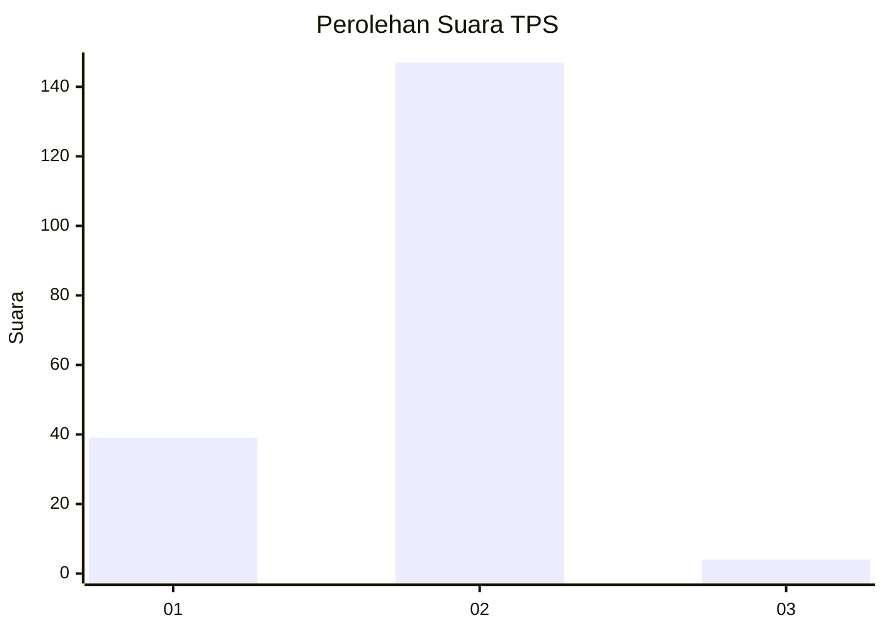
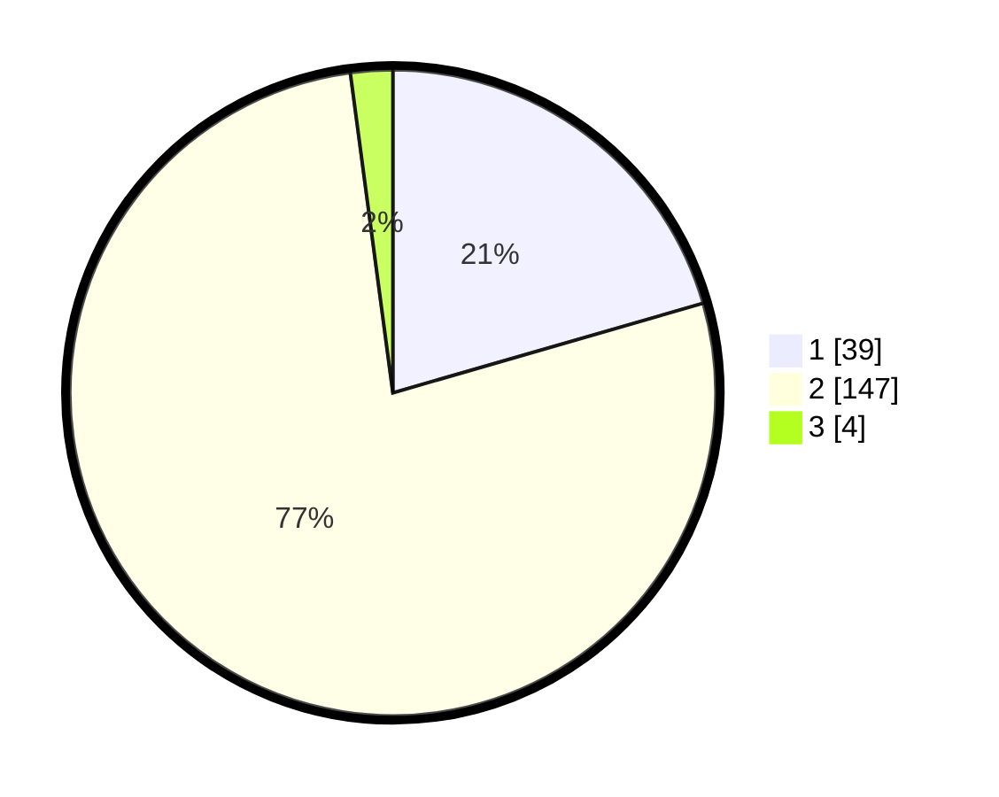

# Hasil

## Grafik

## Tabel

| No. | Nama Paslon    | Suara | Suara (raw) | Persentase |
|:--- |:-------------- | -----:| -----------:| ----------:|
| 1   | ANIES MUHAIMIN | 39    | [39][p-1]   | 20,53      |
| 2   | PRABOWO GIBRAN | 147   | [147][p-2]  | 77,37      |
| 3   | GANJAR MAHFUD  | 4     | [4][p-3]    | 2,11       |

[p-1]: https://github.com/gigit-pemilu/pemilu-2024-18-lampung/blob/main/pilpres/hitung-suara/sub/18-lampung/sub/02-lampung-tengah/sub/13-terusan-nunyai/sub/2001-gunung-batin-udik/sub/005-tps/sub/paslon-1.txt
[p-2]: https://github.com/gigit-pemilu/pemilu-2024-18-lampung/blob/main/pilpres/hitung-suara/sub/18-lampung/sub/02-lampung-tengah/sub/13-terusan-nunyai/sub/2001-gunung-batin-udik/sub/005-tps/sub/paslon-2.txt
[p-3]: https://github.com/gigit-pemilu/pemilu-2024-18-lampung/blob/main/pilpres/hitung-suara/sub/18-lampung/sub/02-lampung-tengah/sub/13-terusan-nunyai/sub/2001-gunung-batin-udik/sub/005-tps/sub/paslon-3.txt

## Foto C Plano

https://sirekap-obj-formc.kpu.go.id/3ce8/pemilu/ppwp/18/02/13/20/01/1802132001005-20240225-110940--24387303-e63d-4641-86d7-6ff31e965b95.jpg

https://sirekap-obj-formc.kpu.go.id/3ce8/pemilu/ppwp/18/02/13/20/01/1802132001005-20240225-110947--62f450a1-003c-42f5-b971-a83d1a526a09.jpg

https://sirekap-obj-formc.kpu.go.id/3ce8/pemilu/ppwp/18/02/13/20/01/1802132001005-20240225-110953--6341381d-4dd0-4c02-afe8-7e9545ef9bcc.jpg

## Metadata

| Key        | Value               |
| ---------- | ------------------- |
| Time Stamp | 2024-02-25 17:00:00 |

