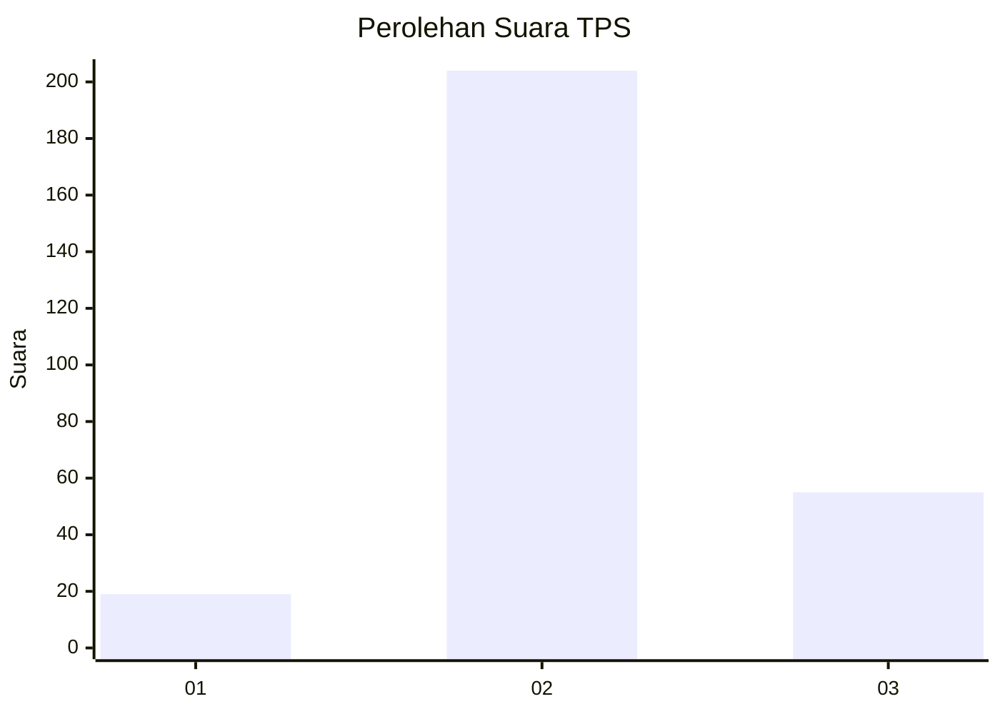
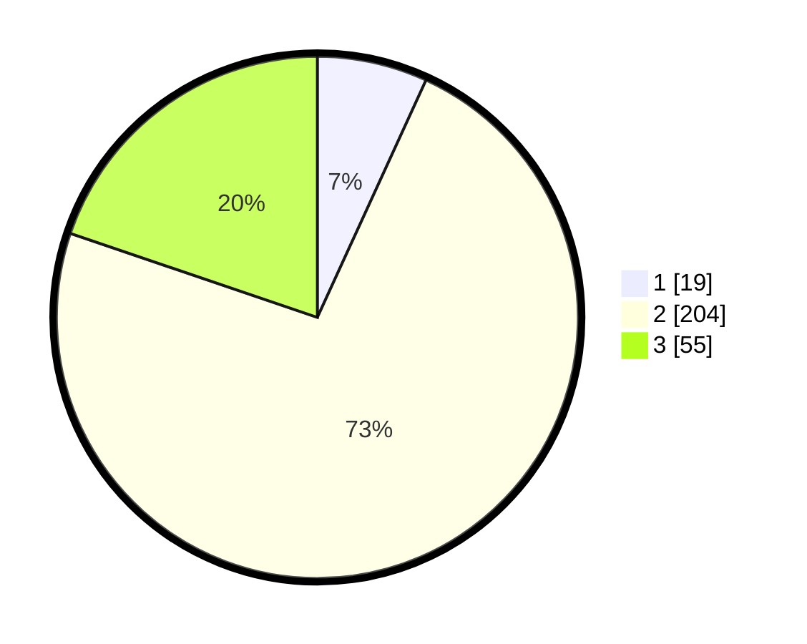

# Hasil

## Grafik

## Tabel

| No. | Nama Paslon    | Suara | Suara (raw) | Persentase |
|:--- |:-------------- | -----:| -----------:| ----------:|
| 1   | ANIES MUHAIMIN | 19    | [19][p-1]   | 6,83       |
| 2   | PRABOWO GIBRAN | 204   | [204][p-2]  | 73,38      |
| 3   | GANJAR MAHFUD  | 55    | [55][p-3]   | 19,78      |

[p-1]: https://github.com/gigit-pemilu/pemilu-2024-18-lampung/blob/main/pilpres/hitung-suara/sub/18-lampung/sub/02-lampung-tengah/sub/13-terusan-nunyai/sub/2004-gunung-agung/sub/006-tps/sub/paslon-1.txt
[p-2]: https://github.com/gigit-pemilu/pemilu-2024-18-lampung/blob/main/pilpres/hitung-suara/sub/18-lampung/sub/02-lampung-tengah/sub/13-terusan-nunyai/sub/2004-gunung-agung/sub/006-tps/sub/paslon-2.txt
[p-3]: https://github.com/gigit-pemilu/pemilu-2024-18-lampung/blob/main/pilpres/hitung-suara/sub/18-lampung/sub/02-lampung-tengah/sub/13-terusan-nunyai/sub/2004-gunung-agung/sub/006-tps/sub/paslon-3.txt

## Foto C Plano

https://sirekap-obj-formc.kpu.go.id/c584/pemilu/ppwp/18/02/13/20/04/1802132004006-20240224-152916--c8f1e866-6937-4104-9ecd-3efb47e3d133.jpg

https://sirekap-obj-formc.kpu.go.id/c584/pemilu/ppwp/18/02/13/20/04/1802132004006-20240224-152922--8f1f7829-e7c3-4d5c-9cfb-59fef0206a76.jpg

https://sirekap-obj-formc.kpu.go.id/c584/pemilu/ppwp/18/02/13/20/04/1802132004006-20240224-152928--40a77980-603c-4c49-813a-79a8e7434cf6.jpg

## Metadata

| Key        | Value               |
| ---------- | ------------------- |
| Time Stamp | 2024-02-25 15:00:00 |

