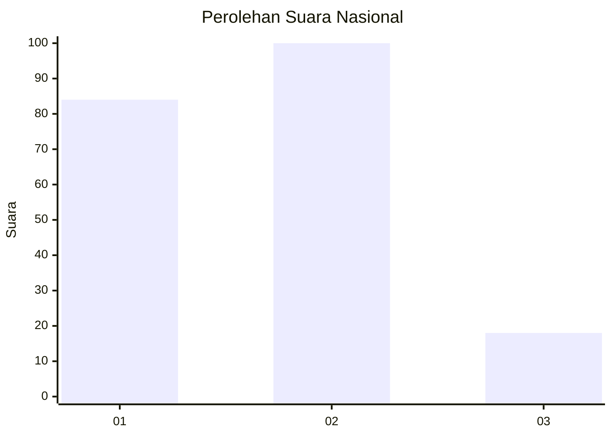
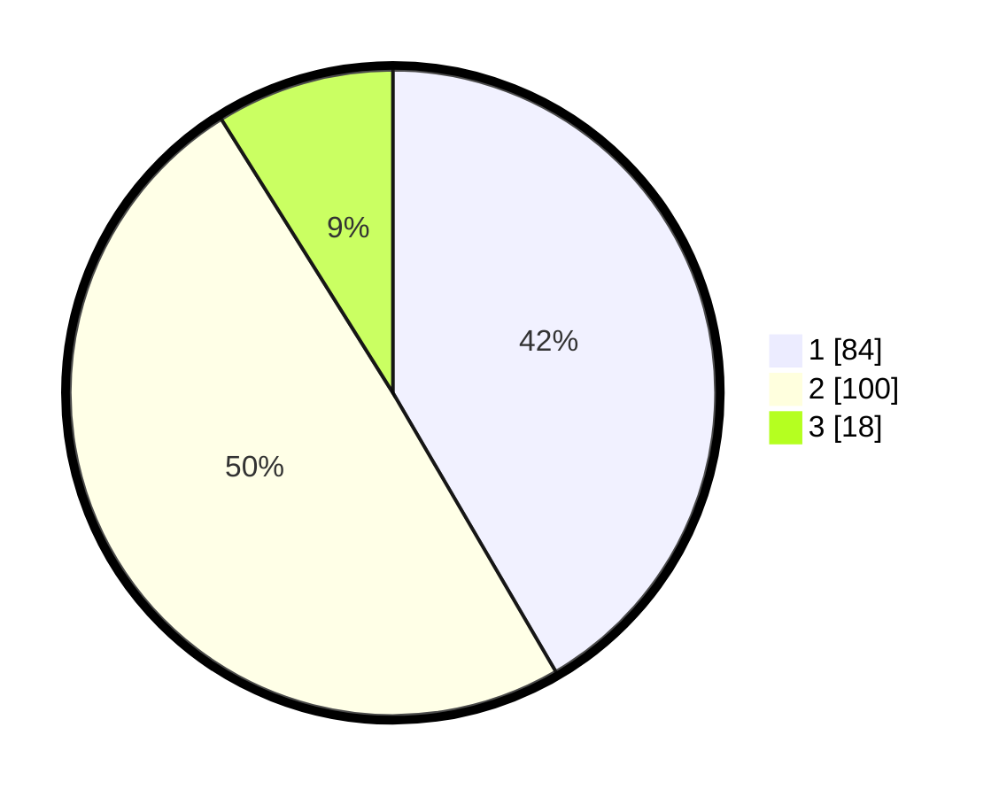

# Hasil

## Grafik

## Tabel

| No. | Nama Paslon    | Suara | Suara (raw) | Persentase |
|:--- |:-------------- | -----:| -----------:| ----------:|
| 1   | ANIES MUHAIMIN | 84    | [84][p-1]   | 41,58      |
| 2   | PRABOWO GIBRAN | 100   | [100][p-2]  | 49,50      |
| 3   | GANJAR MAHFUD  | 18    | [18][p-3]   | 8,91       |

[p-1]: https://github.com/gigit-pemilu/pemilu-2024/blob/main/pilpres/hitung-suara/sub/18-lampung/sub/02-lampung-tengah/sub/14-bumi-ratu-nuban/sub/2001-suka-jawa/sub/003-tps/sub/paslon-1.txt
[p-2]: https://github.com/gigit-pemilu/pemilu-2024/blob/main/pilpres/hitung-suara/sub/18-lampung/sub/02-lampung-tengah/sub/14-bumi-ratu-nuban/sub/2001-suka-jawa/sub/003-tps/sub/paslon-2.txt
[p-3]: https://github.com/gigit-pemilu/pemilu-2024/blob/main/pilpres/hitung-suara/sub/18-lampung/sub/02-lampung-tengah/sub/14-bumi-ratu-nuban/sub/2001-suka-jawa/sub/003-tps/sub/paslon-3.txt

## Foto C Plano

https://sirekap-obj-formc.kpu.go.id/62d8/pemilu/ppwp/18/02/14/20/01/1802142001003-20240219-081646--fc97818c-9557-4e38-a529-a59d8906a65d.jpg

https://sirekap-obj-formc.kpu.go.id/62d8/pemilu/ppwp/18/02/14/20/01/1802142001003-20240214-213723--eb8b9a68-6fc8-453e-be73-81ea05efe0fb.jpg

https://sirekap-obj-formc.kpu.go.id/62d8/pemilu/ppwp/18/02/14/20/01/1802142001003-20240214-213918--3848c932-0233-40d4-992f-8f39c8b97300.jpg

## Metadata

| Key        | Value               |
| ---------- | ------------------- |
| Time Stamp | 2024-02-19 09:00:00 |

