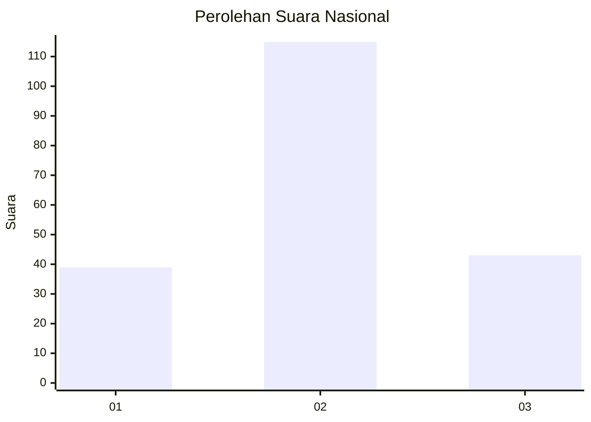
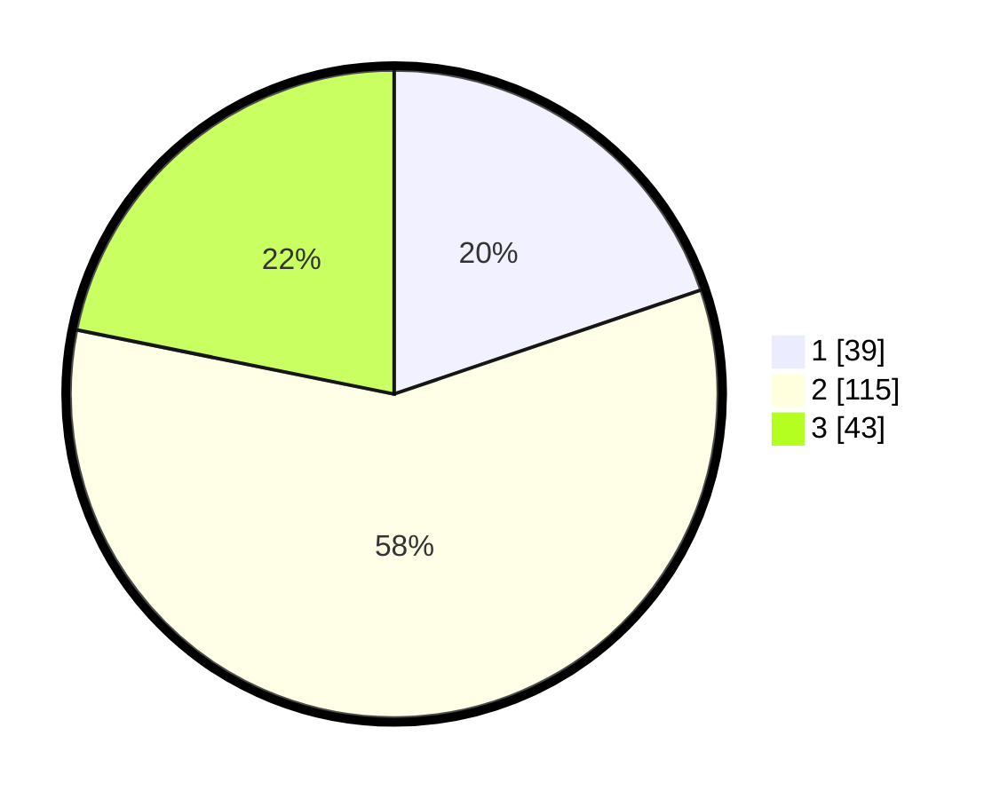

# Hasil

## Grafik

## Tabel

| No. | Nama Paslon    | Suara | Suara (raw) | Persentase |
|:--- |:-------------- | -----:| -----------:| ----------:|
| 1   | ANIES MUHAIMIN | 39    | [39][p-1]   | 19,80      |
| 2   | PRABOWO GIBRAN | 115   | [115][p-2]  | 58,38      |
| 3   | GANJAR MAHFUD  | 43    | [43][p-3]   | 21,83      |

[p-1]: https://github.com/gigit-pemilu/pemilu-2024/blob/main/pilpres/hitung-suara/sub/18-lampung/sub/02-lampung-tengah/sub/19-pubian/sub/2001-kota-batu/sub/005-tps/sub/paslon-1.txt
[p-2]: https://github.com/gigit-pemilu/pemilu-2024/blob/main/pilpres/hitung-suara/sub/18-lampung/sub/02-lampung-tengah/sub/19-pubian/sub/2001-kota-batu/sub/005-tps/sub/paslon-2.txt
[p-3]: https://github.com/gigit-pemilu/pemilu-2024/blob/main/pilpres/hitung-suara/sub/18-lampung/sub/02-lampung-tengah/sub/19-pubian/sub/2001-kota-batu/sub/005-tps/sub/paslon-3.txt

## Foto C Plano

https://sirekap-obj-formc.kpu.go.id/d2e3/pemilu/ppwp/18/02/19/20/01/1802192001005-20240222-133348--c216a5eb-cd3b-4e21-a3b8-6fb5f4f40f69.jpg

https://sirekap-obj-formc.kpu.go.id/d2e3/pemilu/ppwp/18/02/19/20/01/1802192001005-20240222-133431--55173757-bcf9-4286-8bc7-eb9c763cb32c.jpg

https://sirekap-obj-formc.kpu.go.id/d2e3/pemilu/ppwp/18/02/19/20/01/1802192001005-20240222-133511--bfa986af-0dd9-4be8-bbe8-ddfc33d2529a.jpg

## Metadata

| Key        | Value               |
| ---------- | ------------------- |
| Time Stamp | 2024-02-25 11:00:00 |

