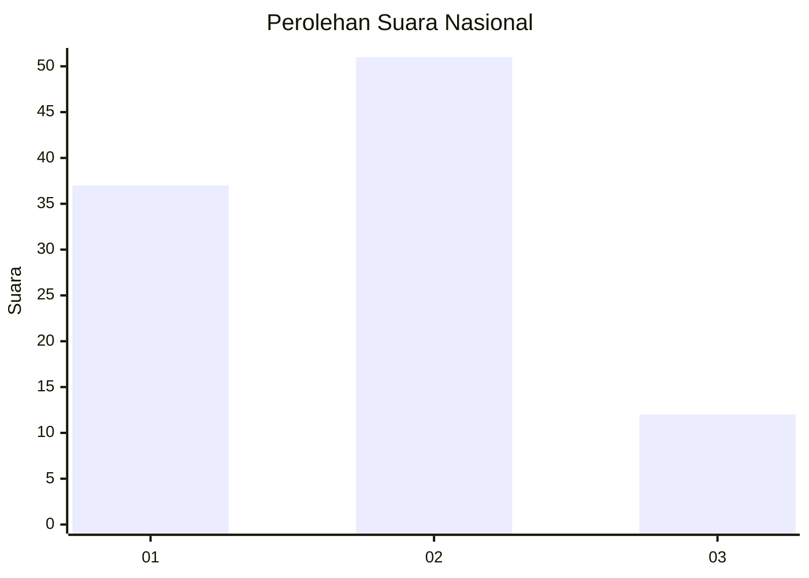
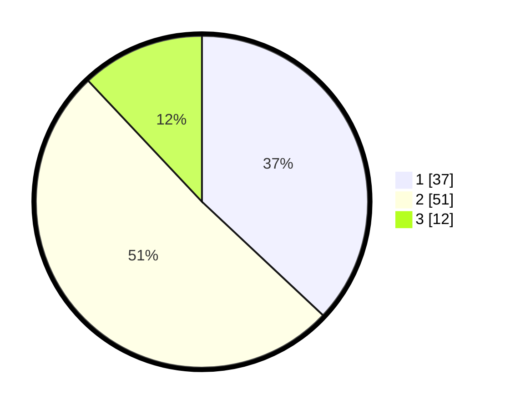

# Hasil

## Grafik

## Tabel

| No. | Nama Paslon    | Suara | Suara (raw) | Persentase |
|:--- |:-------------- | -----:| -----------:| ----------:|
| 1   | ANIES MUHAIMIN | 37    | [37][p-1]   | 37,00      |
| 2   | PRABOWO GIBRAN | 51    | [51][p-2]   | 51,00      |
| 3   | GANJAR MAHFUD  | 12    | [12][p-3]   | 12,00      |

[p-1]: https://github.com/gigit-pemilu/pemilu-2024/blob/main/pilpres/hitung-suara/sub/18-lampung/sub/02-lampung-tengah/sub/19-pubian/sub/2012-riau-priangan/sub/003-tps/sub/paslon-1.txt
[p-2]: https://github.com/gigit-pemilu/pemilu-2024/blob/main/pilpres/hitung-suara/sub/18-lampung/sub/02-lampung-tengah/sub/19-pubian/sub/2012-riau-priangan/sub/003-tps/sub/paslon-2.txt
[p-3]: https://github.com/gigit-pemilu/pemilu-2024/blob/main/pilpres/hitung-suara/sub/18-lampung/sub/02-lampung-tengah/sub/19-pubian/sub/2012-riau-priangan/sub/003-tps/sub/paslon-3.txt

## Foto C Plano

https://sirekap-obj-formc.kpu.go.id/0277/pemilu/ppwp/18/02/19/20/12/1802192012003-20240222-193931--4a7f9ab6-04dc-465a-8e22-da5090f198e0.jpg

https://sirekap-obj-formc.kpu.go.id/0277/pemilu/ppwp/18/02/19/20/12/1802192012003-20240222-193938--e92b187a-1e11-45f5-9779-153b7959e8d5.jpg

https://sirekap-obj-formc.kpu.go.id/0277/pemilu/ppwp/18/02/19/20/12/1802192012003-20240222-193945--e4dd4cde-42f8-4194-aafe-e36362fb6946.jpg

## Metadata

| Key        | Value               |
| ---------- | ------------------- |
| Time Stamp | 2024-02-24 22:31:28 |

