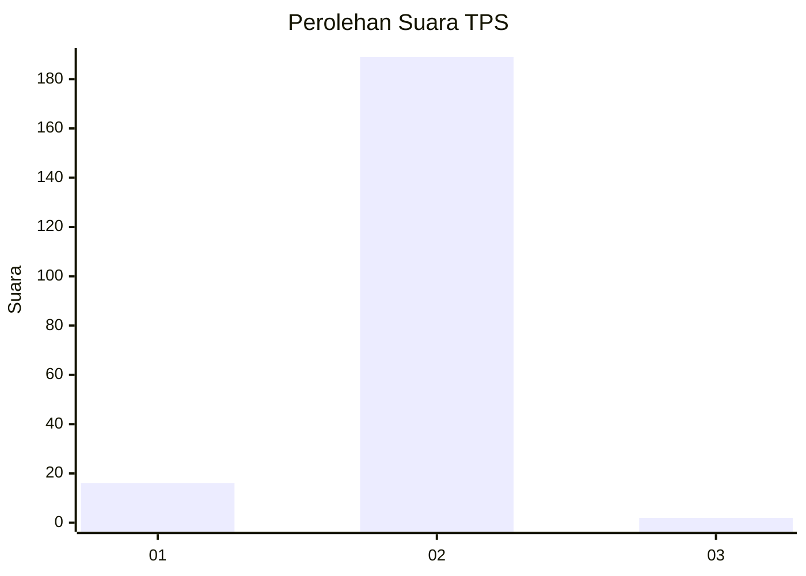
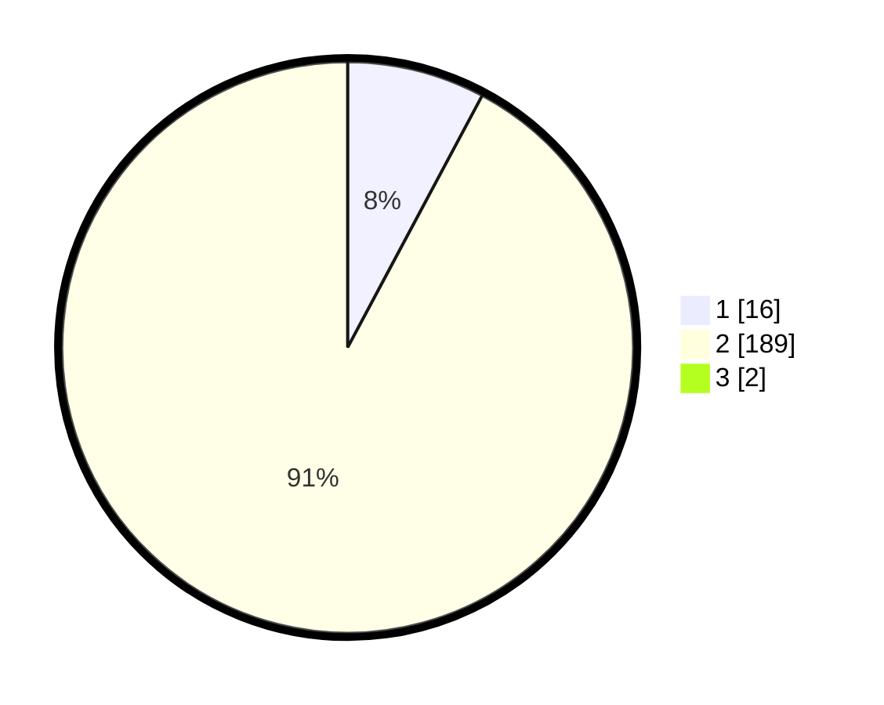

# Hasil

## Grafik

## Tabel

| No. | Nama Paslon    | Suara | Suara (raw) | Persentase |
|:--- |:-------------- | -----:| -----------:| ----------:|
| 1   | ANIES MUHAIMIN | 16    | [16][p-1]   | 7,73       |
| 2   | PRABOWO GIBRAN | 189   | [189][p-2]  | 91,30      |
| 3   | GANJAR MAHFUD  | 2     | [2][p-3]    | 0,97       |

[p-1]: https://github.com/gigit-pemilu/pemilu-2024-18-lampung/blob/main/pilpres/hitung-suara/sub/18-lampung/sub/02-lampung-tengah/sub/24-bumi-nabung/sub/2002-bumi-nabung-ilir/sub/002-tps/sub/paslon-1.txt
[p-2]: https://github.com/gigit-pemilu/pemilu-2024-18-lampung/blob/main/pilpres/hitung-suara/sub/18-lampung/sub/02-lampung-tengah/sub/24-bumi-nabung/sub/2002-bumi-nabung-ilir/sub/002-tps/sub/paslon-2.txt
[p-3]: https://github.com/gigit-pemilu/pemilu-2024-18-lampung/blob/main/pilpres/hitung-suara/sub/18-lampung/sub/02-lampung-tengah/sub/24-bumi-nabung/sub/2002-bumi-nabung-ilir/sub/002-tps/sub/paslon-3.txt

## Foto C Plano

https://sirekap-obj-formc.kpu.go.id/aff5/pemilu/ppwp/18/02/24/20/02/1802242002002-20240222-190657--dd0f1e9d-d5e7-4399-b2c2-79e3a87daa34.jpg

https://sirekap-obj-formc.kpu.go.id/aff5/pemilu/ppwp/18/02/24/20/02/1802242002002-20240222-190712--10faecc5-baf0-4db9-b0e8-e4fd0e957dbd.jpg

https://sirekap-obj-formc.kpu.go.id/aff5/pemilu/ppwp/18/02/24/20/02/1802242002002-20240222-190719--cab291f6-f46c-4f99-980d-3f8dfaa40770.jpg

## Metadata

| Key        | Value               |
| ---------- | ------------------- |
| Time Stamp | 2024-02-24 22:31:28 |

