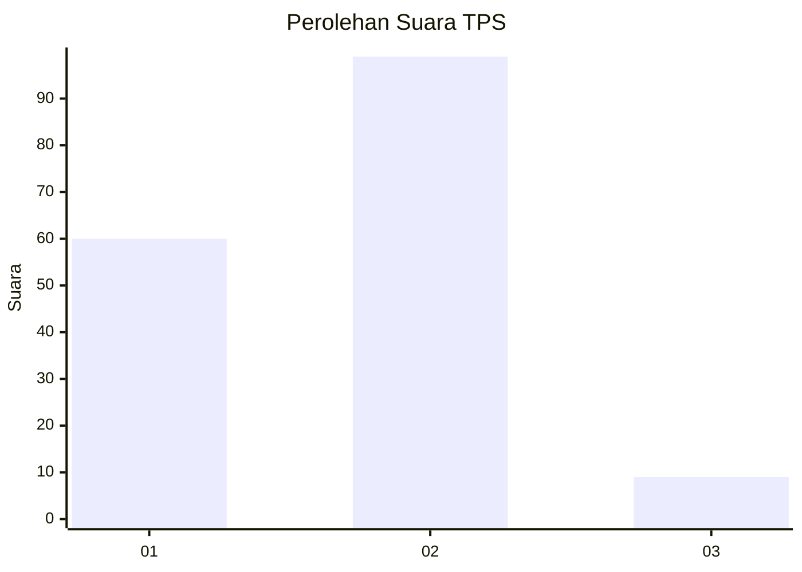
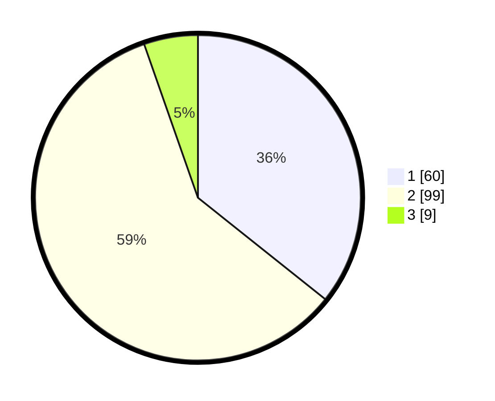

# Hasil

## Grafik

## Tabel

| No. | Nama Paslon    | Suara | Suara (raw) | Persentase |
|:--- |:-------------- | -----:| -----------:| ----------:|
| 1   | ANIES MUHAIMIN | 60    | [60][p-1]   | 35,71      |
| 2   | PRABOWO GIBRAN | 99    | [99][p-2]   | 58,93      |
| 3   | GANJAR MAHFUD  | 9     | [9][p-3]    | 5,36       |

[p-1]: https://github.com/gigit-pemilu/pemilu-2024-18-lampung/blob/main/pilpres/hitung-suara/sub/18-lampung/sub/03-lampung-utara/sub/01-bukit-kemuning/sub/1001-bukit-kemuning/sub/004-tps/sub/paslon-1.txt
[p-2]: https://github.com/gigit-pemilu/pemilu-2024-18-lampung/blob/main/pilpres/hitung-suara/sub/18-lampung/sub/03-lampung-utara/sub/01-bukit-kemuning/sub/1001-bukit-kemuning/sub/004-tps/sub/paslon-2.txt
[p-3]: https://github.com/gigit-pemilu/pemilu-2024-18-lampung/blob/main/pilpres/hitung-suara/sub/18-lampung/sub/03-lampung-utara/sub/01-bukit-kemuning/sub/1001-bukit-kemuning/sub/004-tps/sub/paslon-3.txt

## Foto C Plano

https://sirekap-obj-formc.kpu.go.id/47ed/pemilu/ppwp/18/03/01/10/01/1803011001004-20240214-214922--2e7345ee-879d-405a-bbb0-fbb686142274.jpg

https://sirekap-obj-formc.kpu.go.id/47ed/pemilu/ppwp/18/03/01/10/01/1803011001004-20240215-023427--d9f2986a-59eb-4157-86a2-236434bb69dc.jpg

https://sirekap-obj-formc.kpu.go.id/47ed/pemilu/ppwp/18/03/01/10/01/1803011001004-20240215-014450--c842f29d-3ddf-4fb8-a487-50e74229f628.jpg

## Metadata

| Key        | Value               |
| ---------- | ------------------- |
| Time Stamp | 2024-02-15 15:30:25 |

