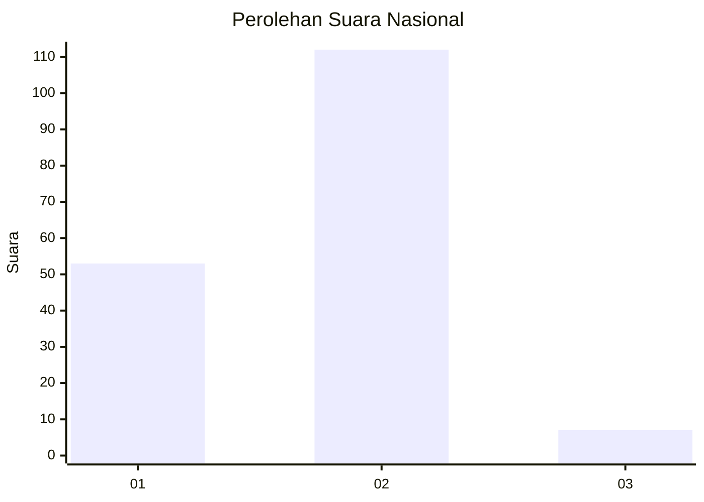
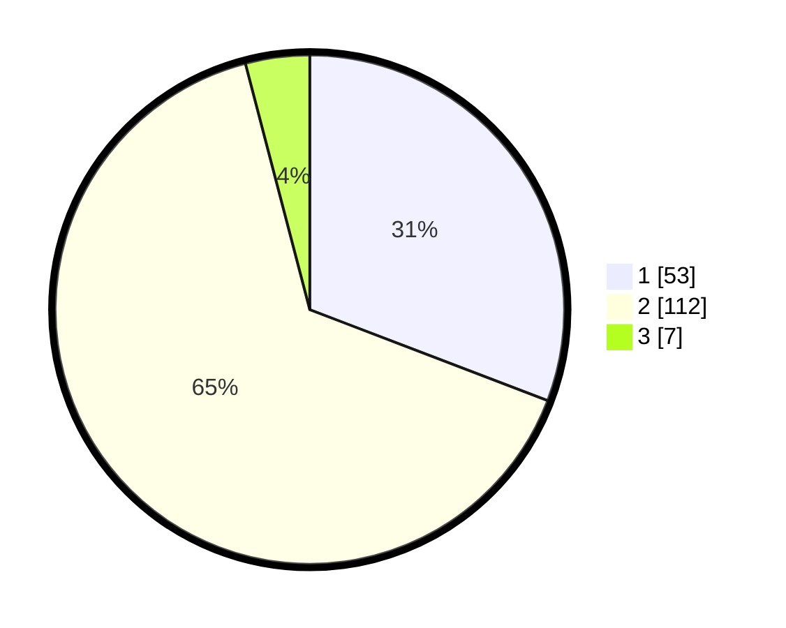

# Hasil

## Grafik

## Tabel

| No. | Nama Paslon    | Suara | Suara (raw) | Persentase |
|:--- |:-------------- | -----:| -----------:| ----------:|
| 1   | ANIES MUHAIMIN | 53    | [53][p-1]   | 30,81      |
| 2   | PRABOWO GIBRAN | 112   | [112][p-2]  | 65,12      |
| 3   | GANJAR MAHFUD  | 7     | [7][p-3]    | 4,07       |

[p-1]: https://github.com/gigit-pemilu/pemilu-2024/blob/main/pilpres/hitung-suara/sub/18-lampung/sub/03-lampung-utara/sub/01-bukit-kemuning/sub/1001-bukit-kemuning/sub/014-tps/sub/paslon-1.txt
[p-2]: https://github.com/gigit-pemilu/pemilu-2024/blob/main/pilpres/hitung-suara/sub/18-lampung/sub/03-lampung-utara/sub/01-bukit-kemuning/sub/1001-bukit-kemuning/sub/014-tps/sub/paslon-2.txt
[p-3]: https://github.com/gigit-pemilu/pemilu-2024/blob/main/pilpres/hitung-suara/sub/18-lampung/sub/03-lampung-utara/sub/01-bukit-kemuning/sub/1001-bukit-kemuning/sub/014-tps/sub/paslon-3.txt

## Foto C Plano

https://sirekap-obj-formc.kpu.go.id/1112/pemilu/ppwp/18/03/01/10/01/1803011001014-20240214-200157--f404d4bb-68b6-40a3-a079-0ef3a115f0c2.jpg

https://sirekap-obj-formc.kpu.go.id/1112/pemilu/ppwp/18/03/01/10/01/1803011001014-20240214-200414--204329d3-0332-4fab-8fee-c0e6bef9e0a1.jpg

https://sirekap-obj-formc.kpu.go.id/1112/pemilu/ppwp/18/03/01/10/01/1803011001014-20240214-200549--3e7f1ee4-1588-4ed4-87ef-2b07437c90b4.jpg

## Metadata

| Key        | Value               |
| ---------- | ------------------- |
| Time Stamp | 2024-02-15 18:00:26 |

