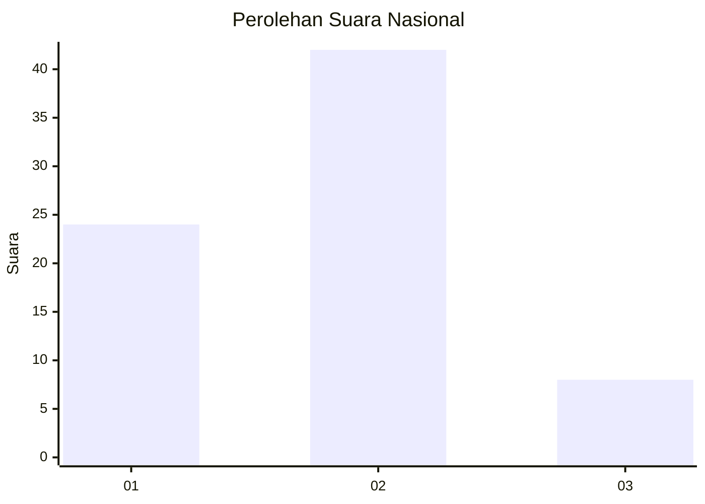
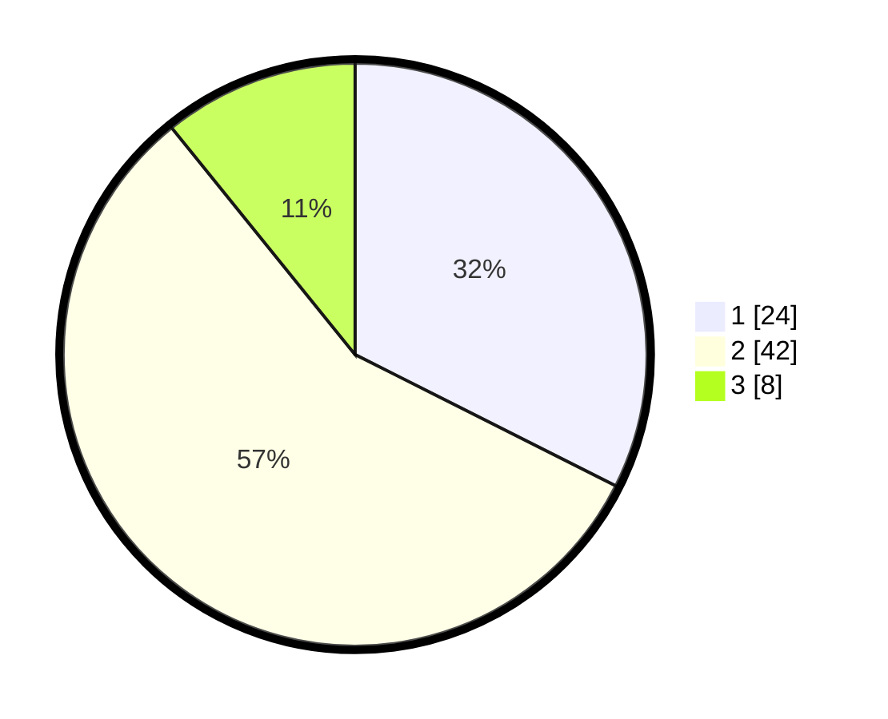

# Hasil

## Grafik

## Tabel

| No. | Nama Paslon    | Suara | Suara (raw) | Persentase |
|:--- |:-------------- | -----:| -----------:| ----------:|
| 1   | ANIES MUHAIMIN | 24    | [24][p-1]   | 32,43      |
| 2   | PRABOWO GIBRAN | 42    | [42][p-2]   | 56,76      |
| 3   | GANJAR MAHFUD  | 8     | [8][p-3]    | 10,81      |

[p-1]: https://github.com/gigit-pemilu/pemilu-2024/blob/main/pilpres/hitung-suara/sub/18-lampung/sub/03-lampung-utara/sub/01-bukit-kemuning/sub/1001-bukit-kemuning/sub/055-tps/sub/paslon-1.txt
[p-2]: https://github.com/gigit-pemilu/pemilu-2024/blob/main/pilpres/hitung-suara/sub/18-lampung/sub/03-lampung-utara/sub/01-bukit-kemuning/sub/1001-bukit-kemuning/sub/055-tps/sub/paslon-2.txt
[p-3]: https://github.com/gigit-pemilu/pemilu-2024/blob/main/pilpres/hitung-suara/sub/18-lampung/sub/03-lampung-utara/sub/01-bukit-kemuning/sub/1001-bukit-kemuning/sub/055-tps/sub/paslon-3.txt

## Foto C Plano

https://sirekap-obj-formc.kpu.go.id/d0dc/pemilu/ppwp/18/03/01/10/01/1803011001055-20240214-202843--6ef0b576-ea05-42c1-a7ea-2e8991c0c40a.jpg

https://sirekap-obj-formc.kpu.go.id/d0dc/pemilu/ppwp/18/03/01/10/01/1803011001055-20240214-204836--9ee76638-17e9-40ad-851f-5dc5d459b95b.jpg

https://sirekap-obj-formc.kpu.go.id/d0dc/pemilu/ppwp/18/03/01/10/01/1803011001055-20240214-202507--7cf900d5-a870-44bd-afa5-aaf1707d4718.jpg

## Metadata

| Key        | Value               |
| ---------- | ------------------- |
| Time Stamp | 2024-02-21 19:00:00 |

