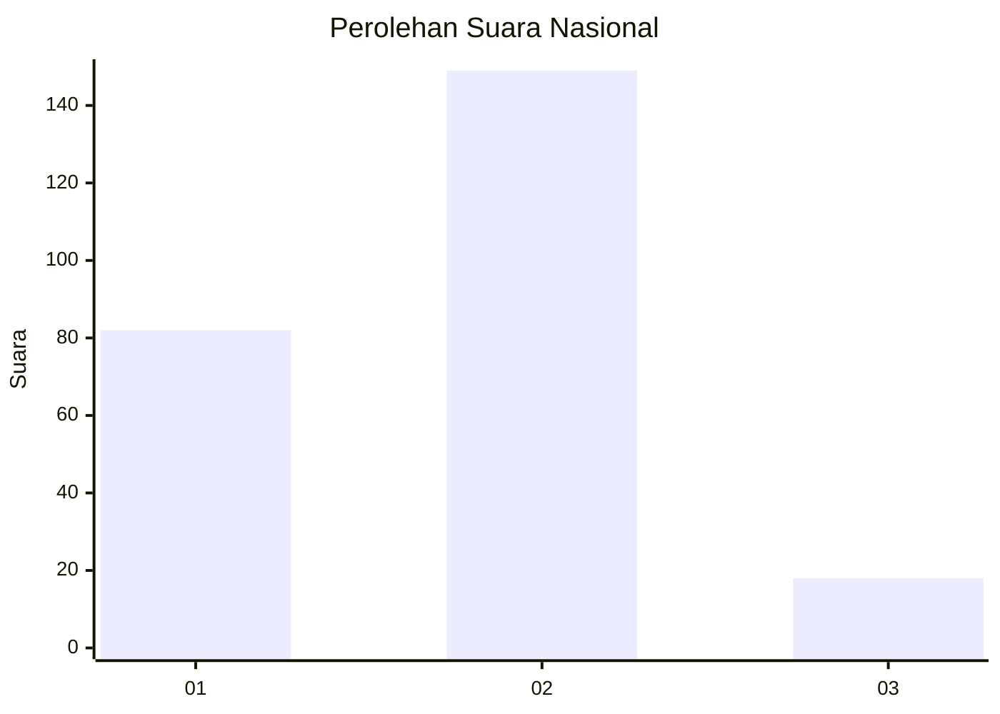
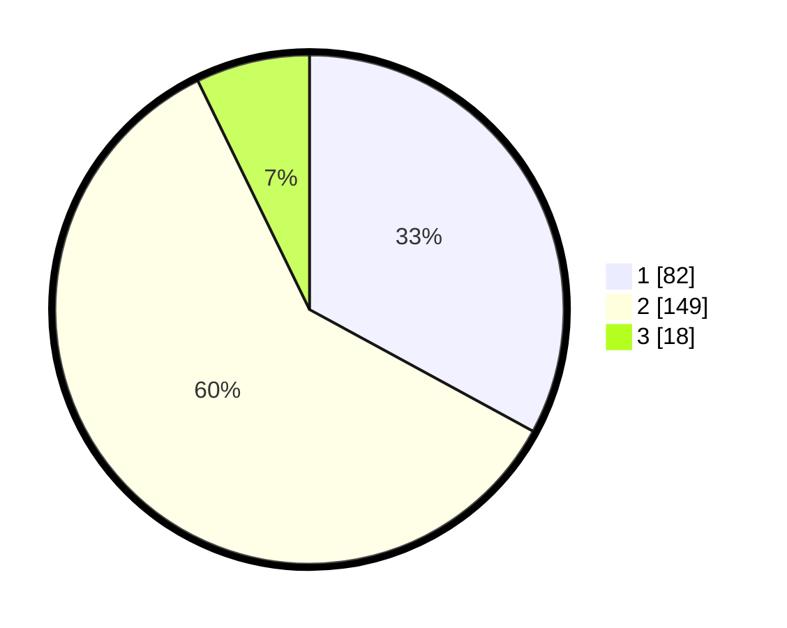

# Hasil

## Grafik

## Tabel

| No. | Nama Paslon    | Suara | Suara (raw) | Persentase |
|:--- |:-------------- | -----:| -----------:| ----------:|
| 1   | ANIES MUHAIMIN | 82    | [82][p-1]   | 32,93      |
| 2   | PRABOWO GIBRAN | 149   | [149][p-2]  | 59,84      |
| 3   | GANJAR MAHFUD  | 18    | [18][p-3]   | 7,23       |

[p-1]: https://github.com/gigit-pemilu/pemilu-2024/blob/main/pilpres/hitung-suara/sub/18-lampung/sub/03-lampung-utara/sub/02-kotabumi/sub/1001-kotabumi-udik/sub/001-tps/sub/paslon-1.txt
[p-2]: https://github.com/gigit-pemilu/pemilu-2024/blob/main/pilpres/hitung-suara/sub/18-lampung/sub/03-lampung-utara/sub/02-kotabumi/sub/1001-kotabumi-udik/sub/001-tps/sub/paslon-2.txt
[p-3]: https://github.com/gigit-pemilu/pemilu-2024/blob/main/pilpres/hitung-suara/sub/18-lampung/sub/03-lampung-utara/sub/02-kotabumi/sub/1001-kotabumi-udik/sub/001-tps/sub/paslon-3.txt

## Foto C Plano

https://sirekap-obj-formc.kpu.go.id/fb12/pemilu/ppwp/18/03/02/10/01/1803021001001-20240215-110009--444cfe3a-faea-4865-94be-edd5853d885e.jpg

https://sirekap-obj-formc.kpu.go.id/fb12/pemilu/ppwp/18/03/02/10/01/1803021001001-20240215-110055--3da75cbd-9bf3-4e40-ac87-04de4b5bf8bb.jpg

https://sirekap-obj-formc.kpu.go.id/fb12/pemilu/ppwp/18/03/02/10/01/1803021001001-20240215-110214--b602d4bf-d83e-45bb-afe4-8639d55f9dfa.jpg

## Metadata

| Key        | Value               |
| ---------- | ------------------- |
| Time Stamp | 2024-02-15 19:00:26 |

