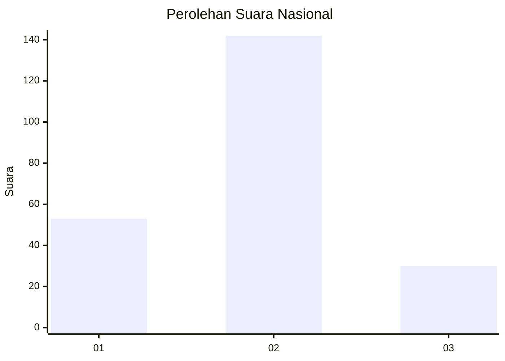
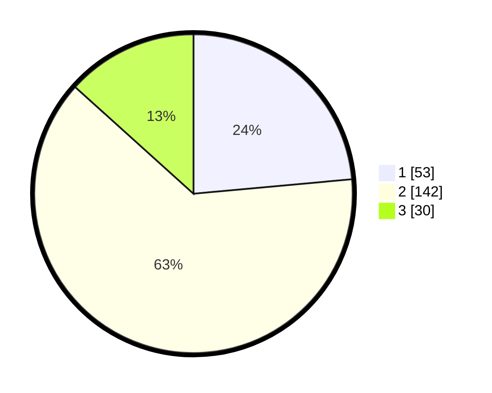

# Hasil

## Grafik

## Tabel

| No. | Nama Paslon    | Suara | Suara (raw) | Persentase |
|:--- |:-------------- | -----:| -----------:| ----------:|
| 1   | ANIES MUHAIMIN | 53    | [53][p-1]   | 23,56      |
| 2   | PRABOWO GIBRAN | 142   | [142][p-2]  | 63,11      |
| 3   | GANJAR MAHFUD  | 30    | [30][p-3]   | 13,33      |

[p-1]: https://github.com/gigit-pemilu/pemilu-2024/blob/main/pilpres/hitung-suara/sub/18-lampung/sub/03-lampung-utara/sub/02-kotabumi/sub/1001-kotabumi-udik/sub/006-tps/sub/paslon-1.txt
[p-2]: https://github.com/gigit-pemilu/pemilu-2024/blob/main/pilpres/hitung-suara/sub/18-lampung/sub/03-lampung-utara/sub/02-kotabumi/sub/1001-kotabumi-udik/sub/006-tps/sub/paslon-2.txt
[p-3]: https://github.com/gigit-pemilu/pemilu-2024/blob/main/pilpres/hitung-suara/sub/18-lampung/sub/03-lampung-utara/sub/02-kotabumi/sub/1001-kotabumi-udik/sub/006-tps/sub/paslon-3.txt

## Foto C Plano

https://sirekap-obj-formc.kpu.go.id/7007/pemilu/ppwp/18/03/02/10/01/1803021001006-20240215-041406--2d6d2a70-b7d3-4151-9e8c-c47b18d794dc.jpg

https://sirekap-obj-formc.kpu.go.id/7007/pemilu/ppwp/18/03/02/10/01/1803021001006-20240215-041840--42a1d91e-c52f-43a8-af28-14f736a32fce.jpg

https://sirekap-obj-formc.kpu.go.id/7007/pemilu/ppwp/18/03/02/10/01/1803021001006-20240215-041931--9b5edba0-09f5-40f7-ad07-787bd895ed4a.jpg

## Metadata

| Key        | Value               |
| ---------- | ------------------- |
| Time Stamp | 2024-02-16 14:00:34 |

