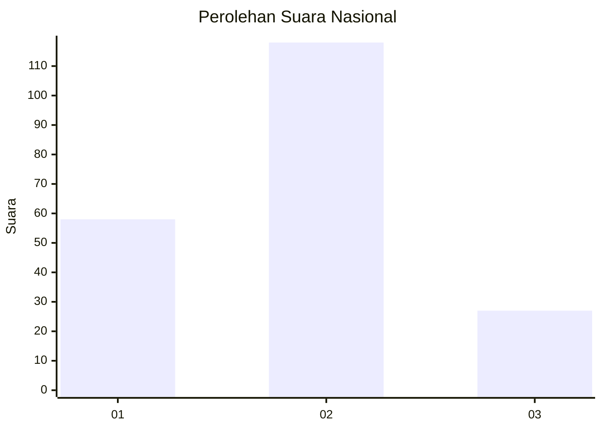
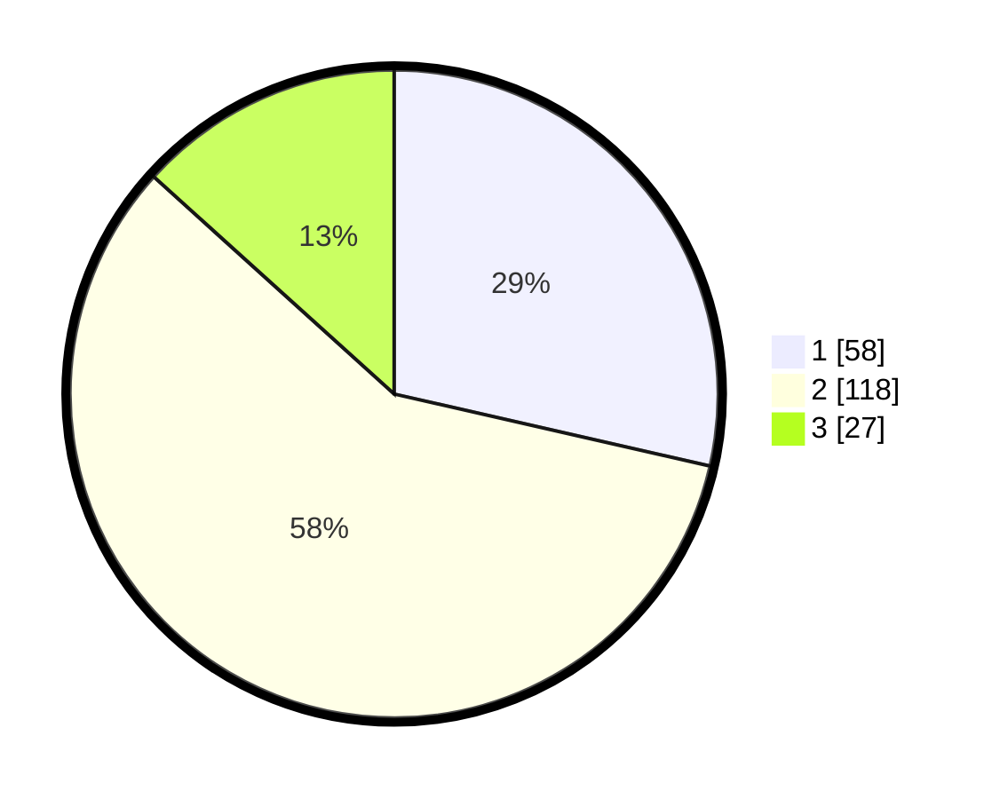

# Hasil

## Grafik

## Tabel

| No. | Nama Paslon    | Suara | Suara (raw) | Persentase |
|:--- |:-------------- | -----:| -----------:| ----------:|
| 1   | ANIES MUHAIMIN | 58    | [58][p-1]   | 28,57      |
| 2   | PRABOWO GIBRAN | 118   | [118][p-2]  | 58,13      |
| 3   | GANJAR MAHFUD  | 27    | [27][p-3]   | 13,30      |

[p-1]: https://github.com/gigit-pemilu/pemilu-2024/blob/main/pilpres/hitung-suara/sub/18-lampung/sub/03-lampung-utara/sub/02-kotabumi/sub/1001-kotabumi-udik/sub/007-tps/sub/paslon-1.txt
[p-2]: https://github.com/gigit-pemilu/pemilu-2024/blob/main/pilpres/hitung-suara/sub/18-lampung/sub/03-lampung-utara/sub/02-kotabumi/sub/1001-kotabumi-udik/sub/007-tps/sub/paslon-2.txt
[p-3]: https://github.com/gigit-pemilu/pemilu-2024/blob/main/pilpres/hitung-suara/sub/18-lampung/sub/03-lampung-utara/sub/02-kotabumi/sub/1001-kotabumi-udik/sub/007-tps/sub/paslon-3.txt

## Foto C Plano

https://sirekap-obj-formc.kpu.go.id/0289/pemilu/ppwp/18/03/02/10/01/1803021001007-20240215-181417--1d62a4d6-ac86-4c05-8d27-eeb27c90d22e.jpg

https://sirekap-obj-formc.kpu.go.id/0289/pemilu/ppwp/18/03/02/10/01/1803021001007-20240215-182047--00a0a08c-1823-4ca5-896d-12ddf0a4ba86.jpg

https://sirekap-obj-formc.kpu.go.id/0289/pemilu/ppwp/18/03/02/10/01/1803021001007-20240214-205942--f962bb85-b26a-452f-810d-98b2b7258cde.jpg

## Metadata

| Key        | Value               |
| ---------- | ------------------- |
| Time Stamp | 2024-02-24 22:31:28 |

