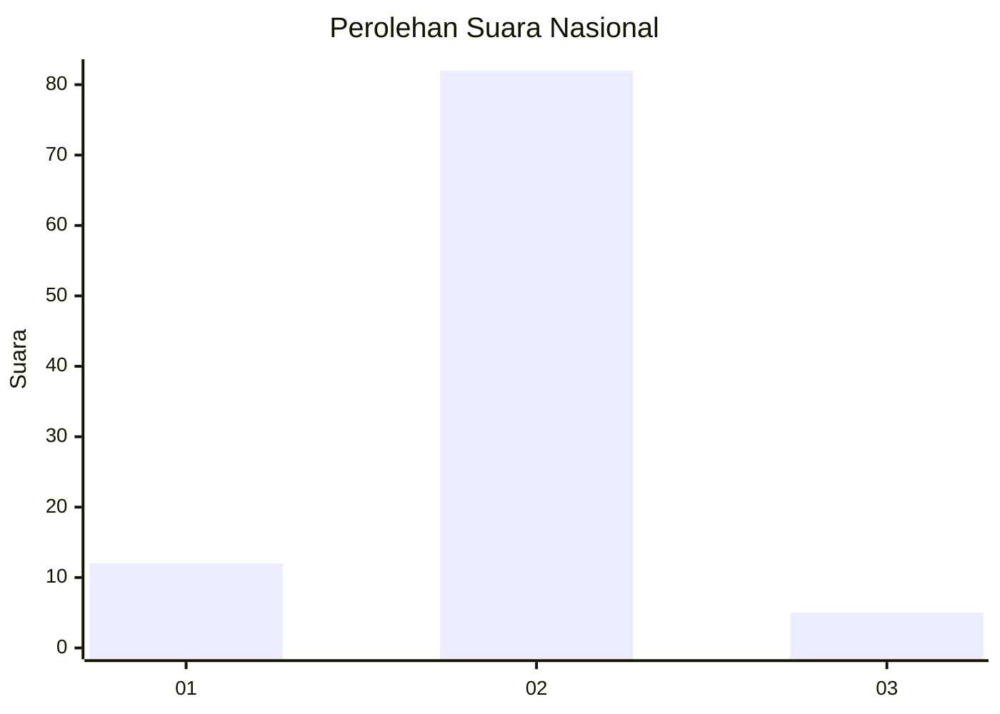
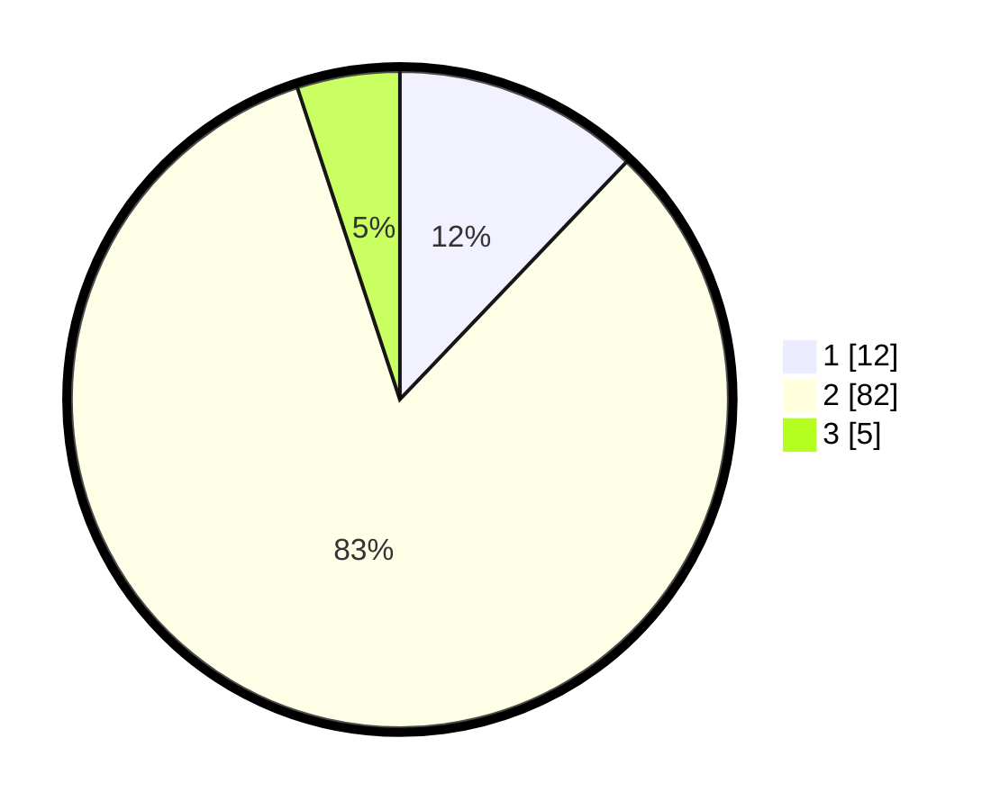

# Hasil

## Grafik

## Tabel

| No. | Nama Paslon    | Suara | Suara (raw) | Persentase |
|:--- |:-------------- | -----:| -----------:| ----------:|
| 1   | ANIES MUHAIMIN | 12    | [12][p-1]   | 12,12      |
| 2   | PRABOWO GIBRAN | 82    | [82][p-2]   | 82,83      |
| 3   | GANJAR MAHFUD  | 5     | [5][p-3]    | 5,05       |

[p-1]: https://github.com/gigit-pemilu/pemilu-2024/blob/main/pilpres/hitung-suara/sub/18-lampung/sub/03-lampung-utara/sub/04-tanjung-raja/sub/2010-tanjung-riang/sub/001-tps/sub/paslon-1.txt
[p-2]: https://github.com/gigit-pemilu/pemilu-2024/blob/main/pilpres/hitung-suara/sub/18-lampung/sub/03-lampung-utara/sub/04-tanjung-raja/sub/2010-tanjung-riang/sub/001-tps/sub/paslon-2.txt
[p-3]: https://github.com/gigit-pemilu/pemilu-2024/blob/main/pilpres/hitung-suara/sub/18-lampung/sub/03-lampung-utara/sub/04-tanjung-raja/sub/2010-tanjung-riang/sub/001-tps/sub/paslon-3.txt

## Foto C Plano

https://sirekap-obj-formc.kpu.go.id/a279/pemilu/ppwp/18/03/04/20/10/1803042010001-20240214-225651--a6522233-8b5e-413e-b4a4-5f365e17538d.jpg

https://sirekap-obj-formc.kpu.go.id/a279/pemilu/ppwp/18/03/04/20/10/1803042010001-20240214-211941--fcf0fa12-dc12-41f1-a07b-5284f794d4a6.jpg

https://sirekap-obj-formc.kpu.go.id/a279/pemilu/ppwp/18/03/04/20/10/1803042010001-20240214-213955--9b7ec760-2280-48ad-99fd-228930f143b1.jpg

## Metadata

| Key        | Value               |
| ---------- | ------------------- |
| Time Stamp | 2024-02-16 12:51:22 |

