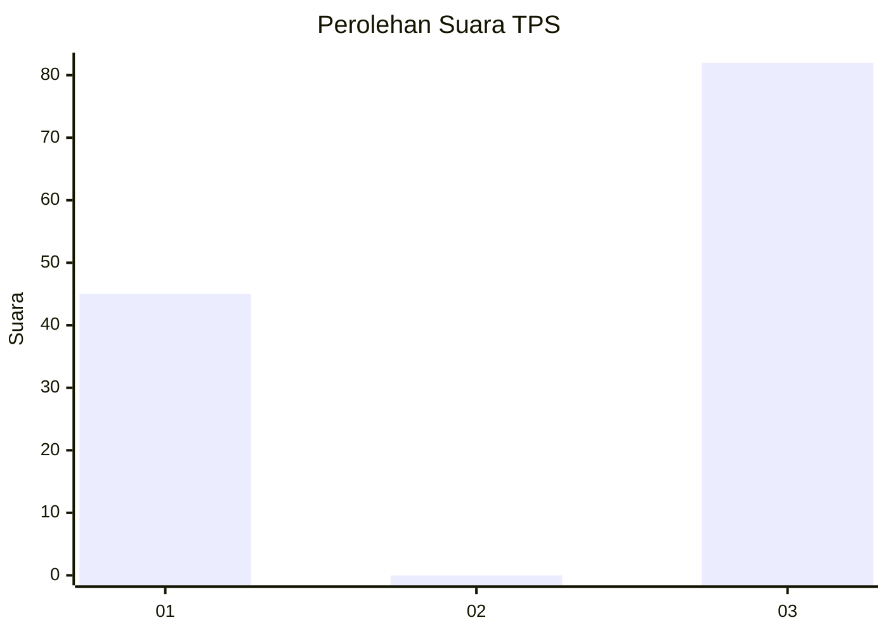
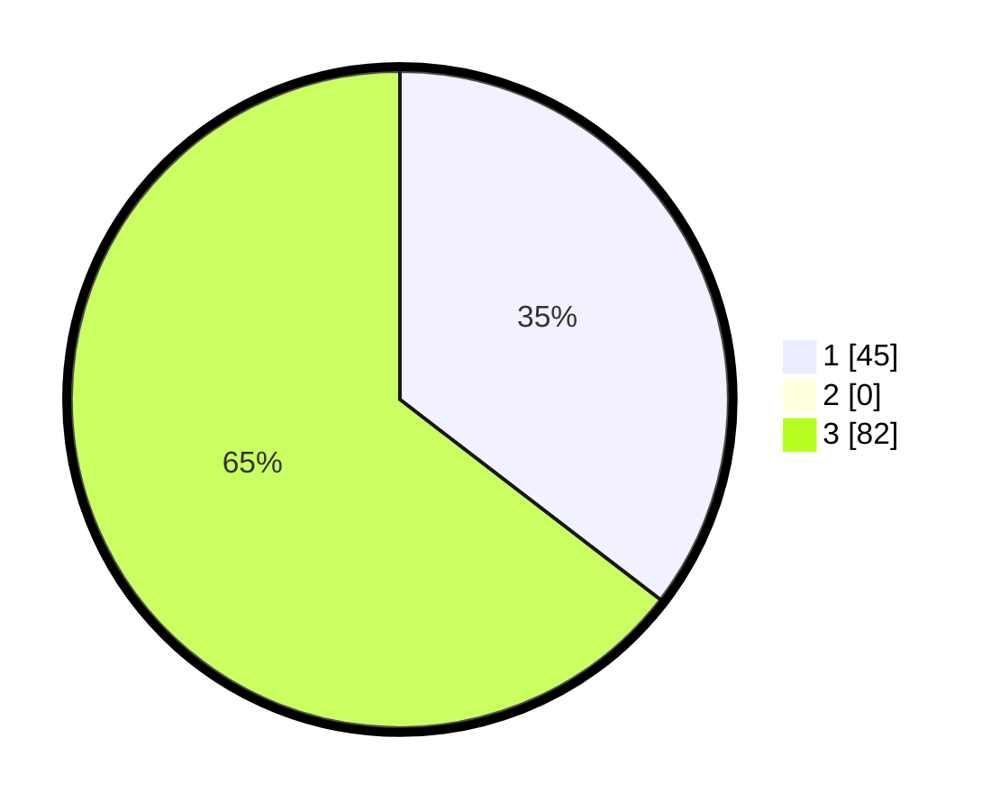

# Hasil

## Grafik

## Tabel

| No. | Nama Paslon    | Suara | Suara (raw) | Persentase |
|:--- |:-------------- | -----:| -----------:| ----------:|
| 1   | ANIES MUHAIMIN | 45    | [45][p-1]   | 35,43      |
| 2   | PRABOWO GIBRAN | 0     | [0][p-2]    | 0,00       |
| 3   | GANJAR MAHFUD  | 82    | [82][p-3]   | 64,57      |

[p-1]: https://github.com/gigit-pemilu/pemilu-2024-18-lampung/blob/main/pilpres/hitung-suara/sub/18-lampung/sub/03-lampung-utara/sub/05-abung-timur/sub/2002-bumi-agung-marga/sub/003-tps/sub/paslon-1.txt
[p-2]: https://github.com/gigit-pemilu/pemilu-2024-18-lampung/blob/main/pilpres/hitung-suara/sub/18-lampung/sub/03-lampung-utara/sub/05-abung-timur/sub/2002-bumi-agung-marga/sub/003-tps/sub/paslon-2.txt
[p-3]: https://github.com/gigit-pemilu/pemilu-2024-18-lampung/blob/main/pilpres/hitung-suara/sub/18-lampung/sub/03-lampung-utara/sub/05-abung-timur/sub/2002-bumi-agung-marga/sub/003-tps/sub/paslon-3.txt

## Foto C Plano

https://sirekap-obj-formc.kpu.go.id/340d/pemilu/ppwp/18/03/05/20/02/1803052002003-20240219-210349--17e9502e-17ea-4be0-b586-0fa1dbd453e1.jpg

https://sirekap-obj-formc.kpu.go.id/340d/pemilu/ppwp/18/03/05/20/02/1803052002003-20240219-210432--7d9bc7ae-4a64-465b-9d75-3bae913c4b87.jpg

https://sirekap-obj-formc.kpu.go.id/340d/pemilu/ppwp/18/03/05/20/02/1803052002003-20240219-210513--229f7abb-c93a-47a6-bd3b-30f391f3b9af.jpg

## Metadata

| Key        | Value               |
| ---------- | ------------------- |
| Time Stamp | 2024-02-19 22:00:00 |

## DATA PEMILIH TETAP

Jumlah pemilih dalam DPT: **302**.
 * L: **895**.
 * P: **806**.

## DATA PENGGUNA HAK PILIH

Jumlah pengguna hak pilih dalam DPT: **890**.
 * L: **855**.
 * P: **835**.

Jumlah pengguna hak pilih dalam DPTb: **888**.
 * L: **888**.
 * P: **888**.

Jumlah pengguna hak pilih dalam DPK: **888**.
 * L: **888**.
 * P: **888**.

Jumlah pengguna hak pilih: **462**.
 * L: **835**.
 * P: **890**.

## JUMLAH SUARA SAH DAN TIDAK SAH

JUMLAH SELURUH SUARA SAH: **454**.

JUMLAH SUARA TIDAK SAH: **884**.

JUMLAH SELURUH SUARA SAH DAN SUARA TIDAK SAH: **485**.

