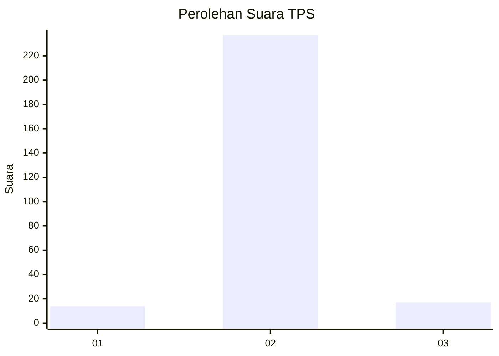
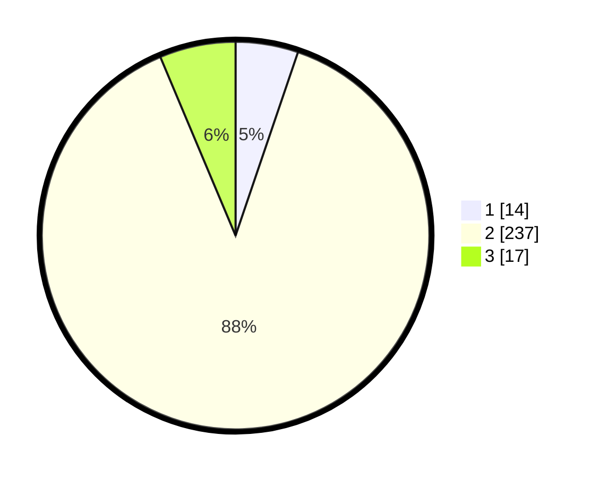

# Hasil

## Grafik

## Tabel

| No. | Nama Paslon    | Suara | Suara (raw) | Persentase |
|:--- |:-------------- | -----:| -----------:| ----------:|
| 1   | ANIES MUHAIMIN | 14    | [14][p-1]   | 5,22       |
| 2   | PRABOWO GIBRAN | 237   | [237][p-2]  | 88,43      |
| 3   | GANJAR MAHFUD  | 17    | [17][p-3]   | 6,34       |

[p-1]: https://github.com/gigit-pemilu/pemilu-2024-18-lampung/blob/main/pilpres/hitung-suara/sub/18-lampung/sub/03-lampung-utara/sub/09-kotabumi-utara/sub/2005-margo-rejo/sub/007-tps/sub/paslon-1.txt
[p-2]: https://github.com/gigit-pemilu/pemilu-2024-18-lampung/blob/main/pilpres/hitung-suara/sub/18-lampung/sub/03-lampung-utara/sub/09-kotabumi-utara/sub/2005-margo-rejo/sub/007-tps/sub/paslon-2.txt
[p-3]: https://github.com/gigit-pemilu/pemilu-2024-18-lampung/blob/main/pilpres/hitung-suara/sub/18-lampung/sub/03-lampung-utara/sub/09-kotabumi-utara/sub/2005-margo-rejo/sub/007-tps/sub/paslon-3.txt

## Foto C Plano

https://sirekap-obj-formc.kpu.go.id/ff0e/pemilu/ppwp/18/03/09/20/05/1803092005007-20240215-071001--93b636ff-7441-4a37-82df-fcbb3eb0512c.jpg

https://sirekap-obj-formc.kpu.go.id/ff0e/pemilu/ppwp/18/03/09/20/05/1803092005007-20240215-071149--e8cf3a5f-4834-42a1-9df6-bbc10fa86596.jpg

https://sirekap-obj-formc.kpu.go.id/ff0e/pemilu/ppwp/18/03/09/20/05/1803092005007-20240215-071331--c51086c9-366b-4d19-8858-a75a7bc6048c.jpg

## Metadata

| Key        | Value               |
| ---------- | ------------------- |
| Time Stamp | 2024-02-16 14:00:34 |

