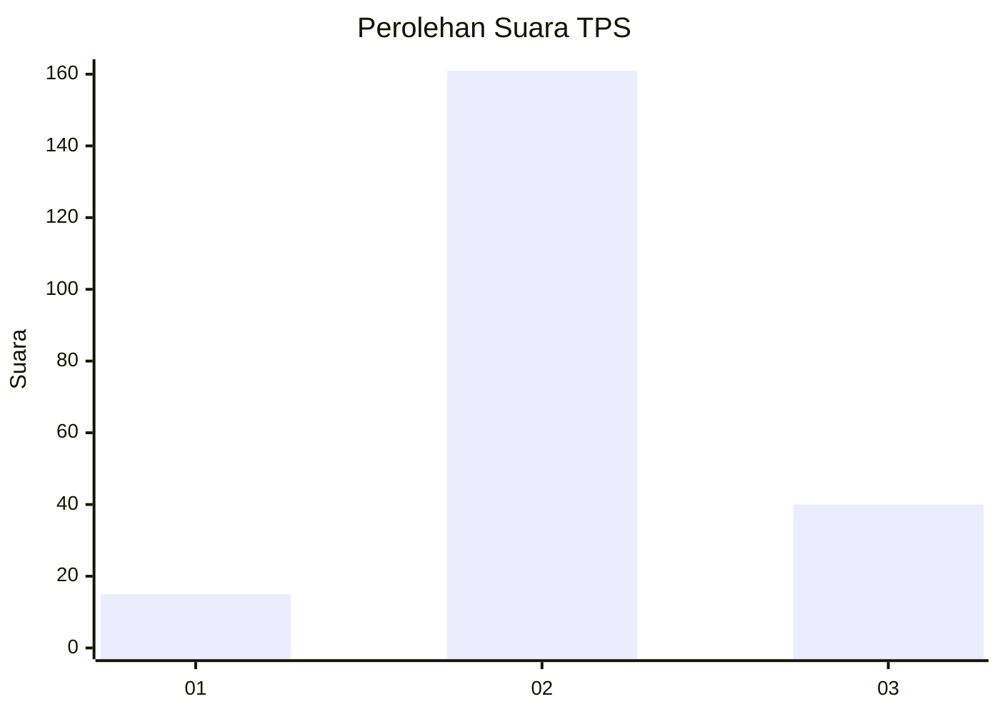
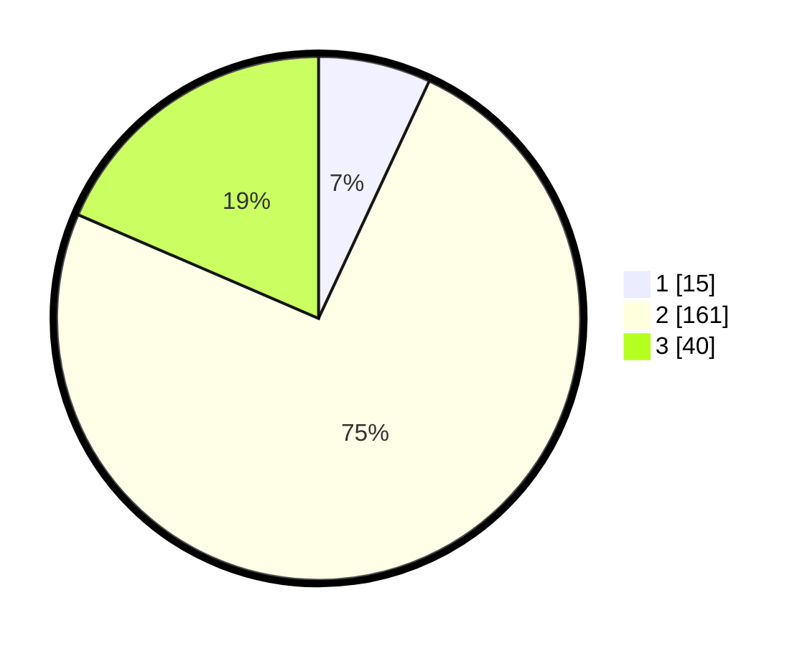

# Hasil

## Grafik

## Tabel

| No. | Nama Paslon    | Suara | Suara (raw) | Persentase |
|:--- |:-------------- | -----:| -----------:| ----------:|
| 1   | ANIES MUHAIMIN | 15    | [15][p-1]   | 6,94       |
| 2   | PRABOWO GIBRAN | 161   | [161][p-2]  | 74,54      |
| 3   | GANJAR MAHFUD  | 40    | [40][p-3]   | 18,52      |

[p-1]: https://github.com/gigit-pemilu/pemilu-2024-18-lampung/blob/main/pilpres/hitung-suara/sub/18-lampung/sub/03-lampung-utara/sub/14-abung-surakarta/sub/2001-tatakarya/sub/001-tps/sub/paslon-1.txt
[p-2]: https://github.com/gigit-pemilu/pemilu-2024-18-lampung/blob/main/pilpres/hitung-suara/sub/18-lampung/sub/03-lampung-utara/sub/14-abung-surakarta/sub/2001-tatakarya/sub/001-tps/sub/paslon-2.txt
[p-3]: https://github.com/gigit-pemilu/pemilu-2024-18-lampung/blob/main/pilpres/hitung-suara/sub/18-lampung/sub/03-lampung-utara/sub/14-abung-surakarta/sub/2001-tatakarya/sub/001-tps/sub/paslon-3.txt

## Foto C Plano

https://sirekap-obj-formc.kpu.go.id/9dc9/pemilu/ppwp/18/03/14/20/01/1803142001001-20240215-041324--2836d892-f0e8-4333-833b-a2dfb788d86e.jpg

https://sirekap-obj-formc.kpu.go.id/9dc9/pemilu/ppwp/18/03/14/20/01/1803142001001-20240215-041543--4bffa6c6-5979-43ad-87d0-a74fccc4e594.jpg

https://sirekap-obj-formc.kpu.go.id/9dc9/pemilu/ppwp/18/03/14/20/01/1803142001001-20240215-041704--138267de-e102-4d64-b5e3-df65a2bd8f11.jpg

## Metadata

| Key        | Value               |
| ---------- | ------------------- |
| Time Stamp | 2024-02-16 12:51:22 |

