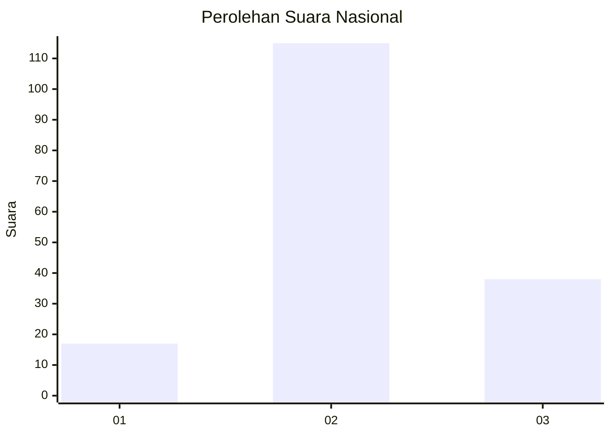
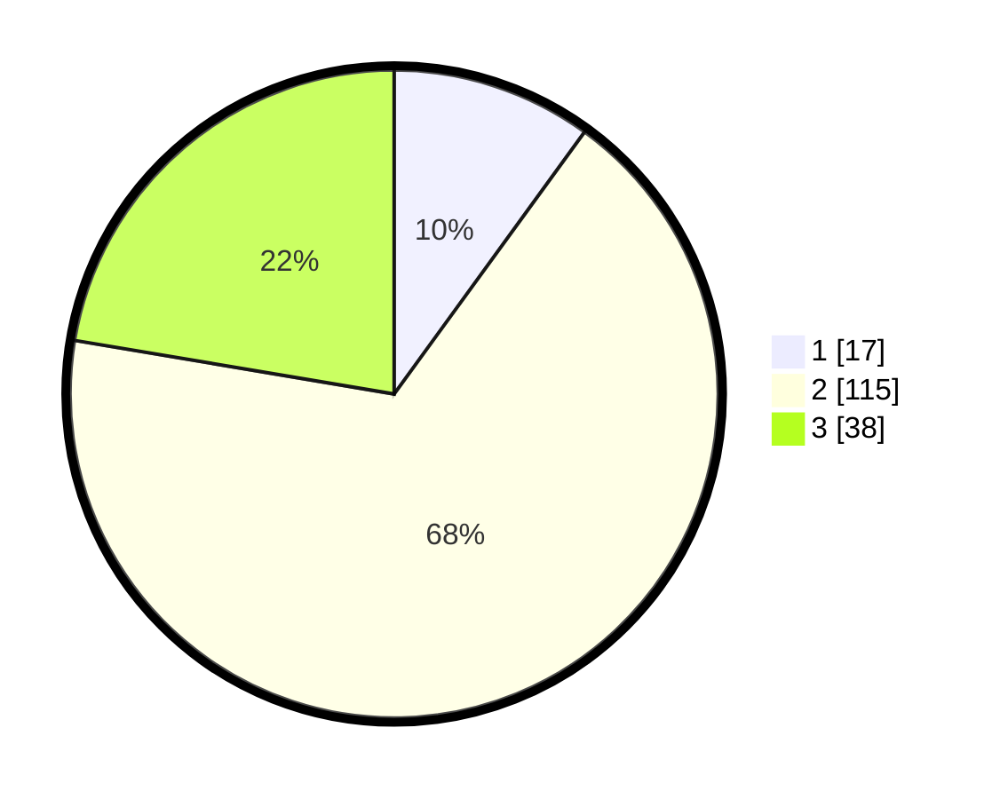

# Hasil

## Grafik

## Tabel

| No. | Nama Paslon    | Suara | Suara (raw) | Persentase |
|:--- |:-------------- | -----:| -----------:| ----------:|
| 1   | ANIES MUHAIMIN | 17    | [17][p-1]   | 10,00      |
| 2   | PRABOWO GIBRAN | 115   | [115][p-2]  | 67,65      |
| 3   | GANJAR MAHFUD  | 38    | [38][p-3]   | 22,35      |

[p-1]: https://github.com/gigit-pemilu/pemilu-2024/blob/main/pilpres/hitung-suara/sub/18-lampung/sub/03-lampung-utara/sub/14-abung-surakarta/sub/2001-tatakarya/sub/002-tps/sub/paslon-1.txt
[p-2]: https://github.com/gigit-pemilu/pemilu-2024/blob/main/pilpres/hitung-suara/sub/18-lampung/sub/03-lampung-utara/sub/14-abung-surakarta/sub/2001-tatakarya/sub/002-tps/sub/paslon-2.txt
[p-3]: https://github.com/gigit-pemilu/pemilu-2024/blob/main/pilpres/hitung-suara/sub/18-lampung/sub/03-lampung-utara/sub/14-abung-surakarta/sub/2001-tatakarya/sub/002-tps/sub/paslon-3.txt

## Foto C Plano

https://sirekap-obj-formc.kpu.go.id/9611/pemilu/ppwp/18/03/14/20/01/1803142001002-20240214-230813--79796cec-90c9-4be1-840a-366107c281c0.jpg

https://sirekap-obj-formc.kpu.go.id/9611/pemilu/ppwp/18/03/14/20/01/1803142001002-20240215-032417--2b06d7f2-bd39-4fc0-b283-bbbe2c213700.jpg

https://sirekap-obj-formc.kpu.go.id/9611/pemilu/ppwp/18/03/14/20/01/1803142001002-20240215-033654--fd58b48a-0e14-4f5f-81d9-3a4e2fe4e46e.jpg

## Metadata

| Key        | Value               |
| ---------- | ------------------- |
| Time Stamp | 2024-02-15 15:00:29 |

