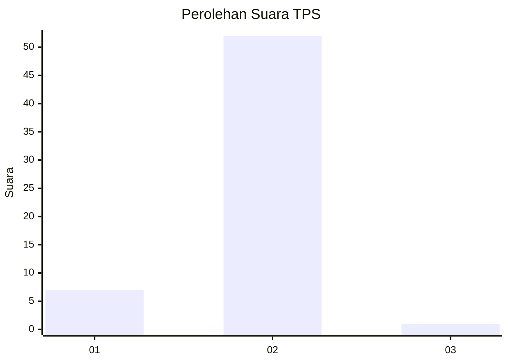
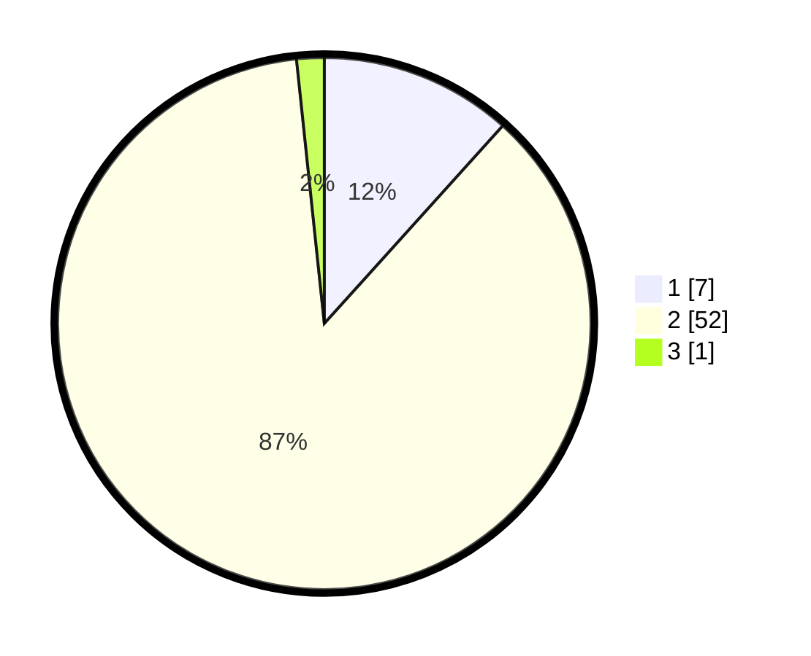

# Hasil

## Grafik

## Tabel

| No. | Nama Paslon    | Suara | Suara (raw) | Persentase |
|:--- |:-------------- | -----:| -----------:| ----------:|
| 1   | ANIES MUHAIMIN | 7     | [7][p-1]    | 11,67      |
| 2   | PRABOWO GIBRAN | 52    | [52][p-2]   | 86,67      |
| 3   | GANJAR MAHFUD  | 1     | [1][p-3]    | 1,67       |

[p-1]: https://github.com/gigit-pemilu/pemilu-2024-18-lampung/blob/main/pilpres/hitung-suara/sub/18-lampung/sub/03-lampung-utara/sub/15-muara-sungkai/sub/2001-negeri-ujung-karang/sub/002-tps/sub/paslon-1.txt
[p-2]: https://github.com/gigit-pemilu/pemilu-2024-18-lampung/blob/main/pilpres/hitung-suara/sub/18-lampung/sub/03-lampung-utara/sub/15-muara-sungkai/sub/2001-negeri-ujung-karang/sub/002-tps/sub/paslon-2.txt
[p-3]: https://github.com/gigit-pemilu/pemilu-2024-18-lampung/blob/main/pilpres/hitung-suara/sub/18-lampung/sub/03-lampung-utara/sub/15-muara-sungkai/sub/2001-negeri-ujung-karang/sub/002-tps/sub/paslon-3.txt

## Foto C Plano

https://sirekap-obj-formc.kpu.go.id/50fe/pemilu/ppwp/18/03/15/20/01/1803152001002-20240215-095751--a194bd67-4964-4858-9a6c-024311690120.jpg

https://sirekap-obj-formc.kpu.go.id/50fe/pemilu/ppwp/18/03/15/20/01/1803152001002-20240215-100156--06cb8b34-7204-417b-8751-b6cb8618bc52.jpg

## Metadata

| Key        | Value               |
| ---------- | ------------------- |
| Time Stamp | 2024-02-15 18:00:26 |

