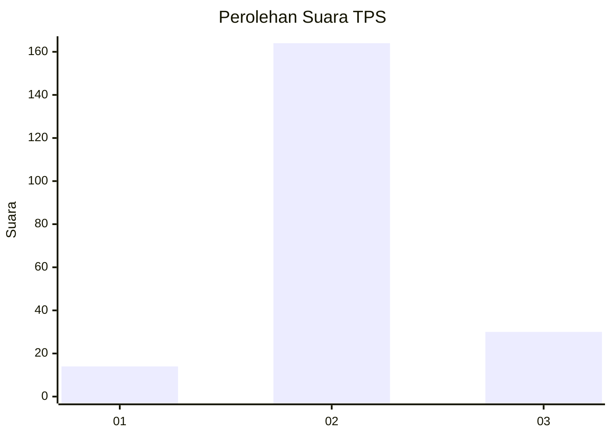

# Hasil

## Grafik

## Tabel

| No. | Nama Paslon    | Suara | Suara (raw) | Persentase |
|:--- |:-------------- | -----:| -----------:| ----------:|
| 1   | ANIES MUHAIMIN | 14    | [14][p-1]   | 6,73       |
| 2   | PRABOWO GIBRAN | 164   | [164][p-2]  | 78,85      |
| 3   | GANJAR MAHFUD  | 30    | [30][p-3]   | 14,42      |

[p-1]: https://github.com/gigit-pemilu/pemilu-2024-18-lampung/blob/main/pilpres/hitung-suara/sub/18-lampung/sub/03-lampung-utara/sub/15-muara-sungkai/sub/2001-negeri-ujung-karang/sub/003-tps/sub/paslon-1.txt
[p-2]: https://github.com/gigit-pemilu/pemilu-2024-18-lampung/blob/main/pilpres/hitung-suara/sub/18-lampung/sub/03-lampung-utara/sub/15-muara-sungkai/sub/2001-negeri-ujung-karang/sub/003-tps/sub/paslon-2.txt
[p-3]: https://github.com/gigit-pemilu/pemilu-2024-18-lampung/blob/main/pilpres/hitung-suara/sub/18-lampung/sub/03-lampung-utara/sub/15-muara-sungkai/sub/2001-negeri-ujung-karang/sub/003-tps/sub/paslon-3.txt

## Foto C Plano

https://sirekap-obj-formc.kpu.go.id/c9ed/pemilu/ppwp/18/03/15/20/01/1803152001003-20240215-034247--e9d28e4e-2e2a-459e-95ee-d0ac27592f3f.jpg

https://sirekap-obj-formc.kpu.go.id/c9ed/pemilu/ppwp/18/03/15/20/01/1803152001003-20240215-034321--e7e8fd7b-7c55-4808-93e9-1f036734368f.jpg

https://sirekap-obj-formc.kpu.go.id/c9ed/pemilu/ppwp/18/03/15/20/01/1803152001003-20240215-034354--f76d62da-e416-4bd6-b7f0-9e426c108d6c.jpg

## Metadata

| Key        | Value               |
| ---------- | ------------------- |
| Time Stamp | 2024-02-15 18:00:26 |

