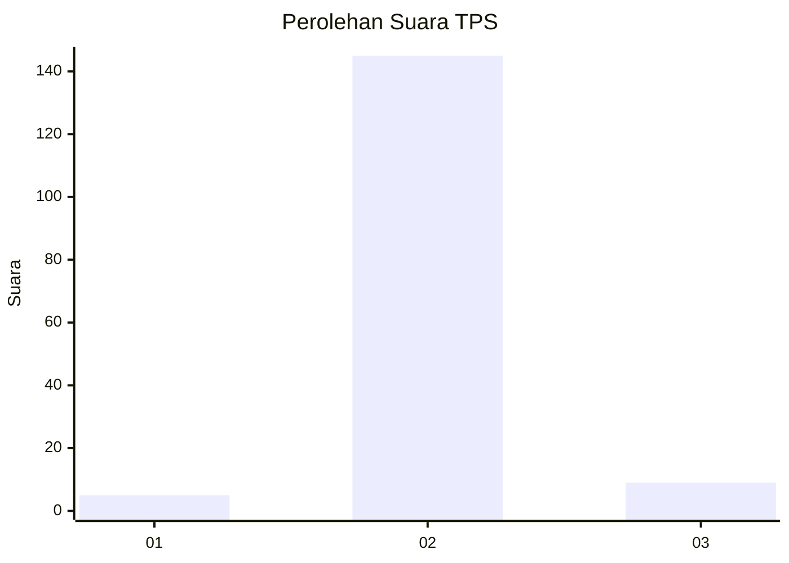
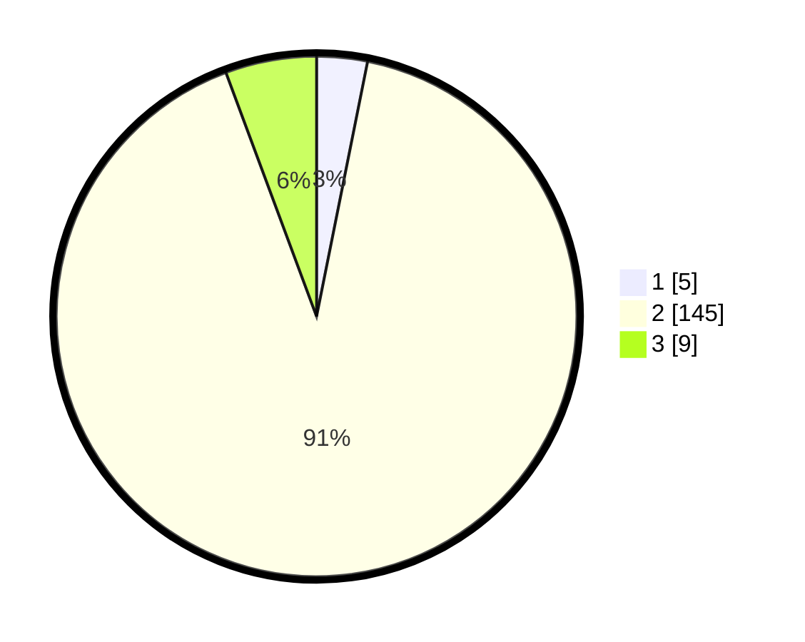

# Hasil

## Grafik

## Tabel

| No. | Nama Paslon    | Suara | Suara (raw) | Persentase |
|:--- |:-------------- | -----:| -----------:| ----------:|
| 1   | ANIES MUHAIMIN | 5     | [5][p-1]    | 3,14       |
| 2   | PRABOWO GIBRAN | 145   | [145][p-2]  | 91,19      |
| 3   | GANJAR MAHFUD  | 9     | [9][p-3]    | 5,66       |

[p-1]: https://github.com/gigit-pemilu/pemilu-2024-18-lampung/blob/main/pilpres/hitung-suara/sub/18-lampung/sub/03-lampung-utara/sub/15-muara-sungkai/sub/2001-negeri-ujung-karang/sub/005-tps/sub/paslon-1.txt
[p-2]: https://github.com/gigit-pemilu/pemilu-2024-18-lampung/blob/main/pilpres/hitung-suara/sub/18-lampung/sub/03-lampung-utara/sub/15-muara-sungkai/sub/2001-negeri-ujung-karang/sub/005-tps/sub/paslon-2.txt
[p-3]: https://github.com/gigit-pemilu/pemilu-2024-18-lampung/blob/main/pilpres/hitung-suara/sub/18-lampung/sub/03-lampung-utara/sub/15-muara-sungkai/sub/2001-negeri-ujung-karang/sub/005-tps/sub/paslon-3.txt

## Foto C Plano

https://sirekap-obj-formc.kpu.go.id/b077/pemilu/ppwp/18/03/15/20/01/1803152001005-20240215-015526--c195acd1-5a61-4bcc-8c74-628e441eaa40.jpg

https://sirekap-obj-formc.kpu.go.id/b077/pemilu/ppwp/18/03/15/20/01/1803152001005-20240215-014752--7ff64f83-63cb-4927-8f14-ea01fb55cddd.jpg

https://sirekap-obj-formc.kpu.go.id/b077/pemilu/ppwp/18/03/15/20/01/1803152001005-20240217-103023--a5478e6f-255a-410d-b4cc-6a2823fedfac.jpg

## Metadata

| Key        | Value               |
| ---------- | ------------------- |
| Time Stamp | 2024-02-17 11:00:02 |

