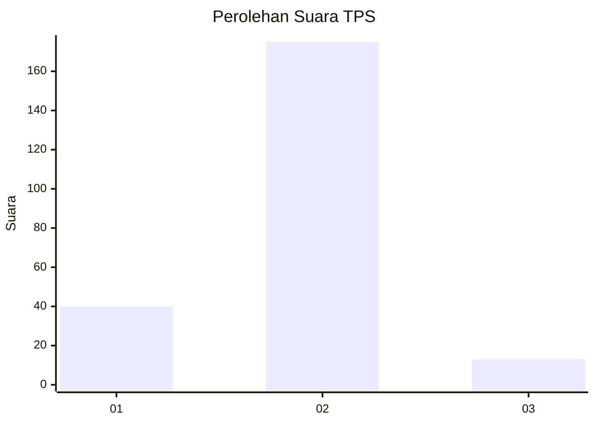
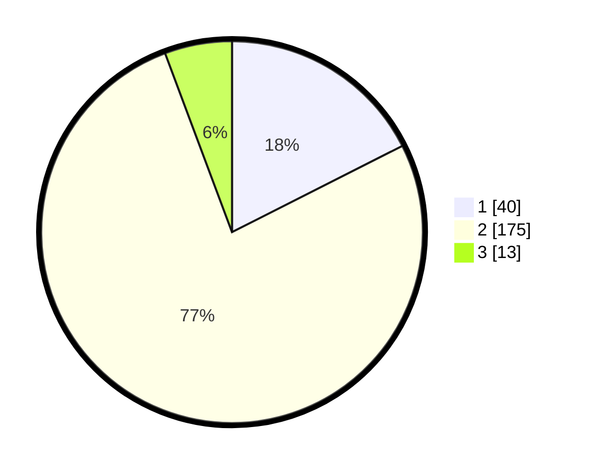

# Hasil

## Grafik

## Tabel

| No. | Nama Paslon    | Suara | Suara (raw) | Persentase |
|:--- |:-------------- | -----:| -----------:| ----------:|
| 1   | ANIES MUHAIMIN | 40    | [40][p-1]   | 17,54      |
| 2   | PRABOWO GIBRAN | 175   | [175][p-2]  | 76,75      |
| 3   | GANJAR MAHFUD  | 13    | [13][p-3]   | 5,70       |

[p-1]: https://github.com/gigit-pemilu/pemilu-2024-18-lampung/blob/main/pilpres/hitung-suara/sub/18-lampung/sub/03-lampung-utara/sub/16-bunga-mayang/sub/2001-negara-tulang-bawang/sub/001-tps/sub/paslon-1.txt
[p-2]: https://github.com/gigit-pemilu/pemilu-2024-18-lampung/blob/main/pilpres/hitung-suara/sub/18-lampung/sub/03-lampung-utara/sub/16-bunga-mayang/sub/2001-negara-tulang-bawang/sub/001-tps/sub/paslon-2.txt
[p-3]: https://github.com/gigit-pemilu/pemilu-2024-18-lampung/blob/main/pilpres/hitung-suara/sub/18-lampung/sub/03-lampung-utara/sub/16-bunga-mayang/sub/2001-negara-tulang-bawang/sub/001-tps/sub/paslon-3.txt

## Foto C Plano

https://sirekap-obj-formc.kpu.go.id/61ef/pemilu/ppwp/18/03/16/20/01/1803162001001-20240214-210625--09b44648-a587-4da8-bf36-9b5599777110.jpg

https://sirekap-obj-formc.kpu.go.id/61ef/pemilu/ppwp/18/03/16/20/01/1803162001001-20240214-210714--89853366-3a1d-4e96-9444-0245fa990362.jpg

https://sirekap-obj-formc.kpu.go.id/61ef/pemilu/ppwp/18/03/16/20/01/1803162001001-20240214-210757--7879f0e1-1472-4354-b718-9372cf3717f0.jpg

## Metadata

| Key        | Value               |
| ---------- | ------------------- |
| Time Stamp | 2024-02-15 07:00:44 |

