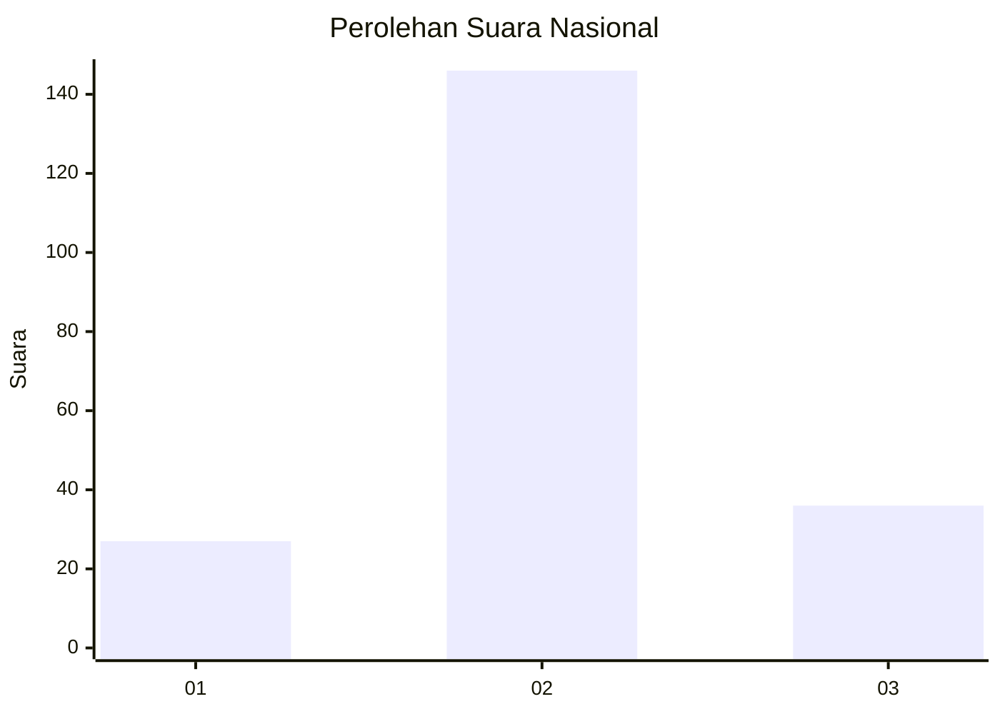
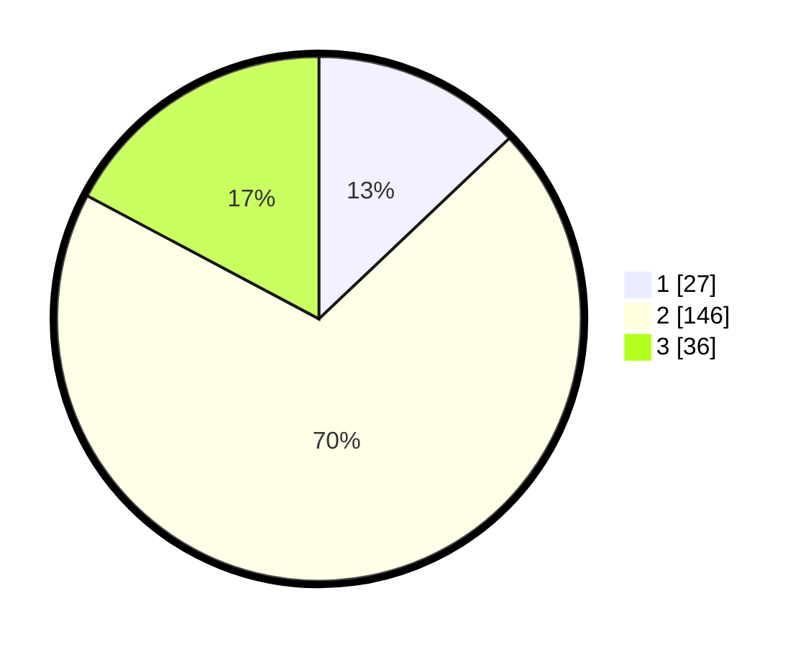

# Hasil

## Grafik

## Tabel

| No. | Nama Paslon    | Suara | Suara (raw) | Persentase |
|:--- |:-------------- | -----:| -----------:| ----------:|
| 1   | ANIES MUHAIMIN | 27    | [27][p-1]   | 12,92      |
| 2   | PRABOWO GIBRAN | 146   | [146][p-2]  | 69,86      |
| 3   | GANJAR MAHFUD  | 36    | [36][p-3]   | 17,22      |

[p-1]: https://github.com/gigit-pemilu/pemilu-2024/blob/main/pilpres/hitung-suara/sub/18-lampung/sub/03-lampung-utara/sub/20-sungkai-jaya/sub/2001-cempaka/sub/002-tps/sub/paslon-1.txt
[p-2]: https://github.com/gigit-pemilu/pemilu-2024/blob/main/pilpres/hitung-suara/sub/18-lampung/sub/03-lampung-utara/sub/20-sungkai-jaya/sub/2001-cempaka/sub/002-tps/sub/paslon-2.txt
[p-3]: https://github.com/gigit-pemilu/pemilu-2024/blob/main/pilpres/hitung-suara/sub/18-lampung/sub/03-lampung-utara/sub/20-sungkai-jaya/sub/2001-cempaka/sub/002-tps/sub/paslon-3.txt

## Foto C Plano

https://sirekap-obj-formc.kpu.go.id/01cc/pemilu/ppwp/18/03/20/20/01/1803202001002-20240217-191842--be9fcec3-3b0e-492c-89f7-15514f7428f5.jpg

https://sirekap-obj-formc.kpu.go.id/01cc/pemilu/ppwp/18/03/20/20/01/1803202001002-20240217-192008--13c608a7-6749-409b-93ea-ebdac3fb5229.jpg

https://sirekap-obj-formc.kpu.go.id/01cc/pemilu/ppwp/18/03/20/20/01/1803202001002-20240217-192151--e388eb43-c271-4b5b-b8f2-815b9fb9bf96.jpg

## Metadata

| Key        | Value               |
| ---------- | ------------------- |
| Time Stamp | 2024-02-24 22:31:28 |

